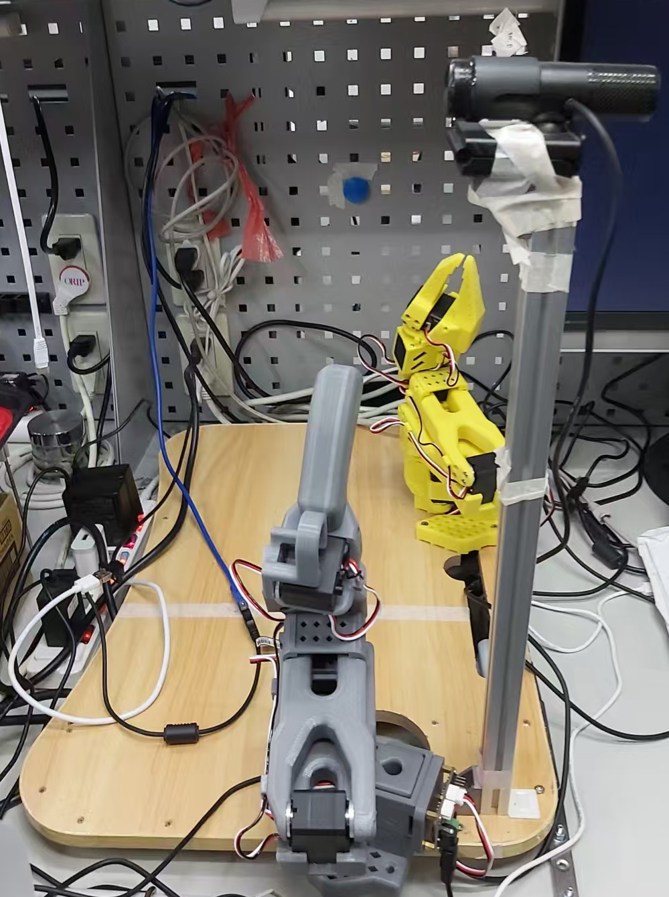

# 02 - 練習任務：按壓圓形磁鐵 (Practice Run)

這篇筆記記錄正式挑戰「通用電梯按鈕」之前，為了熟悉 LeRobot 完整工作流程而設計的「按壓牆上圓形磁鐵」練習任務。主要目的是記錄流程，並留下具體的步驟備忘，以及實作的踩坑經驗。



## 練習目標

1. **練習流程**：親手跑過**資料收集 (Data Collection)**、**模型訓練 (Model Training)** 到**實機推論 (Inference)** 的流程
2. **驗證配置**：透過這次小規模的資料錄製，確認攝影機視角與手臂運動範圍是否合理
3. **快速試錯**：不追求完美的泛化能力，先求有、再求好，快速生出一個懂「按壓」的 ACT 模型

## 第一步：資料收集 (Data Collection)

使用 `lerobot-record` 指令啟動遙控模式，直接操作 Leader Arm 來示範按壓牆上的圓形磁鐵。

- **硬體配置**：
  - Leader Arm (操作端)：`/dev/ttyACM0`
  - Follower Arm (執行端)：`/dev/ttyACM1`
  - 前置相機：`/dev/video0` (設定為 640x480, 30fps)
- **錄製計畫**：錄製 50 個 demonstrations (episodes)。

- **錄製指令：**

  編寫 `record_episodes.sh` 執行以下命令：
  ```bash
  lerobot-record \
    --robot.type=so101_follower \
    --robot.port=/dev/ttyACM1 \
    --robot.id=my_awesome_follower_arm \
    --teleop.type=so101_leader \
    --teleop.port=/dev/ttyACM0 \
    --teleop.id=my_awesome_leader_arm \
    --robot.cameras="{front: {type: opencv, index_or_path: 0, width: 640, height: 480, fps: 30}}" \
    --display_data=false \
    --play_sounds=false \
    --dataset.repo_id=$REPO_ID \
    --dataset.num_episodes=1 \
    --dataset.episode_time_s=10 \
    --dataset.single_task="Press the circular magnet on the wall" \
    --dataset.push_to_hub=false \
    --resume=$RESUME_FLAG
  ```
- **錄製資料驗證**

  確認數據生成狀況
  - Parquet 軌跡數據：`ls -l ~/.cache/huggingface/lerobot/RonLiao/lerobot-so101-elevator-dataset/data`
  - 影片影格目錄：`ls -l ~/.cache/huggingface/lerobot/RonLiao/lerobot-so101-elevator-dataset/videos`

  執行以下腳本確認數據完整性（特別是相機影像與手臂軌跡）：
   ```bash
   # 執行驗證腳本 (預設檢查最新錄製的一段)
   python scripts/verify_data.py
   ```
  *(腳本將自動讀取最後一段錄製的 Parquet 檔案，並確認欄位與軌跡數據是否存在變動。)*

- **單段刪除**

   用於移除某個錄壞之片段 (如 Episode 4)：
   ```bash
   lerobot-edit-dataset \
     --repo_id=RonLiao/lerobot-so101-elevator-dataset \
     --operation.type=delete_episodes \
     --operation.episode_indices="[4]"
   ```

- **錄製過程中的實務經驗與觀察：**
  - 受環境狹小所限，無論是leader arm還是follower arm都不能做到從任何初始角度的示範錄制
  - 承上，因此抓取的50次無法涵蓋所有初始角度，或許會在之後訓練或推論時出問題
  - 對一個簡單任務如這個按圓磁鐵來說，是否有縮小錄制次數的可能，還是50次已經是讓模型能收斂的最小次數了？

- **經驗：發生 `RevisionNotFoundError` 或 `info.json` 遺失時**
  - 多為遠端存儲庫狀態異常。須先手動刪除 Hugging Face 上的 Dataset Repository 及其本地快取夾後重啟。
  - **解決方法**：先至 [Hugging Face 網頁](https://huggingface.co/datasets/RonLiao/lerobot-so101-elevator-dataset/settings) 刪除該 Dataset，並執行 `rm -rf ~/.cache/huggingface/lerobot/RonLiao/lerobot-so101-elevator-dataset`，然後再執行腳本。


## 第二步：設定視覺化監控與認證 (WandB & Hugging Face)

採用 LeRobot 原生支援之 **Weights & Biases (WandB)** 監控訓練收斂狀況，並登入 Hugging Face 以利存取模型權重。

此登入動作只需執行一次，登入資訊會儲存在容器中。除非刪除或重新建立 Container，否則只是 Docker 或 Host 重啟都不需重新登入。

**WandB 配置要點：**
- 於 [wandb.ai](https://wandb.ai) 取得 API Key。
- 登入 WandB
   ```bash
   wandb login
   ```
- 若需更換 API Key 或重新登入，請執行：
   ```bash
   wandb login --relogin
   ```
   [!NOTE]
   API Key 應視為密碼保護，請勿洩露。若不慎洩露，請至 [wandb.ai/settings](https://wandb.ai/settings) 重新產生。


**Hugging Face 認證：**
1. 於 [Hugging Face Settings -> Tokens](https://huggingface.co/settings/tokens) 取得 `Write` 權限的 Token。
2. 執行登入並貼入 Token：
   ```bash
   huggingface-cli login
   ```
   只需執行一次，登入資訊會持久化在 `/root/.cache/huggingface/` 目錄中

## 第三步：模型訓練 (Model Training)

以 ACT (Action Chunking with Transformers) 模型進行訓練。

- **啟動訓練指令：**
   ```bash
   lerobot-train \
     --dataset.repo_id=RonLiao/lerobot-so101-elevator-dataset \
     --policy.type=act \
     --output_dir=outputs/train/act_elevator_test \
     --job_name=act_elevator_test \
     --batch_size=8 \
     --steps=50000 \
     --save_freq=5000 \
     --eval.n_episodes=10 \
     --eval.batch_size=10 \
     --wandb.enable=true \
     --wandb.project=lerobot-so101-elevator \
     --policy.repo_id=RonLiao/so101-elevator-act \
     2>&1 | tee -a train.log
   ```

- 經驗：**`RuntimeError: Could not load libtorchcodec` (FFmpeg 缺失)**
   - **問題描述**：訓練啟動後在 `Creating dataset` 階段報錯，顯示無法載入 `libtorchcodec`。
   - **原因**：Docker 容器內缺少 FFmpeg 共享函式庫，導致 `torchcodec` 無法解析影像數據。
   - **解決方法**：在容器內安裝 `ffmpeg`：
     ```bash
     sudo apt-get update
     sudo apt-get install -y ffmpeg
     ```

- 經驗：**`FileExistsError: Output directory ... already exists`**
   - **原因**：LeRobot 不允許覆寫同名的輸出目錄。
   - **解決方法**：手動修改 `--output_dir` 參數，或在目錄名後加上日期（如 `act_elevator_test_v1`）。

- 經驗：**`DataLoader worker is killed by signal: Bus error` (Shared Memory 不足)**
   - **問題描述**：訓練剛啟動，即將開始讀取 Dataset 時崩潰，出現 `out of shared memory` 相關的錯誤。
   - **原因**：Docker 預設的 shared memory (`/dev/shm`) 只有 64MB，無法滿足 PyTorch DataLoader 多進程讀取資料集的需求。
   - **解決方法**：建立 Docker 容器時，需加入 `--shm-size` 參數擴充共享記憶體限制 (建議至少 4GB 甚至 8GB 以上)。同時建議加上 `--privileged -v /dev:/dev` 解放硬體權限，以及 `-v` 掛載共享資料夾。

- 經驗：**無法使用 GPU 訓練 (僅能使用 CPU)**
   - **問題描述**：訓練啟動時日誌顯示 `Switching to 'cpu'`，或者偵測不到 CUDA 裝置，造成訓練速度極慢（每步可能耗時數秒甚至更久）。
   - **原因**：建立 Docker 容器時未顯式宣告 GPU 資源，導致容器內部的 PyTorch 無法存取宿主機的顯卡。
   - **解決方法**：重新建立容器，並在 `docker run` 指令中加入 `--gpus all` 參數。例如：`sudo docker run --gpus all ...`。這要求宿主機必須先安裝好 [NVIDIA Container Toolkit](https://docs.nvidia.com/datacenter/cloud-native/container-toolkit/latest/install-guide.html)。

- 經驗：**從舊容器救援資料集 (Rescue Data from Old Container)**
   - **問題描述**：更換新容器後，發現舊有的 50 episodes 資料集仍留在舊容器的內部路徑中。
   - **解決方法**：在 Ubuntu Host 執行以下指令將數據拷貝至 Host，再搬移至新容器掛載的路徑：
     ```bash
     # 從舊容器拷貝 (注意使用絕對路徑 /root 而非 ~)
     sudo docker cp <OLD_CONTAINER_NAME>:/root/.cache/huggingface/lerobot/RonLiao/lerobot-so101-elevator-dataset .

     # 搬移至掛載路徑
     mv lerobot-so101-elevator-dataset/ ~/SSD4T/ron/shared/
     ```
     *(搬移後，需在新容器內手動建立 `mkdir -p ~/.cache/huggingface/lerobot/RonLiao` 並將數據移回快取路徑)*

## 第四步：實機推論 (Inference)

訓練完成後，載入指定 checkpoint 透過實體機械臂進行自動控制測試。

**載入權重並執行推論：**
```bash
lerobot-control \
  --robot.type=so101 \
  --robot.cameras='{"phone": {"video_device_index": 4}}' \
  --model.path=outputs/train/act_elevator_test/checkpoints/005000 \
  --control.time_s=60
```
