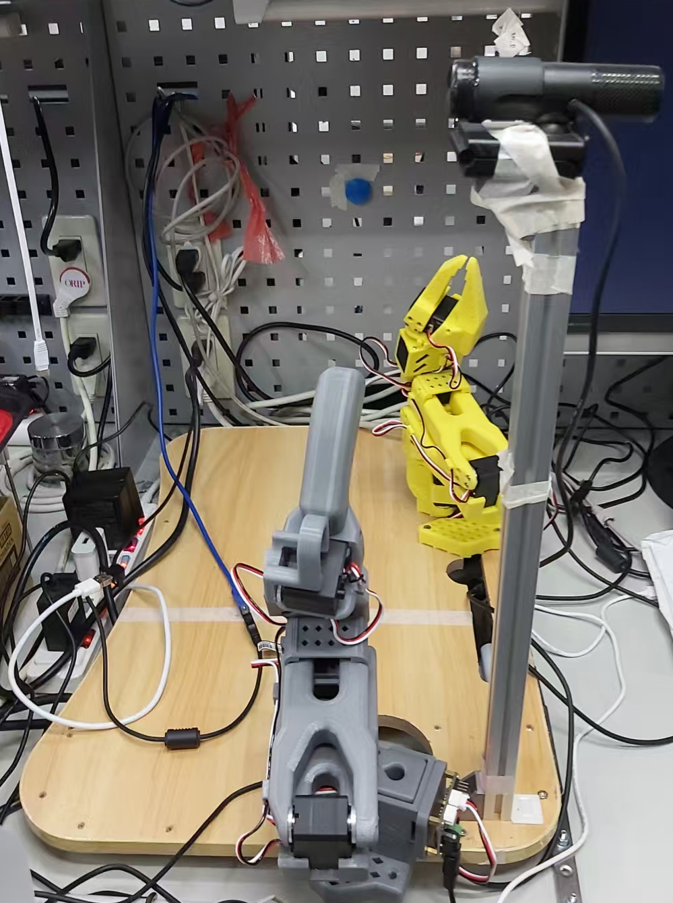

# 02 - 練習任務：按壓圓形磁鐵 (Practice Run)

這篇筆記記錄正式挑戰「通用電梯按鈕」之前，為了熟悉 LeRobot 完整工作流程而設計的「按壓牆上圓形磁鐵」練習任務。主要目的是記錄流程，並留下具體的步驟備忘，以及實作的踩坑經驗。



## 練習目標

1. **練習流程**：親手跑過**資料收集 (Data Collection)**、**模型訓練 (Model Training)** 到**實機推論 (Inference)** 的流程
2. **驗證配置**：透過這次小規模的資料錄製，確認攝影機視角與手臂運動範圍是否合理
3. **快速試錯**：不追求完美的泛化能力，先求有、再求好，快速生出一個懂「按壓」的 ACT 模型

## 第一步：資料收集 (Data Collection)

使用 `lerobot-record` 指令啟動遙控模式，直接操作 Leader Arm 來示範按壓牆上的圓形磁鐵。

- **硬體配置**：
  - Leader Arm (操作端)：`/dev/ttyACM0`
  - Follower Arm (執行端)：`/dev/ttyACM1`
  - 前置相機：`/dev/video0` (設定為 640x480, 30fps)
- **錄製計畫**：錄製 50 個 demonstrations (episodes)。

- **錄製指令：**

  編寫 `record_episodes.sh` 執行以下命令：
  ```bash
  lerobot-record \
    --robot.type=so101_follower \
    --robot.port=/dev/ttyACM1 \
    --robot.id=my_awesome_follower_arm \
    --teleop.type=so101_leader \
    --teleop.port=/dev/ttyACM0 \
    --teleop.id=my_awesome_leader_arm \
    --robot.cameras="{front: {type: opencv, index_or_path: 0, width: 640, height: 480, fps: 30}}" \
    --display_data=false \
    --play_sounds=false \
    --dataset.repo_id=$REPO_ID \
    --dataset.num_episodes=1 \
    --dataset.episode_time_s=10 \
    --dataset.single_task="Press the circular magnet on the wall" \
    --dataset.push_to_hub=false \
    --resume=$RESUME_FLAG
  ```
- **錄製資料驗證**

  確認數據生成狀況
  - Parquet 軌跡數據：`ls -l ~/.cache/huggingface/lerobot/RonLiao/lerobot-so101-elevator-dataset/data`
  - 影片影格目錄：`ls -l ~/.cache/huggingface/lerobot/RonLiao/lerobot-so101-elevator-dataset/videos`

  執行以下腳本確認數據完整性（特別是相機影像與手臂軌跡）：
   ```bash
   # 執行驗證腳本 (預設檢查最新錄製的一段)
   python scripts/verify_data.py
   ```
  *(腳本將自動讀取最後一段錄製的 Parquet 檔案，並確認欄位與軌跡數據是否存在變動。)*

- **單段刪除**

   用於移除某個錄壞之片段 (如 Episode 4)：
   ```bash
   lerobot-edit-dataset \
     --repo_id=RonLiao/lerobot-so101-elevator-dataset \
     --operation.type=delete_episodes \
     --operation.episode_indices="[4]"
   ```

- **資料集上傳 (Push to Hugging Face)**：
  雲端資料集位址：[RonLiao/lerobot-so101-elevator-dataset](https://huggingface.co/datasets/RonLiao/lerobot-so101-elevator-dataset)

  若錄製時使用了 `--dataset.push_to_hub=false`，資料會僅存在本地。可透過以下方式上傳現存資料集：
  1. 進入 `lerobot` 原始碼目錄（位於根目錄）：
     ```bash
     cd /lerobot
     export PYTHONPATH=$PYTHONPATH:/lerobot:/lerobot/src
     ```
  2. 執行 Python 指令：
     ```bash
     PYTHONPATH=/lerobot/src python -c "from lerobot.datasets.lerobot_dataset import LeRobotDataset; dataset = LeRobotDataset('RonLiao/lerobot-so101-elevator-dataset'); dataset.push_to_hub()"
     ```

- **錄製過程中的實務經驗與觀察：**
  - 受環境狹小所限，無論是leader arm還是follower arm都不能做到從任何初始角度的示範錄制
  - 承上，因此抓取的50次無法涵蓋所有初始角度，或許會在之後訓練或推論時出問題
  - 對一個簡單任務如這個按圓磁鐵來說，是否有縮小錄制次數的可能，還是50次已經是讓模型能收斂的最小次數了？

- **經驗：發生 `RevisionNotFoundError` 或 `info.json` 遺失時**
  - 多為遠端存儲庫狀態異常。須先手動刪除 Hugging Face 上的 Dataset Repository 及其本地快取夾後重啟。
  - **解決方法**：先至 [Hugging Face 網頁](https://huggingface.co/datasets/RonLiao/lerobot-so101-elevator-dataset/settings) 刪除該 Dataset，並執行 `rm -rf ~/.cache/huggingface/lerobot/RonLiao/lerobot-so101-elevator-dataset`，然後再執行腳本。

- **經驗：未來如何「錄製完即上傳」**：
  在 `lerobot-record` 指令中，將 `--dataset.push_to_hub=false` 改為 `true` 即可。系統會在錄製結束或手動停止後，自動觸發上傳機制。


## 第二步：設定視覺化監控與認證 (WandB & Hugging Face)

採用 LeRobot 原生支援之 **Weights & Biases (WandB)** 監控訓練收斂狀況，並登入 Hugging Face 以利存取模型權重。

此登入動作只需執行一次，登入資訊會儲存在容器中。除非刪除或重新建立 Container，否則只是 Docker 或 Host 重啟都不需重新登入。

**WandB 配置要點：**
- 於 [wandb.ai](https://wandb.ai) 取得 API Key。
- 登入 WandB
   ```bash
   wandb login
   ```
- 若需更換 API Key 或重新登入，請執行：
   ```bash
   wandb login --relogin
   ```
   [!NOTE]
   API Key 應視為密碼保護，請勿洩露。若不慎洩露，請至 [wandb.ai/settings](https://wandb.ai/settings) 重新產生。


**Hugging Face 認證：**
1. 於 [Hugging Face Settings -> Tokens](https://huggingface.co/settings/tokens) 取得 `Write` 權限的 Token。
2. 執行登入並貼入 Token：
   ```bash
   huggingface-cli login
   ```
   只需執行一次，登入資訊會持久化在 `/root/.cache/huggingface/` 目錄中

## 第三步：模型訓練 (Model Training)

以 ACT (Action Chunking with Transformers) 模型進行訓練。

- **啟動訓練指令：**
   ```bash
   lerobot-train \
     --dataset.repo_id=RonLiao/lerobot-so101-elevator-dataset \
     --dataset.revision=main \
     --policy.type=act \
     --output_dir=outputs/train/act_elevator_test \
     --job_name=act_elevator_test \
     --batch_size=8 \
     --steps=50000 \
     --save_freq=5000 \
     --eval.n_episodes=10 \
     --eval.batch_size=10 \
     --wandb.enable=true \
     --wandb.project=lerobot-so101-elevator \
     --policy.repo_id=RonLiao/so101-elevator-act \
     2>&1 | tee -a record/so101-elevator-act.log
   ```

- **首度訓練成果分析 (2026-03-12)：**

   - **訓練資料集 (Hugging Face)**：[lerobot-so101-elevator-dataset](https://huggingface.co/datasets/RonLiao/lerobot-so101-elevator-dataset)
   - **訓練成果 (Hugging Face)**：[so101-elevator-act](https://huggingface.co/RonLiao/so101-elevator-act)
   - **訓練監控 (WandB)**：[lerobot-so101-elevator](https://wandb.ai/ron-liao-nuwa-robotics/lerobot-so101-elevator)
   - **訓練日誌 (GitHub)**：[so101-elevator-act.log](../record/so101-elevator-act.log)

   這是專案第一次正式跑完 50,000 steps 的模型訓練。透過 WandB 的數據監控，獲得以下關鍵指標與心得：

  1. **訓練效能與時長**：
     - **硬體**：NVIDIA GeForce GTX 1080 Ti (11GB VRAM)。
     - **總耗時**：**2 小時 27 分鐘**。
     - **更新速率 (update_s)**：平均每步耗時約 **0.18 秒**。
     - **資料載入延遲 (dataloading_s)**：平均約 **0.012 秒**。
     - **分析**：資料載入僅佔總時間的 6.5%，證實了配置大容量 `Shared Memory` 的重要性。在 1080 Ti 上能達到此速度代表資料讀取完全沒有成為瓶頸 (Bottleneck)。
  2. **Loss 收斂趨勢**：
     - **數值變化**：Loss 從初始的 **6.8** 穩定下降至 **2.4** 以下。
     - **原理說明**：ACT 模型的 Loss 主要由 **L1 Loss** (預測動作與專家動作的絕對誤差) 與 **KLD Loss** (潛在空間的正規化誤差) 組成。
     - **理想程度**：曲線呈現平滑下降且無劇烈震盪，代表 Learning Rate 與 Batch Size (8) 的配置與當前資料量 (51 episodes) 銜接良好。

  3. **關於本地儲存與 Hugging Face 的關係**：
     - **數據流向**：雖然指令中帶有 `repo_id`，但 LeRobot 會優先檢查本地快取路徑 (`~/.cache/huggingface/lerobot/`)。
     - **結論**：本次訓練完全在本地 Server48 執行，訓練產出的權重檔 (Checkpoints) 存放於 `outputs/train/act_elevator_test` 目錄下，並未自動上傳至雲端

- **經驗：如何確保訓練時使用 Hugging Face 最新資料集**：
  LeRobot 預設會優先使用本地快取。若雲端有更新且欲強制同步，可在 `lerobot-train` 指令中加入：
  ```bash
  --dataset.revision=main  # 強制檢查主分支更新
  ```
  或者最徹底的方法（在 Server 48）：
  ```bash
  # 刪除本地快取，強制重新下載
  rm -rf ~/.cache/huggingface/lerobot/RonLiao/lerobot-so101-elevator-dataset
  ```

- **經驗：訓練權重上傳 (Push Model to Hugging Face)**：
  訓練完成後通常會自動上傳，但若想要手動再上傳一次，請執行：
  ```bash
  # 進入 LeRobot scripts 目錄
  cd /lerobot/src/lerobot/scripts

  # 執行上傳腳本 (將本地 outputs 路徑對應到雲端 Model repo)
  python push_dataset_to_hub.py \
    --local_dir /lerobot/outputs/train/act_elevator_test \
    --repo_id RonLiao/so101-elevator-act
  ```

- **經驗：`RuntimeError: Could not load libtorchcodec` (FFmpeg 缺失)**
   - **問題描述**：訓練啟動後在 `Creating dataset` 階段報錯，顯示無法載入 `libtorchcodec`。
   - **原因**：Docker 容器內缺少 FFmpeg 共享函式庫，導致 `torchcodec` 無法解析影像數據。
   - **解決方法**：在容器內安裝 `ffmpeg`：
     ```bash
     sudo apt-get update
     sudo apt-get install -y ffmpeg
     ```

- **經驗：`FileExistsError: Output directory ... already exists`**
   - **原因**：LeRobot 不允許覆寫同名的輸出目錄。
   - **解決方法**：手動修改 `--output_dir` 參數，或在目錄名後加上日期（如 `act_elevator_test_v1`）。

- **經驗：`DataLoader worker is killed by signal: Bus error` (Shared Memory 不足)**
   - **問題描述**：訓練剛啟動，即將開始讀取 Dataset 時崩潰，出現 `out of shared memory` 相關的錯誤。
   - **原因**：Docker 預設的 shared memory (`/dev/shm`) 只有 64MB，無法滿足 PyTorch DataLoader 多進程讀取資料集的需求。
   - **解決方法**：建立 Docker 容器時，需加入 `--shm-size` 參數擴充共享記憶體限制 (建議至少 4GB 甚至 8GB 以上)。同時建議加上 `--privileged -v /dev:/dev` 解放硬體權限，以及 `-v` 掛載共享資料夾。

- **經驗：無法使用 GPU 訓練 (僅能使用 CPU)**
   - **問題描述**：訓練啟動時日誌顯示 `Switching to 'cpu'`，或者偵測不到 CUDA 裝置，造成訓練速度極慢（每步可能耗時數秒甚至更久）。
   - **原因**：建立 Docker 容器時未顯式宣告 GPU 資源，導致容器內部的 PyTorch 無法存取宿主機的顯卡。
   - **解決方法**：重新建立容器，並在 `docker run` 指令中加入 `--gpus all` 參數。例如：`sudo docker run --gpus all ...`。這要求宿主機必須先安裝好 [NVIDIA Container Toolkit](https://docs.nvidia.com/datacenter/cloud-native/container-toolkit/latest/install-guide.html)。

- **經驗：從舊容器救援資料集 (Rescue Data from Old Container)**
   - **問題描述**：更換新容器後，發現舊有的 50 episodes 資料集仍留在舊容器的內部路徑中。
   - **解決方法**：在 Ubuntu Host 執行以下指令將數據拷貝至 Host，再搬移至新容器掛載的路徑：
     ```bash
     # 從舊容器拷貝 (注意使用絕對路徑 /root 而非 ~)
     sudo docker cp <OLD_CONTAINER_NAME>:/root/.cache/huggingface/lerobot/RonLiao/lerobot-so101-elevator-dataset .

     # 搬移至掛載路徑
     mv lerobot-so101-elevator-dataset/ ~/SSD4T/ron/shared/
     ```
     *(搬移後，需在新容器內手動建立 `mkdir -p ~/.cache/huggingface/lerobot/RonLiao` 並將數據移回快取路徑)*

## 第四步：實機推論 (Inference)

訓練完成後，載入指定 checkpoint 透過實體機械臂進行自動控制測試。

**載入權重並執行推論：**
```bash
rm /root/.cache/huggingface/lerobot/RonLiao/eval_so101_elevator_test/ -rf
lerobot-record \
  --robot.type=so101_follower \
  --robot.port=/dev/ttyACM1 \
  --robot.id=my_awesome_follower_arm \
  --robot.cameras="{front: {type: opencv, index_or_path: 0, width: 640, height: 480, fps: 30}}" \
  --policy.type=act \
  --policy.pretrained_path ./outputs/train/act_elevator_test/checkpoints/005000/pretrained_model \
  --dataset.repo_id=RonLiao/eval_so101_elevator_test \
  --dataset.single_task="Press the circular magnet on the wall" \
  --display_data=false \
  --play_sounds=false
```

- **經驗：此訓練結果的推論有問題**
   - **問題描述**：推論時手臂一直無法按到目標，一直來回抖動如影片。 
   - **原因**：
   - **解決方法**：

## 延伸學習
- [03-lerobot-framework-anatomy.md](03-lerobot-framework-anatomy.md)：深入探討 LeRobot 框架如何整合資料集、模型與相關工具鏈。
