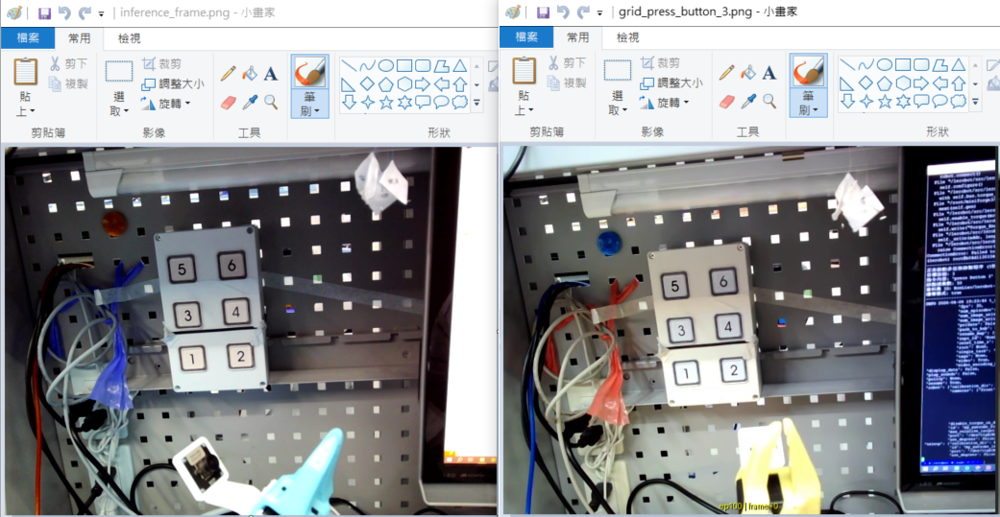
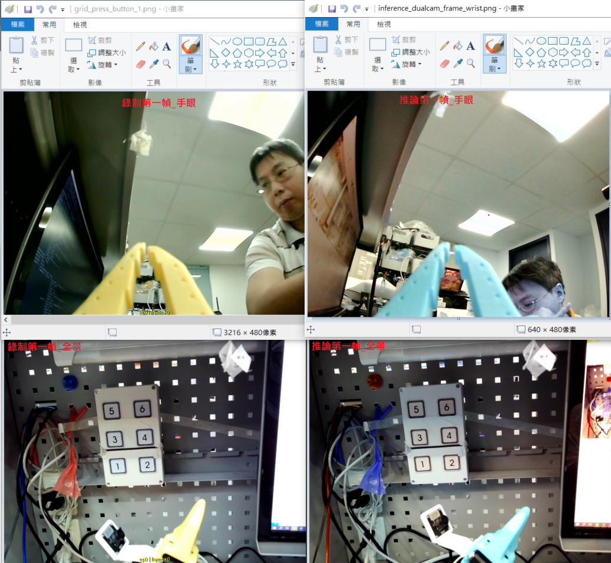
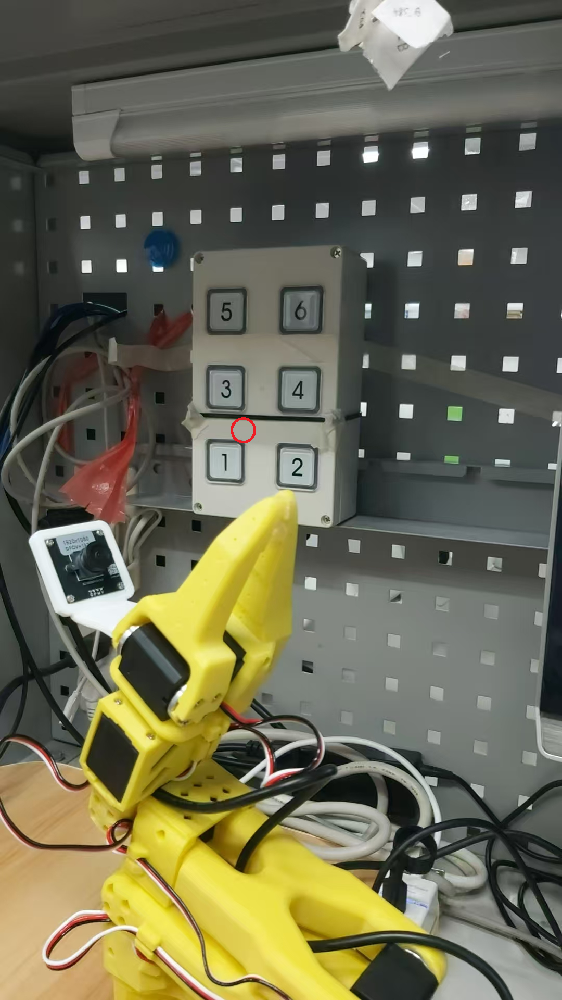
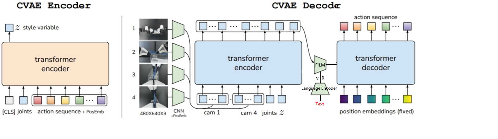

# 04 - 階段二實作：語意驅動的特定面板按壓 (6 顆按鈕)

在進入適應所有電梯面板的通用任務前，此中繼階段的目標是：**針對特定款式（6 顆按鈕，按下會亮藍光）的面板，讓模型能「聽懂指令」，由輸入的文字字串決定按哪個按鈕。**

環境樣式參考：


## 任務目標

1. **指令驅動動作**：使用者無論是藉由口頭（用語音轉文字）還是文字輸入，手臂都能根據傳入的動態字串參數決定按下對應的目標按鈕。
2. **區辨能力驗證**：確認單一系統架構能否準確解析相近按鈕影像與文字指令的對應關係，不誤觸相鄰的其它選項。
3. **特徵驗證**：觀察按下後發出的「藍光」是否能作為動作完成的視覺回饋特徵。

---

## 💡 理論探討：指令驅動按壓的三層級解決方案

為實現「由輸入字串決定發動哪個按壓行為」，在目前具身智能（Embodied AI）的發展路徑上，有三個截然不同的工程與演算法層次可以探索：

### 層次一：工程中控台路由 (Wrapper 與權重動態切換)
本質上仍是傳統的「一個按鈕，訓練一個專屬模型」。首先由外部程式（如 Python 腳本、語法解析器或輕量級 LLM Router）攔截使用者的語音或字串，解析出目標按鈕為何（例如：`target=Btn3`）後，程式再去動態讀取並載入 `btn3` 的權重（pretrained_model）來執行。
- **特性**：實作簡單直觀，但欠缺泛化性。未來若有百個按鈕，則需維護百個龐大的模型庫，且切換權重時會有將模型掛載至 VRAM 的載入延遲。

### 層次二：條件式輸入的多任務模型 (Language-Conditioned ACT)
**【⭐ 本階段 (04 筆記) 先行採用的方案】**
不再將每一顆按鈕視作獨立外掛，而是將 6 個按鈕的所有示範軌跡整合，訓練這「唯一一部」了解所有情況的 **Multi-Task ACT 模型**。
透過將代表任務的「文字指令」轉換為特徵（Language Embeddings），當作一個額外的條件 (Condition) 一併餵給類神經網路。模型在推論時會根據文字條件，自動將視覺注意力 (Attention) 對齊畫面中對應的號碼。只要傳入 `"Press button 3"` 的字串，這個單一模型就能動態產生前往按鈕 3 的動作軌跡！

### 層次三：導入視覺-語言-動作大模型 (VLA, Vision-Language-Action)
**【🚀 未來規劃：將於後續的 `05_xxx` 階段實作】**
免去手動萃取特徵與繁瑣的模型訓練設定，直接導入端到端的大型多模態基礎模型（例如 OpenVLA）。VLA 模型就像是擁有 ChatGPT 般的強大常識，不只能同時看圖與讀懂文字指令，產出的也不是文字語言，而是能直接驅動馬達的 **Action Tokens**！即使是模型以前完全沒見過的按鈕面板，單憑其強大的預訓練語言常識也有極高的機率達成 Zero-shot 的零樣本按壓。

---

## 具體實作與原始碼修改步驟 (層次二架構)

要讓原生的 ACT 模型學會「聽懂人話」，必須在 LeRobot 中進行架構級別的改裝（Language-Conditioned ACT Mod）。以下為核心的實作步驟：

### 第0步：了解 lerobot 的 ACT 實作
在動手修改架構之前，先深入理解 LeRobot 預設的原生 ACT 模型實作（原始碼與資料流），確認 Transformer Encoder/Decoder 的實際運作方式，這部分的探討與筆記對應至理論學習的 ACT 分析中，程式碼註解已加入至 [`policies/act/modeling_act.py`](../policies/act/modeling_act.py)。

### 第一步：修改 ACT 網路架構 (注入 Text Embeddings)

為保留原始實作，已將 `policies/act` 目錄複製一份為 `policies/act_lc`(Language-Conditioned ACT)。接下來的修改都將在 `act_lc` 目錄中進行。

原生 ACT 實作(位於 `lerobot/common/policies/act/modeling_act.py`) 僅接收影像與本體狀態。以下為架構改造的核心：

**📍 架構變更圖解 (ACT-LC 資料流)：**
將提取出的語意特徵注入到 Transformer Encoder 的輸入端，強制模型進行跨模態注意力計算。


具體必須做以下改造：

1. **引入文字編碼器 (Text Encoder)**：
    - 在 ACT Policy 的 `__init__` 中，載入輕量且推理快速的預訓練語言模型（採用 `distilbert-base-uncased`），並將其權重凍結 (`requires_grad=False`) 以減少機器手臂訓練初期的計算資源負擔與過度擬合問題。
2. **新增特徵對齊層 (Projection MLP)**：
    - 文字編碼器輸出的隱藏維度（DistilBERT 為 768）與 ACT 內部 Transformer 的維度（預設為 512）不同。需加入一層 Linear 進行特徵降維與映射：
    ```python
    self.text_proj = nn.Linear(config.language_dim, config.hidden_dim)
    ```
3. **改造 Transformer Encoder 流水線**：
    - 原生的 `forward()` 與 `compute_loss()` 需修改為可以接收 `batch` 中的 `language_instruction` 的批次字串，並在內部呼叫 Tokenizer 將字串轉為 `input_ids` 與 `attention_mask`。送入 Text Encoder 與 `text_proj` 後，得到 `text_tokens`（維度為 `(Batch, Seq_Len, 512)`）。
    - 接著，進入 Transformer (`self.model.encoder`) 之前，將 `text_tokens` 加入至序列中（與 `is_pad`、`z`、`proprioception`、`image_tokens` 串接），這樣 Encoder 的 Self-Attention 機制就會強制讓「語意 Token」與「影像空間 Token」產生跨模態的權重聯結。
   這樣 Encoder 的 Self-Attention 機制就會強制讓「語意 Token」與「影像空間 Token」產生跨模態的權重聯結。
4. **驗證**：
    - 在不開啟正式訓練迴圈的情況下，撰寫一小段 Python 測試腳本，初始化改版後的 ACTPolicy 並模擬輸入 batch (包含一組假影像、假 proprioception 與文字指令 ["press button 3"])。
    - 確認 forward() 能夠順利產出維度正確的 action_tokens 而不拋出維度不匹配或是 Cuda Memory 錯誤。


### 第二步：多任務資料集混合 (Multi-task Data Collection)

1. **指令標註**：
   在錄製這 6 顆按鈕時，將所有軌跡錄進 **同一個 Repo**，但透過給定特定的 `--dataset.single_task` 來給予模型訓練時的解題線索：
   ```bash
   lerobot-record ... \
     --dataset.repo_id=RonLiao/lerobot-so101-elevator-6btn-multitask \
     --dataset.single_task="press button 3" # 錄製按鈕 3 的回合
   ```

2. **修改 Dataset 解析器**：
   因為原生的 `LeRobotDataset` 預設只回傳數值型與影像特徵，為了讓改版後的 ACT-LC 模型能順利讀取到文字指令，必須撰寫一個 Wrapper 類別（實作了 `ACTLCDataset`）。
   - **實作邏輯**：在 `__getitem__` 取資料時，攔截當下回傳的字典，並拿取當前的 `task_idx = item["task_index"].item()`。接著直接從底層已載入記憶體的 `self.dataset.tasks` 映射表中（在 v3.0 架構下，數據來自 `meta/tasks.parquet`）調閱出對應的 instruction string，最後將其注入到 `item["language_instruction"]` 欄位中供 `DistilBERT` 編碼。

- **經驗：為何在多任務混合錄製時，需要給定特定的 `--dataset.single_task`？**
  - **核心考量**：正常邏輯下，錄製 Episode 前應給定一串指令（比如"press button 3"，並補入每一幀 (Frame) 的數據中。但此舉會導致同一 Episode 的每個 Frame 都存入完全重複的文字，造成嚴重的空間浪費。
  - **既有機制**：LeRobot 框架分為 Dataset/Episode/Frame 三層級。每個 Episode 附帶一個 `task_index`，並自動包含於該 Episode 下的所有 Frame 中。
  - **優化策略**：既然每個 Frame 原來就有 `task_index`，且指令字串也是以 Episode 為單位，故直接沿用此索引。訓練時透過 `act_lc_dataset.py` 將索引動態展開為“dataset.single_task"指定的對應文字指令，達成節省資料夾體積但訓練具備語意輸入的效果。
  - **參數價值**：`--dataset.single_task` 用於「為該次錄製的所有 Episode 下定義」，在 v3.0 架構下它會將此標籤自動登記於字串映射表 `meta/tasks.parquet` 中（取代了舊版存於 info.json 的作法），符合上面提到的需求。此外也能避免每個 Episode 都需手動輸入字串，支援一次錄製多個 Episode。

- **經驗：推論時若輸入略有不同的字串（如 "3" 或 "button 3"）還能運作嗎？**
  - **初期現狀**：雖然 `DistilBERT` 具備語意理解能力（換句話說，這兩個字串經過DistilBERT編碼後，會得到非常接近的向量），但 ACT 模型目前訓練時僅見過極少數的特定 Embedding。若推論時輸入未曾對齊過動作的字串，即便語意接近，仍極可能失敗。此階段建議維持與錄製時 **完全一致** 的指令。
  - **泛化解決方案（文字擾動）**：後續在訓練階段可引入「文字擾動 (Text Augmentation)」，例如將標準指令隨機更換為多樣化的說法（如 "press 3"、"go to 3" 或 "button 3"）。
  - **實施建議**：此擾動不建議在錄製時手動為 50 個 Episode 分別輸入不同字串，而應在訓練程式讀取資料時，由 DataLoader 自動進行隨機替換，迫使模型學到「語意相似」即代表「動作相同」，顯著提升系統對自然語言輸入的容錯與泛化能力。

3. **多任務錄製腳本 (Headless 全自動錄製版)**：
   為了簡化流程並確保標籤一致，使用專用的錄製腳本 `scripts/record_6btn.sh`。由於在 Docker 的 Headless 環境內無法使用鍵盤空白鍵進入下一回合，腳本中特別加入了 `--dataset.reset_time_s=5` 參數。這讓系統在錄影結束後只等待 5 秒，隨即自動進入下一段錄製，實現全程無觸碰的全自動化收集流程：
   ```bash
   # 初始化：錄製按鈕 1 的第 1 個 Episode (禁用續傳，用於徹底重建或覆蓋舊有資料集)
   bash scripts/record_6btn.sh 1 1 false

   # 錄製按鈕 1 的 剩餘49 個回合 (預設續傳模式)
   bash scripts/record_6btn.sh 1 50

   # 錄製按鈕 2 的 50 個回合 (錄制50回合，使用預設的 true 續傳模式)
   bash scripts/record_6btn.sh 2 50

   # 錄製按鈕 6 的 50 個回合 (同上)
   bash scripts/record_6btn.sh 6 50
   ```
   此腳本會自動將資料儲存至 `RonLiao/lerobot-so101-elevator-6btn-multitask`，並套用 `--dataset.single_task="press button $N"` 標籤。

4. **指令標註與數據均衡**：
   在錄製過程中，應隨時使用 `python scripts/check_dataset_balance.py` 檢查各任務進度。

5. **資料集一鍵上傳雲端**：
   由於錄製腳本為了追求效率，預設關閉了即時上傳 (`--dataset.push_to_hub=false`)。當在本地完成一段錄製（例如錄滿 50 個 Episode）後，可使用以下指令手動將所有資料打包並同步至雲端：
   ```bash
   python -c "from lerobot.datasets.lerobot_dataset import LeRobotDataset; dataset = LeRobotDataset('RonLiao/lerobot-so101-elevator-6btn-multitask'); dataset.push_to_hub()"
   ```
   > [!NOTE]
   > 這會上傳當前本地快取中該 Repo 的所有內容。上傳完成後，建議檢查 Hugging Face 頁面，確認檔案大小與 `tasks.parquet` 是否符合預期。

- **經驗：首次錄製注意事項 (404 報錯解決方案)**：
  - 若資料集尚未存在於 Hugging Face 或本地，啟動時會報 `RepositoryNotFoundError` (404)。請按照以下步驟初始化：
  - **1. 在雲端建立倉庫**：
    ```bash
    python -c "from huggingface_hub import HfApi; HfApi().create_repo(repo_id='RonLiao/ lerobot-so101-elevator-6btn-multitask', repo_type='dataset', exist_ok=True)"
    ```
  - **2. 執行首次錄製 (禁用續傳)**：
    務必在指令最後加上 `false` 以關閉 `--resume`：`bash scripts/record_6btn.sh 1 1 false`。

- **經驗：遇到錄壞欲刪除 Episode 導致資料毀損 (Metadata Corruption)**
  - **問題描述**：若因為超時多錄了空白片段，嘗試使用原生的 `lerobot-edit-dataset --operation.type=delete_episodes` 工具刪除時，可能會觸發 V2 版本底層的 Bug，導致 `info.json` 遺失，並引發連鎖反應將 Metadata 破壞，甚至報錯 `RevisionNotFoundError`。
  - **解決方式**：目前版本中，刪除特定 Episodes 具有高風險。如果不幸讓資料結構毀損，最乾淨解就是砍掉本地快取資料夾重煉 (`rm -rf ~/.cache/huggingface/lerobot/RonLiao/lerobot-so101-elevator-6btn-multitask`)。


### 第三步：啟動條件式訓練 (Language-Conditioned Training)

此時不再分開訓練 6 次。一次將混合了上述所有按鈕的巨大 Dataset 餵給改裝後的 ACT。
- **訓練哲學**：模型在預測馬達位置時，會發現同樣是「六顆按鈕的畫面」，但最佳軌跡卻有 6 種解。這會迫使 Loss 函數推動網路依賴剛加入的 `text_tokens` 作為解題的先驗條件，進而學會「看字決定按哪顆按鈕」的區辨能力。

**具體實施步驟：**
1. **資料集準備**：確保已錄製足夠的多任務 Episode (建議每顆按鈕 50+ 個)，並上傳至 Hugging Face。
2. **訓練環境配置**：啟動 Docker 容器並掛載 `ron_so101_v2` 環境。
3. **執行自定義訓練腳本 (`scripts/train_act_lc.py`)**：
   執行腳本並傳入標準的參數：
   ```bash
   python scripts/train_act_lc.py \
     --dataset.repo_id="RonLiao/lerobot-so101-elevator-6btn-multitask" \
     --policy.type="act" \
     --batch_size=16 \
     --eval_freq=10000 \
     --save_freq=10000 \
     --save_checkpoint=true \
     --policy.push_to_hub=false \
     --wandb.enable=true \
     --wandb.project="lerobot-so101-elevator-lc" \
     --output_dir="outputs/train/act_lc_btn_1_to_3" \
     --job_name="act_lc_btn_1_to_3"
   ```
4. **監控與驗證**：透過 WandB 觀察不同任務指令下，Loss 曲線是否穩定下降並收斂。

- **經驗：在不修改框架核心原始碼下注入新模型結構 (Monkey-patch 套件架構設計)**
  - **背景問題**：若要向 LeRobot 新增一種模型架構 (如 `act_lc`)，傳統做法必須將程式碼寫進 `/lerobot/src/...` 並修改框架的 Config Parser。這會導致客製化程式碼離開當前 GitHub 專案，降低可維護性並衍生版本衝突問題。
  - **另外一項誤區**：指令中的 `--policy.path` 是設計用來「讀取預訓練權重資料夾」的，不能用於載入本地的未註冊網路架構（兩者共存會拋出 `argparse.ArgumentError`）。
  - **解決方案**：採用 **動態攔截 (Monkey-patch)**。刻意撰寫了一份啟動外掛腳本 (`train_act_lc.py`)，利用 `runpy` 在同一個 Process 中呼叫 `lerobot-train`。在此之前，系統會先偷偷將記憶體中原生 LeRobot 的 `ACTPolicy` 與 `LeRobotDataset` 指標，替換 (Patch) 成自定義的 `CustomACTPolicy` 和 `ACTLCDataset`。
  - **優化優勢**：成功借用了原生 `--policy.type="act"` 的合法執行通道，但底層引擎已經實施掉包！此作法使得所有客製化語意模型邏輯、數據處理層都能「100% 留在當前的獨立專案」內。
  - **新增特點：結合 `TeeLogger` 進行日誌雙軌儲存**：包裝腳本也藉機攔截了 `sys.stdout` 與 `sys.stderr`，在啟動訓練時能在 `record/` 資料夾自動生成日誌，等同於 bash 的 `tee -a`，方便無縫保存數據供後續覆盤驗證。

- **經驗：首度條件式訓練 (按鈕 1-3) 成果分析**：
   - **訓練日誌 (GitHub)**：[act_lc_train_20260422_195628.log](../record/act_lc_train_20260422_195628.log)

   這是首度成功跑完 100,000 steps、帶有文字指令條件 (Language-Conditioned) 的多任務模型訓練。從記錄中解析出以下關鍵指標與計步參數的涵義：

  1. **訓練效能與時長**：
     - **硬體**：NVIDIA GeForce GTX 1080 Ti (11GB VRAM)。
     - **總耗時**：約 **8 小時 40 分鐘** (自 19:56 啟動至隔日 04:39 結束)。
     - **更新速率 (updt_s)**：單次 GPU 計算耗時穩定維持在 **0.29 秒**。
     - **資料載入延遲 (data_s)**：平均僅 **0.019 秒**。
     - **分析**：這代表硬體 CPU/SSD 效能充足且多線程設定得宜 (`num_workers=4`)，完全沒有因為載入大量的多任務影像而產生 I/O 瓶頸。儘管加入了 Language Embedding 加工作業，計算效率依然維持絕佳表現。

  2. **Loss 與收斂趨勢**：
     - **誤差下降**：Loss 從初始的 **6.078** (step 200) 平穩下降至結尾的 **0.034** (step 100K)。
     - **梯度穩定度 (grdn)**：從起初的 **113** 完美降落至最後約 **2.0** 的平緩谷底。
     - **分析**：全程完全無任何反彈、震盪或梯度爆炸 (Exploding Gradients)。因為 ACT 只要降至 0.1 以下就代表學習極佳，此異常精準的誤差值證實了模型不只死背熟了這 3 顆按鈕的位置，更「成功抓到了使用文字指令做為預測條件的區分規律」。

  3. **重要計步器參數解讀 (`ep` 與 `epch`)**：
     - **`step` (步數)**：執行優化器更新（Forward + Backpropagation）的次數，本次設定為上限的 100K 萬步。
     - **`ep` (Episodes)**：訓練過程中所抽樣處理了總計多少回合 (Episode)。這有助於確認 DataLoader 在處理混合式多任務時，是否有順暢地載入並堆疊資料。
     - **`epch` (Epochs)**：代表模型「完整看完 150 筆 Episodes」的週期總數。在 10 萬步結束時值約為 **44.28**，代表在這 8 多小時的訓練期間，模型反覆研讀了這批錄製資料整整 44 遍。

- **經驗：自訂網路架構的訓練權重手動上傳 (Push Custom Model to Hugging Face)**：
  由於訓練指令中加上了 `--policy.push_to_hub=false`，權重目前只保留在本地伺服器。若後續想手動備份到雲端，由於模型已加上 Language Embedding，**重新建立一個帶有後綴（如 `-lc`）的新 Repository**，避免覆蓋掉第一階段的純視覺舊模型。操作上沿用之前舊模型上傳的方式，進入 LeRobot scripts 目錄執行：

  ```bash
  # 使用最穩定的 Python API 方式上傳 (程式會自動建立 Repo 並上傳)
  python -c "from huggingface_hub import HfApi; api = HfApi(); repo_id = 'RonLiao/so101-elevator-act-lc-btn-1-to-3'; api.create_repo(repo_id=repo_id, repo_type='model', exist_ok=True); api.upload_folder(folder_path='outputs/train/act_lc_btn_1_to_3/checkpoints/last/pretrained_model', repo_id=repo_id, repo_type='model')"
  ```

  > [!TIP]
  > 這邊特別指定只上傳 `checkpoints/last/pretrained_model` 子資料夾。因為它裡頭包含了乾淨的模型權重 (`model.safetensors`) 與結構設定檔 (`config.json`)，是推論時真正需要的東西。這麼做可以避免把訓練過程產生的龐大 Optimizer 暫存狀態一併上傳，省下巨量的雲端儲存空間。

### 第四步：客製化推論腳本 (Inference Router)
 
由於原廠的錄製與評價工具（如 `lerobot-record`）無法動態接收外部字串作為模型輸入，因此自行實作了 `scripts/inference_language_act.py` 作為推論中控台：
 
 1. **模型載入與初始化**：
    - 直接引用自定義的 `from policies.act_lc.modeling_act import ACTPolicy`。
    - 透過 `from_pretrained("RonLiao/so101-elevator-act-lc-btn-1-to-3")` 自動從 Hugging Face 雲端（或本地快取）拉取權重與 config。
 2. **互動式指令迴圈 (Interactive CLI)**：
    - 啟動後進入 `While True` 模式，程式會暫停並等待使用者輸入指令（例：`press button 3`）。
    - 支援 `--dummy` 模式，在不連接實體手臂的情況下也能驗證語言特徵是否順利注入 Policy。
 3. **多步執行子迴圈 (Action Execution Loop)**：
    - 當接收到指令後，系統會自動開啟一個為期 200 步（可透過 `--num_steps` 調整）的子迴圈。
    - 在每一小步 (Step) 中，即時抓取影像與關節狀態，並將使用者輸入的指令附加在 `observation["language_instruction"]` 欄位中，讓 DistilBERT 產出條件向量。
 4. **硬體下發與對齊**：
    - 使用 `make_robot()` 建構連線，獲取預測動作後透過 `robot.send_action()` 送往馬達執行。

- **驗證指令與結果：**
```bash
# 執行離線虛擬測試
python scripts/inference_language_act.py --dummy

# 執行驗證輸出
# 🎯 鎖定特徵注入條件: [ press button 3 ] - 開始執行任務...
#   ↳ [Step 0] 位移量: 0.000000
#   ↳ [Step 50] 位移量: 0.055191
#   ⏱️ 單次決策總耗時: 0.230 秒
# ✅ 任務執行完畢，回到待命狀態。
```

- **經驗：引入「自動靜止停止機制」優化任務銜接速率**：
  - **核心問題**：ACT 模型本身沒有「終止標籤」，導致傳統做法必須跑滿固定的步數（如 200 步）才能停下來。若模型在第 100 步就已經按完按鈕並縮回，剩下的 100 步就會變成無謂的等待。
  - **解決方案**：在推論迴圈中加入 **「位移量監控 (Stationary Detection)」**。
    - 運算邏輯：計算當前指令 $a_t$ 與前一步指令 $a_{t-1}$ 的歐幾里德距離。
    - 判定準則：當位移量連續 15 步（可透過 `--stop_patience` 調整）低於閾值 `0.001` 時，判定模型已進入「收斂靜止狀態」。
  - **實際效益**：手臂完成按壓任務並回到初始位置後，系統會立即自動跳出迴圈並顯示「任務完成」，無需手動干預或盲目等待，大幅提升了連續多任務（如：按完 3 樓再按 5 樓）的測試效率。

- **經驗：推論失敗與異常行為**

  在實機部署初期，接連發生了多個推論問題，依時間順序分為兩個階段。

  **第一階段：手臂亂舞（推論啟動但完全偏離目標）**

  - **故障現象：**
    手臂雖然接收到指令並開始動作，但動作路徑完全偏離目標，出現甩動或在空中亂舞的現象。典型的失敗錄像如下：

    

  - **問題排查與解決方案紀錄：**

  1.  **[已排除] 色域標準一致性 (BGR vs RGB)**：
       - **現象**：OpenCV 預設讀取影像為 BGR。
       - **驗證結果**：已測試通道翻轉補丁，但亂舞現象依舊，判定色域非此階段主因。
  2.  **[已解決] 指令字串精確度**：
       - **原因**：模型對文字指令敏感。
       - **修正**：已更新提示訊息並鎖定特徵注入字串，排除了輸入歧義。
  3.  **[已解決] 模型文字導引功能缺失 (Deep Model Hotfix)**：
       - **現象**：連續報錯 `AttributeError` 找不到 `text_encoder/tokenizer/pos_embed`。
       - **原因**：受訓模型 `config.json` 缺少屬性，導致內建編碼組件未被載入。
       - **修正**：在 `inference_language_act.py` 中實作外科手術式的補丁，強制注入組件，程式已能正常執行不報錯。
  4.  **[已排除] 校正數據與模型狀態**：
       - **狀態**：已確認固定 `robot_id` 並執行 `policy.eval()`。
  5.  **[已解決] 影像層級報錯**：
       - **現象**：`ByteTensor` 與 `FloatTensor` 不匹配。
       - **原因**：未進行影像歸一化。
       - **修正**：實作 `img.float() / 255.0`。
  6.  **[已解決] 歸一化參數 (Stats) 缺失 (亂舞問題)**：
       - **現象**：手臂行為如 `ACT_LC_InferenceFailed.mp4` 一樣出現亂舞與大幅反向偏移。
       - **原因**：模型推論時 `stats.json` 未自動掛載，導致輸入網路的關節弧度沒有正規化到 `[-1, 1]` 區間，且網路輸出的 Action 亦沒有被反正規化還原，送到實體馬達造成極微小震盪與無序抽動。
       - **修正**：在 `inference_language_act.py` 實作自動與 Hugging Face 同步 `stats.json` 並全域載入，補齊完整的 `(x - mean)/std` 與反推數學運算。

  **第二階段：手臂能到面板但無法精準定位按鈕**

    - **現狀描述**：經過第一階段修復後，推論引擎不再亂舞，順利完成任務執行而不報錯。然而實機出現新的異常行為：
    - **故障錄像**：
    - **現狀敘述**：模型已經不亂甩了，而且會產生像是要前進按面板的平滑軌跡，但最終卻定位失敗，無法精準按壓到所下的文字指令（例如 `press button 3`）對應的目標按鈕。

  - **第二階段問題排查方向：**

  1. **[已排除] 相機視角/環境佈置差異 (Camera Calibration Drift)**：
       - *原推測*：推論時的相機擺放位置、光線或面板的物理距離可能與錄製時產生了些微偏移。
       - *驗證方法*：建立 `scripts/check_train_frames.py` 從訓練集中逐 Task 抽樣首幀並輸出 grid 圖；同時在 `inference_language_act.py` 加入 `--save_frame` 參數，在推論 Step 0 自動儲存實機首幀，兩者並排比對。
       - *驗證結果*：
          - **按鈕面板的位置與大小**：推論首幀與訓練集截圖幾乎重疊，面板在畫面左側的相對位置一致，遠近比例沒有明顯偏移。
          - **背景螢幕內容**：訓練時畫面中央螢幕顯示深藍色 Terminal 畫面；推論時螢幕內容不同。此差異屬於背景雜訊，ACT 的 Spatial Attention 主要聚焦在目標物件上，判定非主因。
     
       - *結論*：**相機視角正常，此項已排除**，不需要調整相機位置。
  2. **多任務特徵崩潰/平均化 (Mode Collapse / Averaging)**：
      - *推測*：模型可能在初期對文字特徵 (`language_instruction`) 關注度不足，導致網路看見面板影像時，由於不知道該選哪一顆按鈕，直接輸出了 6 顆按鈕軌跡的「平均路線」（例如一直往面板群體的正中央按過去）。
      - *判斷*：從 `ACT_LC_InferenceFailed_2.mp4` 觀察，手臂的軌跡有明確方向感且平滑，並非毫無目標地往面板中央按。**目前優先度較低，若補錄後仍無改善再排查此項**。
  3. **[已排除] 初始起始點訓練覆蓋不足 (Insufficient Coverage of Starting Pose)**：
      - *推測*：ACT 模型對起始觀測值（影像 + 關節角度的組合）高度敏感。失敗行為呈現「軌跡平滑但落點不準」，更符合以下原因：在 50 個 Episode 中，與當前推論時完全相同的起始姿勢出現次數不足，導致模型只能「插值拼湊」而無法精確定位。
      - *兩種可能面向*：
          - **手臂姿勢偏移**：推論前手臂未回到錄製時相似的預備位置，導致起始觀測本身就已偏移。
          - **訓練資料覆蓋不足**：即使姿勢正確，該起始點對應的 Episode 數量太少，模型對此起始狀態沒有足夠的動作軌跡可供參考。
      - *行動計畫*：三個按鍵各補錄 20 個 Episode，確保更多樣的起始姿勢都有足夠的訓練覆蓋，補錄後重訓驗證：
          - ***Step A：補錄資料（三個按鍵各補 20 個 → 共 70 個）***
             為避免資料不均衡引入訓練偏差，三個按鍵須同步補錄，維持平衡分布：
             ```bash
             bash scripts/record_6btn.sh 1 20   # 按鍵 1 補錄 20 個 (接續既有 50 個)
             bash scripts/record_6btn.sh 2 20   # 按鍵 2 補錄 20 個
             bash scripts/record_6btn.sh 3 20   # 按鍵 3 補錄 20 個
             ```
             完成後用 `python scripts/check_dataset_balance.py` 確認三個 task 各為 70 個 Episode。
          - ***Step B：資料集上傳雲端***：
             ```bash
             python -c "from lerobot.datasets.lerobot_dataset import LeRobotDataset; dataset = LeRobotDataset('RonLiao/lerobot-so101-elevator-6btn-multitask'); dataset.push_to_hub()"
             ```
          - ***Step C：重新訓練 (v2)***
             ```bash
             python scripts/train_act_lc.py \
               --dataset.repo_id="RonLiao/lerobot-so101-elevator-6btn-multitask" \
               --policy.type="act" \
               --batch_size=16 \
               --eval_freq=10000 \
               --save_freq=10000 \
               --save_checkpoint=true \
               --policy.push_to_hub=false \
               --wandb.enable=true \
               --wandb.project="lerobot-so101-elevator-lc" \
               --output_dir="outputs/train/act_lc_btn_1_to_3_v2" \
               --job_name="act_lc_btn_1_to_3_v2"
             ```
          - ***Step D：推論驗證***
             重訓完成後，再次執行推論，但是仍然未改善：
             - 故障錄像：
             - 故障錄像：
             - 故障錄像：
  4. **[已修正] 多任務特徵崩潰 (Mode Collapse) — 實為 Language Model 不一致**：
      - *影片分析結果*：透過比對三支故障影片（v2），確認三次推論（press button 1 / 2 / 3）的手臂落點幾乎完全相同，手  臂全部朝向面板中層同一按鈕位置，**確認為 Mode Collapse**。
      - *根本原因*：影片終端機畫面中可見大量 `UNEXPECTED` 警告。追查後發現推論腳本 `inference_language_act.py` 的   Deep Model Hotfix 中，硬編碼了錯誤的語言模型名稱：`bert-base-uncased`，而訓練時 `configuration_act.py` 使用  的是 `distilbert-base-uncased`。Tokenizer 與 Text Encoder 完全不同，導致語言特徵對模型而言等同於**隨機雜訊  **，模型退化成純影像驅動，因而輸出訓練集中最常見的「平均軌跡」（恰好是 Button 3 的位置）。
      - *修正*：已修正 `inference_language_act.py`，將 `language_model_name` 由 `"bert-base-uncased"` 改回與訓  練一致的 `"distilbert-base-uncased"`，並將 `max_text_length` 由 512 修正為 16（與 `configuration_act.py`   預設值一致）。**不需要重新訓練，直接用現有的 v2 模型重新推論即可驗證。**
  5. **[已修正，驗證結果：部分改善但仍有定位問題] 推論腳本使用錯誤的 Language Model (inference_language_act.py   Bug)**：
     - *問題描述*：推論模型路徑忘了改成新訓練的 `so101-elevator-act-lc-btn-1-to-3-v2`，加上 Hotfix 中的 Text   Encoder 型號也寫錯（`bert-base-uncased` 應為 `distilbert-base-uncased`）。
     - *修正*：已修正 `inference_language_act.py` 的 `repo_id` 預設值及 `language_model_name`。
     - *驗證結果*：修正後重新推論，**有明顯進步**：手臂已能碰觸到電梯面板，但落點位於 Button 2~3~4 交界的模糊中心  區，未能精確按到指定的 Button 3。
     - 故障錄像（指令：press button 3，但仍按中間甚至誤觸 button 2）：
     - *影片逐點驗證*：
       1. **手臂實際接觸到面板**。約 0:14 秒首次成功碰觸，表示 distilbert 修正有效，語言條件已成功引導手臂移動至面板區域。
       2. **手臂瞄準 Button 2~3 之間**。儘管指令為 "press button 3"，接近面板後動作集中在 Button 2、3、4 交界的中心區域，呈現「模糊的目標感」—知道要按按鈕，但無法從全景相機視野中精確辨識 Button 3 的具體邊界。這個現在在命令為"press button 1"或"press button 2"也會發生，多次嘗試都試著按在1，2，3這三個按鈕的中間，偏Button 2的位置。
       3. **誤觸 Button 2**。約 0:39 秒 Button 2 指示燈明顯亮起（變為藍色），確認發生誤觸。
       4. **其他手臂行為觀察**：
          - **摸索行為（Searching Behavior）**：手臂在面板附近持續小範圍抖動摸索，而非果斷按下。這是模型輸出的動作序列在空間特徵不明確時，在多個可能的按鈕位置間擺盪的典型表現。
          - **導航成功，精度失敗**：從大尺度移動來看，手臂從起始位置準確降落在面板前方，說明「大方向」正確。目前的瓶  頸鎖定在「最後 5 公分」的精確定位，強力支持引入**手眼相機**以提供近距離高解析度特徵的必要性。
  
  6. **[已驗證] 全景相機視角限制，無法提供精確定位所需的視覺資訊**：
     - *推測*：全景相機距離面板約 40-60cm，在 640×480 解析度下，三顆相鄰按鈕的橫向間距推估僅約 **15~30 像素**。  ResNet-18 在經過 stride=32 的 Spatial Pooling 後，此差距被壓縮至不到 1 個 feature 單位，模型幾乎無法從視覺上  區分 Button 1/2/3 的個別位置。
     - *驗證方法與結果*：執行 `scripts/check_train_frames.py` 抽取三組任務的訓練集初始幀截圖（`outputs/  train_frames/front/grid_press_button_*.png`），直接目視分析：
       - **按鈕像素間距實測**：整個 2×3 按鈕面板寬度約 100~120 像素，單顆按鈕寬約 35~40 像素，相鄰按鈕圓心間距約   **45~55 像素**。數字雖比原估計稍好，但問題並非單純的像素數，而是以下兩個發現：
       - **⚠️ 關鍵發現一：三組任務的初始幀視覺上幾乎完全相同**。三張截圖的面板角度、背景、環境幾乎無法用肉眼區分，模  型要從幾乎相同的影像預測完全不同的目標動作，**幾乎完全依賴語言條件和關節角度（`observation.state`）**，而非  視覺差異。
       - **⚠️ 關鍵發現二：初始幀中看不到手臂**。手臂在任務起始時位於畫面下方或後方，全景相機拍不到手臂的初始位置，導  致模型在推論開始時無法從影像中獲得空間參考。
     - *結論*：全景相機能引導手臂「大方向」到達面板前，但缺乏「最後 5cm 精確定位」所需的即時近距離視覺反饋。**手眼相  機是最根本的解法**：手臂接近面板時，手眼視角能提供按鈕的高解析度特寫，使模型獲得清晰的目標位置資訊。
     - *手眼相機（Eye-in-Hand Camera）的潛力*：目前僅使用左側全景相機（`front`），手腕下方的第二顆手眼相機尚未啟  用。手眼相機在手臂接近面板時，能獲得極高解析度的按鈕特寫影像，是解決精度瓶頸最根本的方案。
       - **代價**：現有 v2 資料集完全沒有手眼相機的影像，無法直接在推論時加入。**必須重新錄製全套資料集（同時錄製雙  相機）並重訓**，才能讓模型學會利用手眼視角進行精確定位。
     - *行動計畫*：
       - **方案 A（不重錄，短期嘗試）**：將每個按鈕的資料量從 70 增加至 150 Episodes 並重訓，同時在推論時啟用   `temporal_ensemble_coeff=0.01`, 用時序集成平滑輸出，看是否能在單全景相機條件下提升精度。
       - **方案 B（重錄，根本解法）**：在錄製腳本中加入手眼相機（`wrist`），重新錄製雙相機多任務資料集，訓練含手眼視  角的新版模型（v3）。

### 第五步：手眼相機雙相機 v3 方案 (Eye-in-Hand Camera)

引入手眼相機（`wrist`）作為第二路視覺輸入，解決全景相機在「最後 5cm」精確定位的視覺盲區。

- **方案決策**：放棄方案 A（僅增加資料量），採用**方案 B（根本解法）**：重新錄製雙相機資料集並重新訓練。
  - **原因**：全景相機的視角限制是結構性問題，無法靠資料量補償；手眼相機能在接近面板時提供按鈕的高解析度特寫，是解決精度瓶頸的唯一根本方案。

- **架構說明（雙相機 v3）**：
  - `observation.images.front`：全景相機（既有），提供手臂大方向定位。
  - `observation.images.wrist`：手眼相機（新增），提供接近面板時的近距離按鈕特寫。
  - `modeling_act.py` 的 `for img in batch[OBS_IMAGES]` 迴圈已原生支援多相機，**不需要改動模型架構**。

- **Step 0：硬體確認**

  實體安裝手眼相機後，在容器內確認 device index：
  ```bash
  ls /dev/video*
  ```
  擷取單幀確認手眼相機畫面正確（確認後可刪除）：
  ```bash
  ffmpeg -y -f v4l2 -i /dev/video2 -frames:v 1 -update 1 /root/shared/robotics-ai-ann-foundations/lerobot-so101-elevator/wrist_check.jpg
  ```
  確認結果：手眼相機 device index 為 `/dev/video2`（`/dev/video0/1` 為前置相機，`/dev/video2/3` 為手眼相機）。

- **Step 1：建立雙相機錄製腳本 (`scripts/record_6btn_dual_cam.sh`)**

  保留原有的 `scripts/record_6btn.sh` 不動，新建 `scripts/record_6btn_dual_cam.sh`，加入 `wrist` 相機並指向新 Repo：
  - `REPO_ID="RonLiao/lerobot-so101-elevator-6btn-dual-cam"`
  - `--robot.cameras` 加入 `wrist: {type: opencv, index_or_path: 2, width: 640, height: 480, fps: 30}`

- **Step 2：建立新 Dataset Repo**

  ```bash
  python -c "from huggingface_hub import HfApi; HfApi().create_repo(repo_id='RonLiao/lerobot-so101-elevator-6btn-dual-cam', repo_type='dataset', exist_ok=True)"
  ```

- **Step 3：重新錄製資料集（雙相機，各 50 Episodes）**

  ```bash
  # 按鍵 1 首次錄製（初始化新 Repo）
  bash scripts/record_6btn_dual_cam.sh 1 1 false

  # 按鍵 1 補錄剩餘 49 回合
  bash scripts/record_6btn_dual_cam.sh 1 49

  # 按鍵 2、3 各 50 回合
  bash scripts/record_6btn_dual_cam.sh 2 50
  bash scripts/record_6btn_dual_cam.sh 3 50
  ```

  完成後確認資料均衡：
  ```bash
  python scripts/check_dataset_balance_dual_cam.py
  python scripts/check_train_frames.py --repo_id RonLiao/lerobot-so101-elevator-6btn-dual-cam
  ```
  `check_train_frames.py` 應輸出 `observation.images.front` 與 `observation.images.wrist` 兩組影格截圖，確認雙相機均有正常錄入。

  確認無誤後，將本地資料集上傳至 Hugging Face：
  ```bash
  python -c "from lerobot.datasets.lerobot_dataset import LeRobotDataset; dataset = LeRobotDataset('RonLiao/lerobot-so101-elevator-6btn-dual-cam'); dataset.push_to_hub()"
  ```
  > [!NOTE]
  > 上傳完成後，至 Hugging Face 頁面確認檔案大小與 `tasks.parquet` 中三個任務標籤均正確。

- **經驗：初始位置多樣化策略（避免起始點覆蓋不足）**

  v1/v2 訓練後期暴露出一個問題：所有 Episodes 的起始手臂姿勢過於集中，導致模型在推論時若起始位置略有偏差，就無法精確定位目標按鈕（參見第四步的「初始起始點訓練覆蓋不足」排查筆記）。

  **v3 錄製策略（每按鍵 50 Episodes 的分配建議）：**
  - **前 30 個 Episodes**：使用預設標準起始位置錄製，確保模型在最常見的初始狀態下有充足的訓練覆蓋。
  - **中間 10 個 Episodes**：小幅更改起始位置（手臂微偏左/右/前/後約 2~5cm），讓模型學會從略有偏差的位置仍能正確導航。
  - **最後 10 個 Episodes**：大幅更改起始位置（手臂明顯偏移或角度不同），強迫模型對更廣的起始狀態分布建立魯棒的動作規劃能力。

  此策略可在不增加總錄製量的前提下，顯著提升模型對真實環境中起始位置擾動的容錯性。

- **Step 4：訓練 雙相機 模型**

  ```bash
  python scripts/train_act_lc.py \
    --dataset.repo_id="RonLiao/lerobot-so101-elevator-6btn-dual-cam" \
    --policy.type="act" \
    --batch_size=16 \
    --eval_freq=10000 \
    --save_freq=10000 \
    --save_checkpoint=true \
    --policy.push_to_hub=false \
    --wandb.enable=true \
    --wandb.project="lerobot-so101-elevator-lc-dualcam" \
    --output_dir="outputs/train/act_lc_btn_1_to_3_dualcam" \
    --job_name="act_lc_btn_1_to_3_dualcam"
  ```

  訓練完成後上傳：
  ```bash
  python -c "from huggingface_hub import HfApi; api = HfApi(); repo_id = 'RonLiao/so101-elevator-act-lc-btn-1-to-3-dualcam'; api.create_repo(repo_id=repo_id, repo_type='model', exist_ok=True); api.upload_folder(folder_path='outputs/train/act_lc_btn_1_to_3_dualcam/checkpoints/last/pretrained_model', repo_id=repo_id, repo_type='model')"
  ```

- **經驗：雙相機 訓練成果分析**
   - **訓練日誌 (GitHub)**：[act_lc_train_20260508_201225.log](../record/act_lc_train_20260508_201225.log)

   這是首度加入手眼相機（雙相機輸入）的多任務 Language-Conditioned 模型訓練。從記錄中解析出以下關鍵指標：

  1. **訓練效能與時長**：
     - **硬體**：NVIDIA GeForce GTX 1080 Ti (11GB VRAM)。
     - **總耗時**：約 **16 小時 43 分鐘** (自 2026-05-08 20:12 啟動至隔日 12:55 結束)，**為 v1 單相機的兩倍**。
     - **更新速率 (updt_s)**：單次 GPU 計算耗時穩定維持在 **0.563 秒**（v1 為 0.29 秒）。
     - **資料載入延遲 (data_s)**：平均 **0.037 秒**（v1 為 0.019 秒）。
     - **分析**：updt_s 與 data_s 幾乎恰好是 v1 的兩倍，完全符合「雙相機 = 兩倍影像 Token 運算量」的理論預期。ResNet-18 骨幹對每路相機獨立萃取特徵，Transformer Encoder 的序列長度也相應增長，因此計算時間線性擴增。I/O 方面 CPU/SSD 仍無瓶頸，四線程 DataLoader 能穩定供料。

  2. **Loss 與收斂趨勢**：
     - **誤差下降**：Loss 從初始的 **6.043** (step 200) 平穩下降，在約 step 20K 前快速收斂（0.2 以下），此後進入緩降平台期，最終收斂至 **0.041** (step 100K)。
     - **梯度穩定度 (grdn)**：從起初的 **115.9** 持續降落，最終穩定在 **~3.5~3.8** 的區間內小幅震盪。
     - **與 v1 比較**：v1 最終 loss 為 0.034、grdn 約 2.0；v3 最終 loss 略高（0.041），grdn 也稍高（3.5~3.8）。這是預期內的合理現象：雙相機帶來更複雜的視覺輸入，模型需對齊的特徵維度更多，Loss 地板略高屬正常，不代表訓練品質劣化。Loss 仍遠低於 0.1 的優良基準。
     - **收斂判定**：約 step 70K~80K 後 Loss 與 grdn 均進入穩定平台，不再有顯著下降，代表模型在此資料量下已充分收斂。

  3. **重要計步器參數解讀**：
     - **`dataset.num_frames`**：36,104 幀（v1 的單相機資料集同樣 150 集但幀數更少），差異來自雙相機同步錄製使每幀含兩路影像，資料集體積翻倍。
     - **`num_learnable_params` / Keys**：訓練日誌顯示 **52M 參數**，checkpoint 共 **234 個具名權重張量（Keys）**。
       - 這裡「Keys」指 `model.safetensors` 字典中有幾個具名矩陣（如 `model.backbone.conv1.weight` 算 1 個 key，但內含上千個數值）；「52M 參數」是把所有 key 的純量值加總。兩者是不同維度的計量。
     - **`epch` (Epochs)**：在 10 萬步結束時約為 **44.23**，與 v1 的 44.28 幾乎相同，代表兩次訓練以相同節奏反覆研讀資料。

- **Step 5：建立雙相機推論腳本 (`scripts/inference_language_act_dualcam.py`)**

  保留原有的 `scripts/inference_language_act.py` 不動，新建 `scripts/inference_language_act_dualcam.py`。
  與原腳本的差異：
  - `--repo_id` 預設值改為 `RonLiao/so101-elevator-act-lc-btn-1-to-3-dualcam`
  - 新增 `--front_camera_index`（預設 `0`）與 `--wrist_camera_index`（預設 `2`）參數
  - `robot_cfg.cameras` 同時初始化 `front` 與 `wrist` 兩路相機
  - 推論迴圈中同時處理 `observation.images.front` 與 `observation.images.wrist`
  - Stats 從 `RonLiao/lerobot-so101-elevator-6btn-dual-cam` 讀取，本地快取為 `configs/stats_dualcam.json`（避免覆蓋舊版 `stats.json`）

  驗證指令：
  ```bash
  # 先以 dummy 模式確認雙相機影像正常注入
  python scripts/inference_language_act_dualcam.py --dummy

  # 執行驗證輸出（三個按鈕均通過）
  # 📊 Observation 鍵值: ['observation.images.front', 'observation.images.wrist', 'observation.state']
  #    - observation.images.front: torch.Size([1, 3, 480, 640])
  #    - observation.images.wrist: torch.Size([1, 3, 480, 640])
  #    - observation.state: torch.Size([1, 6])
  # ✅ 任務「press button 1」執行完畢
  # ✅ 任務「press button 2」執行完畢
  # ✅ 任務「press button 3」執行完畢

  # 實機推論驗證（三個按鈕各測試一次）
  python scripts/inference_language_act_dualcam.py
  # 輸入: press button 1 / press button 2 / press button 3
  ```

- **Step 6：實機推論除錯 (v3 dualcam)**

  **已知問題**：實機部署後，3 個按鈕指令均無法精準按壓目標按鈕。

  **排查切入點：**

  1. **[已排除] 相機視角對齊（錄製 vs 推論首幀比較）**：
     - 驗證方法：
       - 從訓練集抽樣雙相機首幀（`front` + `wrist`）：
         ```bash
         python scripts/check_train_frames.py \
           --repo_id RonLiao/lerobot-so101-elevator-6btn-dual-cam \
           --out_dir outputs/train_frames_dualcam
         ```
       - 推論時儲存首幀（兩路相機各存一張）：
         ```bash
         python scripts/inference_language_act_dualcam.py --save_frame outputs/inference_frame_dualcam.png
         # 自動存出 outputs/inference_frame_dualcam_front.png
         # 自動存出 outputs/inference_frame_dualcam_wrist.png
         ```
     - 驗證結果：推論首幀與訓練集截圖高度吻合，面板位置、距離與手眼視角均無明顯偏移。
       
     - *結論*：**front 與 wrist 視角均正常，此項已排除**。

  2. **[已排除] Stats 歸一化對齊**：
     - 驗證方法：`--dummy` 模式加入 `📊 Stats 驗證` 印出，直接觀察數值是否合理。
     - 驗證結果：
       ```
       📊 Stats 驗證 - state mean: [27.58, -62.35, 42.71, -0.23, 0.94, 1.24]
       📊 Stats 驗證 - state std:  [18.96, 34.80, 51.33, 58.57, 15.78, 0.041]
       ```
       數值非全零、非單位向量，`stats_dualcam.json` 已正確從 dualcam dataset 載入，**此項已排除**。

  3. **[已確認根本原因 → 已修正，重訓完成] Checkpoint 中 `text_proj` 權重遺失（語言條件從未啟用）**：
     - 問題現象：Dummy 測試出現 `⚠️ checkpoint 中找不到 text_proj 權重`；v3 dualcam checkpoint 總計僅 234 個 key，DistilBERT 本身就有 ~250 個參數 tensor，代表 `text_encoder`、`text_proj`、`encoder_text_feat_pos_embed` 從未被存入 checkpoint。
     - **根本原因（Monkey-patch 只換了 Policy 類別，沒換 Config 類別）**：
       - 訓練指令使用 `--policy.type="act"`，LeRobot 框架以此 key 從自身的 Config Registry 查找並實例化的是**原生 `ACTConfig`**，而非我們在 `configuration_act.py` 中定義的 `ACTConfig`（後者以 `act_lc` 為 key 註冊）。
       - `train_act_lc.py` 的 Monkey-patch 只替換了 `ACTPolicy` 類別的指標，`ACTConfig` 的指標未被替換，因此訓練時的 config 物件不含 `language_model_name`、`language_dim`、`max_text_length` 等欄位。
       - `ACT.__init__` 與 `ACTPolicy.__init__` 中以 `if hasattr(self.config, 'language_model_name')` 作為守衛，config 缺少此屬性時整個語言組件分支被**靜默跳過**，`text_encoder`、`text_proj`、`encoder_text_feat_pos_embed` 均未被建立。
       - 結果：模型以**純 ACT（無語言條件）**完成 100K 步訓練，Loss 雖收斂至 0.041，但語言輸入對模型完全無效，三個按鈕指令輸出相同軌跡，即 **Mode Collapse**。
     - 診斷指令（確認 checkpoint 實際含有哪些 key）：
       ```bash
       python -c "from safetensors.torch import load_file; ckpt = load_file('outputs/train/act_lc_btn_1_to_3_dualcam/checkpoints/last/pretrained_model/model.safetensors'); print([k for k in ckpt.keys() if 'text' in k or 'lang' in k]); print('total:', len(ckpt))"
       ```
       - 驗證結果：本地 checkpoint 也只有 234 個 key，找不到任何 `text_proj` / `text_encoder` key，確認語言組件從未被訓練。
     - **修正方案（兩處並行修改）**：
       1. **`train_act_lc.py`**：在替換 `ACTPolicy` 後，同步替換 `lerobot.policies.act.configuration_act.ACTConfig`，確保訓練框架使用含語言欄位的自定義 Config：
          ```python
          import lerobot.policies.act.configuration_act as act_config_module
          from policies.act_lc.configuration_act import ACTConfig as CustomACTConfig
          act_config_module.ACTConfig = CustomACTConfig
          ```
       2. **`policies/act_lc/modeling_act.py`**：將 `if hasattr(self.config, 'language_model_name')` 全部改為 `getattr(self.config, 'language_model_name', 'distilbert-base-uncased')` 形式，讓語言組件**無論 config 來源為何都強制建立**，杜絕靜默跳過的可能。
     - 修正驗證指令：
       ```bash
       python -c "import sys; sys.path.insert(0,'.'); from policies.act_lc.modeling_act import ACT; import inspect; src = inspect.getsource(ACT.__init__); print('OK' if 'self.text_proj' in src and 'hasattr' not in src else 'FAIL')"
       ```
       - 驗證結果：`OK`，修正已確認生效。
     - **當前狀態**：以修正後的訓練腳本重新執行 100K 步訓練（`outputs/train/act_lc_btn_1_to_3_dualcam_v2`），**訓練完成**，成果分析見下方「雙相機 v2 訓練成果分析」。

- **經驗：雙相機 v2 (Language-Conditioned 修正版) 訓練成果分析**
   - **訓練日誌**：[act_lc_train_20260511_152008.log](../record/act_lc_train_20260511_152008.log)

   此次為**確認語言條件修正生效**後的重訓。相同資料集（150 集雙相機），訓練步數 100K，核心差異在於 ACTConfig Monkey-patch 已修正、DistilBERT 語言編碼器真正參與訓練。

  1. **Monkey-patch 修正確認**：
     - 訓練啟動時 Log 出現第三行確認訊息：`✅ 成功應用 Monkey-patch: CustomACTConfig (Language-Conditioned) 已替換原生 ACTConfig`，前兩版（v3 bug）均無此訊息。
     - DistilBERT 模型載入 HTTP 請求於啟動時出現（`distilbert-base-uncased`），確認語言編碼器已被實例化。

  2. **訓練效能與時長**：
     - **總耗時**：約 **16 小時 43 分鐘**（2026-05-11 15:20 啟動至 2026-05-12 08:03 結束），與 v3 bug 版本相同。
     - **更新速率 (updt_s)**：穩定維持 **0.563 秒**；DistilBERT 凍結後僅做前向推論，對短文字序列（≤16 token）的 GPU 計算量極小，未造成額外延遲。
     - **資料載入延遲 (data_s)**：平均 **0.038 秒**，與前版一致。

  3. **關鍵參數（語言條件確認指標）**：
     - **`num_learnable_params`**：**52M** — 可訓練參數與 bug 版本相同（DistilBERT 已凍結，不計入）。
     - **`num_total_params`**：**118M** — 與 bug 版本（52M total）的差值為 **66M**，即 DistilBERT 的全部參數。**此數字是語言條件生效的最直接佐證**：bug 版本 52M total = 模型中根本沒有 DistilBERT；修正版 118M total = DistilBERT 已被建立並存入模型。
     - **Checkpoint key 數（預期）**：應可在 `model.safetensors` 中找到 `text_proj.weight`、`text_proj.bias`、`encoder_text_feat_pos_embed.weight` 等 key。驗證指令：
       ```bash
       python -c "from safetensors.torch import load_file; ckpt = load_file('outputs/train/act_lc_btn_1_to_3_dualcam_v2/checkpoints/last/pretrained_model/model.safetensors'); tp = [k for k in ckpt if 'text_proj' in k or 'encoder_text_feat_pos_embed' in k]; print(tp)"
       ```

  4. **Loss 與收斂趨勢**：
     - **誤差下降**：Loss 從初始 **6.048**（step 200）平穩收斂，step 10K 降至 **0.178**，step 30K 降至 **0.083**，最終收斂至 **0.042**（step 100K）。
     - **梯度穩定度 (grdn)**：從初始 **117.7** 持續降落，最終穩定於 **~3.9**。
     - **與 v3 bug 版比較**：最終 Loss 0.042 略高於 bug 版 0.041，此為預期現象——語言條件生效後模型必須區分三種不同指令的動作分布，訓練 Loss 地板略高，反而表示模型沒有 Mode Collapse。

  | 指標 | v3 bug（無 LC） | v2 fixed（有 LC） |
  |------|:---:|:---:|
  | `num_total_params` | 52M | **118M** |
  | `num_learnable_params` | 52M | 52M |
  | DistilBERT 在模型中 | ❌ 無 | ✅ 有 |
  | 最終 Loss (100K) | 0.041 | 0.042 |
  | Checkpoint `text_proj` | ❌ 無 | ✅ 已確認（見下方驗證結果） |
  | 語言條件是否生效 | ❌ Mode Collapse | ✅ 生效（待實機驗證） |

  **Checkpoint key 驗證結果**：
  ```
  ['model.encoder_text_feat_pos_embed.weight', 'model.text_proj.bias', 'model.text_proj.weight']
  ```
  三個語言條件組件 key 全部存在，確認語言條件已正確訓練並儲存至 checkpoint。

- **Step 7：實機推論部署與結果分析（v2 fixed）**

  推論腳本 `inference_language_act_dualcam.py` 直接 `import` 自定義的 `ACTPolicy`（不走 monkey-patch），可用 `--repo_id` 指向本機 checkpoint。

  **上傳至 Hugging Face**
  ```bash
  python -c "from huggingface_hub import HfApi; api = HfApi(); repo_id = 'RonLiao/so101-elevator-act-lc-btn-1-to-3-dualcam-v2'; api.create_repo(repo_id=repo_id, repo_type='model', exist_ok=True); api.upload_folder(folder_path='outputs/train/act_lc_btn_1_to_3_dualcam_v2/checkpoints/last/pretrained_model', repo_id=repo_id, repo_type='model')"
  ```

  **推論指令**
  ```bash
  # Dummy 測試（不接手臂）
  python scripts/inference_language_act_dualcam.py \
    --repo_id outputs/train/act_lc_btn_1_to_3_dualcam_v2/checkpoints/last/pretrained_model \
    --dummy

  # 實機推論
  python scripts/inference_language_act_dualcam.py \
    --repo_id outputs/train/act_lc_btn_1_to_3_dualcam_v2/checkpoints/last/pretrained_model
  python scripts/inference_language_act_dualcam.py \
    --repo_id RonLiao/so101-elevator-act-lc-btn-1-to-3-dualcam-v2 
  ```

  **注意**：`--repo_id` 必須填完整路徑（`pretrained_model` 結尾），若打錯字 LeRobot 會把路徑當 HF repo ID 解析並報 `HFValidationError`。

  **Dummy 測試結果（語言條件驗證）**

  分別輸入 `press button 1` 與 `press button 2`，比較各 Step 的動作位移量：

  | Step | press button 1 | press button 2 |
  |:----:|:--------------:|:--------------:|
  | 50   | 2.17           | 2.16           |
  | 100  | **11.95**      | **38.70**      |
  | 150  | 1.86           | 1.26           |

  Step 100 位移量差達三倍以上，**確認語言條件在推論管線中有效**：不同指令確實產生了不同的動作軌跡。

  同時觀察到 `🔧 Config 修復` 訊息出現，代表 `config.json` 沒有儲存 `language_model_name`（Hydra config 系統不受 Python 層 Monkey-patch 影響，只存原生 ACTConfig 欄位）。此情況**不影響推論正確性**：`modeling_act.py` 的 `getattr` 預設值確保 `text_proj` 等組件被建立，`from_pretrained` 再從 checkpoint 載入已驗證的訓練權重。

  **實機推論結果**

  

  無論輸入 `press button 1 / 2 / 3`，手臂均落在圖中紅圈處（按鍵 1 與 3 之間偏右），三個指令的實體落點完全相同 → **Mode Collapse 仍存在**。

  **根本原因分析**

  Dummy 測試與實機推論的結果對比揭示了問題本質：

  - **Dummy 模式**（視覺輸入 = 隨機雜訊）：模型唯一可用的資訊只有語言指令 → 語言差異被放大，不同指令產生顯著不同的動作。
  - **實機模式**（視覺輸入 = 真實面板影像）：三顆按鈕的視覺特徵幾乎完全相同（前一步已確認），強烈的視覺信號主導模型輸出，語言信號強度不足以克服視覺相似性 → 模型輸出向空間均值坍塌。

  語言條件**技術上已生效**（text_proj 訓練完成、推論管線正確傳遞）；問題在於**語言信號的有效強度不足以在此資料量與訓練步數下學到可靠的語言-動作對應**。

  **待解決：下一步方向**

  | 優先 | 方案 | 說明 |
  |:----:|------|------|
  | ⭐ 高 | 補錄至每顆按鈕 100 Episodes | 更多樣本讓語言梯度更充分學習語言-動作對應 |
  | ⭐ 高 | 訓練延長至 200K 步 | 語言條件的跨模態對齊比純視覺收斂慢：v2 fixed 在 step 70K~80K 後 grdn 仍維持 ~3.9 小幅震盪（v1 純視覺同樣步數已降至 ~2.0），text_proj 與 Encoder Attention 的語言-動作對應尚未固化；200K 步給跨模態梯度足夠時間完成收斂 |
  | 中 | 降低 `kl_weight`（10.0 → 2.0~5.0）| 減少 VAE KL 主導比例，語言梯度相對更強 |
  | 低 | 換 FiLM / Cross-Attention 語言條件 | 架構層面更直接的語言控制，工程量較大 |

### Step 8：補錄資料集 v3 (每按鈕 100 Episodes) 並重訓 200K 步

針對 Mode Collapse 的根本解法：強化樣本密度，延長訓練步數，讓語言梯度有足夠的時間在更豐富的資料上建立語言-動作對應。

**補錄策略**：新的 50 集全部由預設標準位置錄製，以強化最常見起始點的樣本密度（v2 fixed 的 50 集已涵蓋多樣起始點，新增 50 集集中標準位置可加深模型對最常見場景的確信度）。

**補錄後資料集狀態**：
- Dataset：`RonLiao/lerobot-so101-elevator-6btn-dual-cam`
- 每顆按鈕：**100 Episodes**（原 50 + 補錄 50）
- 總計：**300 Episodes**

**Step 8-A：補錄指令**

```bash
# 各按鍵補錄 50 個 Episode（接續既有 50 個，維持平衡）
bash scripts/record_6btn_dual_cam.sh 1 50
bash scripts/record_6btn_dual_cam.sh 2 50
bash scripts/record_6btn_dual_cam.sh 3 50
```

完成後確認資料均衡：
```bash
python scripts/check_dataset_balance_dual_cam.py
```

**Step 8-B：上傳資料集至 Hugging Face**

```bash
python -c "from lerobot.datasets.lerobot_dataset import LeRobotDataset; dataset = LeRobotDataset('RonLiao/lerobot-so101-elevator-6btn-dual-cam'); dataset.push_to_hub()"
```

**Step 8-C：啟動 v3 重訓（200K 步）**

```bash
python scripts/train_act_lc.py \
  --dataset.repo_id="RonLiao/lerobot-so101-elevator-6btn-dual-cam" \
  --policy.type="act" \
  --batch_size=16 \
  --steps=200000 \
  --eval_freq=10000 \
  --save_freq=10000 \
  --save_checkpoint=true \
  --policy.push_to_hub=false \
  --wandb.enable=true \
  --wandb.project="lerobot-so101-elevator-lc-dualcam" \
  --output_dir="outputs/train/act_lc_btn_1_to_3_dualcam_v3" \
  --job_name="act_lc_btn_1_to_3_dualcam_v3"
```

> [!NOTE]
> 與 v2 fixed 的差異：`--steps=200000`（加倍）、`--output_dir` 與 `--job_name` 後綴改為 `_v3`（避免覆蓋 v2 checkpoint，並在 WandB 中區隔兩次訓練曲線）。

- **經驗：v3（300 Episodes × 200K 步）訓練成果分析**
   - **訓練日誌**：[act_lc_train_20260512_154101.log](../record/act_lc_train_20260512_154101.log)

   此次為針對 Mode Collapse 的強化重訓：資料集從 150 增至 300 Episodes（每按鍵 100 集），訓練步數從 100K 延長至 200K。

  1. **Monkey-patch 確認（三行 ✅）**：
     - 訓練啟動 Log 同樣出現三行 Monkey-patch 確認訊息（ACTLCDataset、CustomACTPolicy、CustomACTConfig），DistilBERT HTTP 請求於啟動時出現，語言條件確認生效。
     - `num_total_params=118M`（DistilBERT 存在）、`num_learnable_params=52M`（凍結），與 v2 fixed 一致。

  2. **訓練效能與時長**：
     - **總耗時**：約 **33 小時 25 分鐘**（2026-05-12 15:41 啟動至 2026-05-14 01:05 結束）——恰好是 v2 fixed（16h43m）的 **兩倍**，與「steps × 2」的線性預期完全吻合。
     - **更新速率 (updt_s)**：穩定 **0.563 秒**（與 v2 相同，架構未改動）。
     - **資料載入延遲 (data_s)**：平均 **0.037~0.038 秒**（與 v2 相同，DataLoader 無瓶頸）。
     - **`dataset.num_frames`**：**72,248**（v2 的 36,104 的兩倍，300 集 × 每集平均幀數）。

  3. **Loss 與收斂趨勢**：

     | Step | Loss | grdn | 備註 |
     |:----:|:----:|:----:|------|
     | 200 | 6.131 | 118.9 | 初始 |
     | 20K | 0.119 | ~8.0 | 快速下降期 |
     | 50K | 0.074 | 5.0 | |
     | 100K | 0.049 | 3.5 | **v2 fixed 在此已停（0.042 / 3.9）** |
     | 150K | 0.039 | 2.7 | |
     | **200K** | **0.034** | **~2.4** | 最終收斂 |

     - **全程持續收斂**：v2 fixed 在 step 70K~80K 後進入震盪平台（grdn 維持 ~3.9）；v3 在 100K 時仍在持續改善，直至 200K 才趨於穩定，**驗證了延長訓練步數的必要性**。
     - **grdn 降至 ~2.4**：這是本專案各版本中最低的 grdn，已接近 v1 純視覺單任務的水準（grdn ~2.0），代表語言-動作對應的優化已充分穩定，不再有大幅震盪。
     - **與 v2 fixed 比較**：v3 在 100K 步時 loss 仍為 0.049（略高於 v2 final 的 0.042），原因是 300 集的資料分布更多樣，每個 batch 的語言區辨難度更高；但訓練至 200K 後 loss 降至 0.034，**最終比 v2 fixed 低 19%**，grdn 也從 3.9 降至 2.4（改善 38%）。

  4. **Epoch 數解讀**：
     - **`epch` at 200K**：約 **44.25**——與 v2 fixed 在 100K 時的 44.23 **幾乎完全相同**。
     - 此現象揭示了 v3 與 v2 的本質差異：兩者的 epoch 數完全相同，模型「看資料的次數」一樣多；但 v3 的每一 epoch 含有 **2 倍多樣的 Episodes**，且有 **2 倍的優化步數**讓梯度充分收斂。收斂改善來自「更豐富的語言-動作對應樣本」與「更多的跨模態梯度更新」，而非單純增加重複觀看次數。

  | 指標 | v2 fixed（150 eps / 100K） | v3（300 eps / 200K） |
  |------|:---:|:---:|
  | `num_total_params` | 118M | 118M |
  | `dataset.num_frames` | 36,104 | **72,248** |
  | 最終 Loss | 0.042 | **0.034** |
  | 最終 grdn | ~3.9 | **~2.4** |
  | 訓練耗時 | 16h43m | 33h25m |
  | Epochs | 44.23 | 44.25 |
  | 語言條件 | ✅ 生效 | ✅ 生效 |

**Step 8-D：上傳 v3 模型至 Hugging Face**

```bash
python -c "from huggingface_hub import HfApi; api = HfApi(); repo_id = 'RonLiao/so101-elevator-act-lc-btn-1-to-3-dualcam-v3'; api.create_repo(repo_id=repo_id, repo_type='model', exist_ok=True); api.upload_folder(folder_path='outputs/train/act_lc_btn_1_to_3_dualcam_v3/checkpoints/last/pretrained_model', repo_id=repo_id, repo_type='model')"
```

**Step 8-E：實機推論驗證**

```bash
# Dummy 測試（不接手臂）
python scripts/inference_language_act_dualcam.py \
  --repo_id outputs/train/act_lc_btn_1_to_3_dualcam_v3/checkpoints/last/pretrained_model \
  --dummy

# 實機推論
python scripts/inference_language_act_dualcam.py \
  --repo_id outputs/train/act_lc_btn_1_to_3_dualcam_v3/checkpoints/last/pretrained_model
```

**Dummy 測試結果（v3）**

分別輸入 `press button 1 / 2 / 3`，比較 Step 100 的動作位移量：

| Step | press button 1 | press button 2 | press button 3 |
|:----:|:--------------:|:--------------:|:--------------:|
| 50   | 0.83           | 1.43           | 0.92           |
| 100  | **55.88**      | **38.66**      | **64.75**      |
| 150  | 0.62           | 0.83           | 1.25           |

**三顆按鈕位移量均有顯著差異，語言條件區辨能力大幅強化。**

與 v2 fixed dummy 測試對比（v2 僅測 button 1 / 2）：

| 指令 | v2 fixed Step 100 | v3 Step 100 | 倍率 |
|------|:-----------------:|:-----------:|:----:|
| press button 1 | 11.95 | **55.88** | **4.7×** |
| press button 2 | 38.70 | **38.66** | ~1× |
| press button 3 | — | **64.75** | — |

- **Button 1 語言梯度大幅強化**：從 11.95 跳升至 55.88（4.7 倍），代表 v3 對 button 1 的語言-動作對應學習遠比 v2 更確信。
- **Button 2 維持穩定**：38.70 → 38.66，未退化。
- **三顆按鈕各異**：55.88 / 38.66 / 64.75，沒有任何兩顆相近，語言條件對各任務的區辨已清晰分化。
- **`🔧 Config 修復` 訊息**：同 v2 fixed，屬預期現象，不影響推論正確性（`getattr` 預設值 + checkpoint 權重正確載入）。

**實機推論結果（v3）**

- **指令**：`press button 1` / `press button 2` / `press button 3`（各測試數次，`--num_steps=400`）
- **結果**：**三個指令均執行完全相同的路徑**：先前往按鍵 1 與 3 之間，接著按壓按鍵 3，再按壓按鍵 1，軌跡完全一致 → **Mode Collapse 仍存在**。
- **重要進步**：按鍵 1 與按鍵 3 均成功亮燈（電梯指示燈確認觸發），代表 v3 的手臂**空間精度已達到可物理按壓的水準**。v2 fixed 連可靠按中都很困難；v3 已解決空間覆蓋問題，瓶頸現在純粹集中在語言區辨上。

**根本原因分析（v3 實機 vs Dummy 對比）**

Dummy 測試顯示語言條件已有強烈差異（55/38/64），但實機仍 Collapse，揭示問題的本質：

| 模式 | 視覺輸入 | 語言影響 | 結果 |
|------|---------|---------|------|
| Dummy | 隨機雜訊（無語意） | 被放大（唯一信號） | 三按鍵位移各異 |
| 實機 | 真實面板（三組幾乎完全相同） | 被視覺壓制 | 輸出空間平均軌跡 |

增加資料量與訓練步數確實強化了語言梯度（button 1 從 11.95 → 55.88），但視覺特徵的主導優勢是**架構層面的問題**：語言 token 與視覺 token 在 Self-Attention 中平等競爭，模型沒有被迫優先使用語言信號。

**下一步方向**

**根本原因釐清：語言路徑與 CVAE 路徑完全獨立**

```
語言路徑：instruction → DistilBERT → text_proj → concat 進 Encoder 序列
CVAE 路徑：proprioception + future_actions → VAE Encoder → z → concat 進 Encoder 序列
```

`kl_weight` 只控制 L_KL 這一項（L_total = L_rec + kl_weight × L_KL）。由於 `text_proj` 完全不出現在 L_KL 裡，∂L_KL / ∂θ_text_proj = 0，**kl_weight 對語言梯度沒有直接影響**。降低 kl_weight 反而可能讓 z 攜帶更多任務資訊，語言信號被 z 接管——方向可能相反，此方案撤除。

真正的瓶頸是：語言 token（max 16 tokens）與視覺 token（ResNet 大量空間特徵）在 Self-Attention 中平等競爭。視覺特徵信噪比高，語言信號相對太弱，注意力被視覺主導。

**推論時縮放係數實驗（text_scale 診斷）**

在 `inference_language_act_dualcam.py` 加入 `--text_scale` 參數，對 `text_proj` 輸出掛 PyTorch forward hook 進行推論時放大，實機測試結果：

| text_scale | 實機行為 |
|:----------:|---------|
| 1.0（原始） | 三指令均按 1/2 中間 + 3/1 之間，完全相同路徑 |
| 3.0 | **無改善**，路徑仍完全相同 |
| 5.0 | **無改善**，路徑仍完全相同 |

**確診結論（text_scale 實驗）：問題不在信號強度，而是架構無法讓語言主導動作決策。** Self-Attention softmax 重新正規化是已確認的原因之一。另一個假設——「VAE z 吸收了任務區辨資訊」——留待 Step 9 的 z 群集分析進行實驗驗證。

---

### Step 9：VAE z 群集分析——驗證 z 假設，確認根本原因

**假設**：VAE encoder 在訓練時能從 `[current_state + future_action_chunk]` 識別任務（按鈕 1/2/3），z_mean (μ) 會依任務形成分離的群集；推論時 z=0 導致任務資訊消失 → Mode Collapse。

**分析腳本**：[`scripts/analyze_z_clusters.py`](../scripts/analyze_z_clusters.py)

```bash
python scripts/analyze_z_clusters.py \
  --checkpoint outputs/train/act_lc_btn_1_to_3_dualcam_v3/checkpoints/last/pretrained_model \
  --repo_id RonLiao/lerobot-so101-elevator-6btn-dual-cam \
  --num_samples 300 \
  --batch_size 32
```

**分析方法**：
- 從訓練資料集中抽取 300 × 3 個樣本，對每個樣本直接呼叫 VAE encoder（輸入：正規化後的 `state + action_chunk`）
- 取得每個樣本的 μ 向量（latent_dim=32），依 `task_index` 分組
- 計算群集內方差（intra-cluster variance）與群集間歐氏距離（inter-cluster distance）
- 分離比 = inter-cluster 距離 / √intra-cluster variance：> 3 → z 高度任務可分；< 1.5 → z 幾乎不攜帶任務資訊

**z 群集統計結果（v3 模型，各 300 樣本）**

| 任務 | μ 均值（前4維） | 群集內方差 (MSE) |
|------|:---:|:---:|
| press button 1 (task_0) | [0.0011, 0.0016, -0.0047, 0.0056] | 0.0407 |
| press button 2 (task_1) | [0.0007, 0.0023, -0.0045, 0.0058] | 0.0417 |
| press button 3 (task_2) | [-0.0002, -0.0003, -0.0067, 0.0066] | 0.0392 |

| 群集配對 | 歐氏距離 |
|---------|:-------:|
| button 1 ↔ button 2 | 0.0082 |
| button 1 ↔ button 3 | 0.0095 |
| button 2 ↔ button 3 | 0.0147 |

```
平均群集內標準差（√intra_var）: 0.2013
平均群集間距離（inter_dist）   : 0.0108
分離比（inter / √intra）       : 0.05
```

**結論：❌ z 假設完全不成立（分離比 0.05，遠低於門檻 1.5）**

- 三個任務的 z 分布幾乎完全重疊，群集中心差異（~0.01）只有群集內標準差（0.20）的 5%
- z ≈ N(0, ~0.04)，與任務無關——**kl_weight=10 的強正則化已將 z 壓制到接近零，VAE 無力攜帶任務資訊**
- z-dropout 對此無效：z 本來就已接近零，訓練時也未攜帶任務線索

**真正的根本原因（最終確認）**

| 原因 | 狀態 | 說明 |
|------|:----:|------|
| Self-Attention 視覺 token 稀釋語言 | ✅ **確認** | Encoder 序列共約 620 tokens（1 latent + 1 state + 300×2 視覺 + 16 文字），語言佔比僅 2.6%；softmax 不可避免地邊緣化語言貢獻 |
| VAE z 吸收任務區辨資訊 | ❌ **否定** | z 群集分離比 = 0.05，三任務分布完全重疊，z 未攜帶任何任務識別資訊 |

**根本瓶頸只有一個**：語言 token（16 個）在 620 token 的自注意力序列中被大量視覺 token 淹沒，模型習得「忽略語言、輸出視覺平均軌跡」的局部最佳解，且 L1 重建損失對這個均值策略沒有懲罰機制。

**下一步方向（根據 z 分析更新後的優先順序）**

| 優先 | 方案 | 說明 |
|:----:|------|------|
| ⭐⭐ 最高 | **可學習 Task Embedding**（推薦） | 棄用 DistilBERT，改用 `nn.Embedding(num_tasks, dim_model)` 直接將 `task_index` 映射成可訓練向量，以 FiLM (scale + bias) 形式調製 latent token。梯度路徑最短，語言信號無法被視覺稀釋，工程量最小 |
| ⭐ 高 | **FiLM 條件化（保留 BERT）** | 語言生成 γ/β 參數直接調製視覺特徵（scale + shift），不再 concat 進 Attention 序列；語言直接控制視覺特徵如何被處理，工程量中等 |
| 中 | Cross-Attention 語言條件 | 語言作為 Key/Value，視覺作為 Query，語言獲得架構層面優先保證；工程量較大 |
| 低 | 對比學習輔助 Loss | 訓練時額外懲罰「不同指令產生相同輸出」，強制語言-動作空間分離 |
| ~~撤除~~ | ~~z-dropout 訓練~~ | ~~z 群集分析確認 z ≈ 0 且與任務無關，z-dropout 無效果~~ |

---

### 第六步：可學習 Task Embedding——以 FiLM 取代語言 Token 注入

#### 為何要換架構？

經過前幾步的反覆實驗與分析，**Mode Collapse 的根本原因已確認**：

在 act_lc 架構中，語言指令（"press button 1"）先經 DistilBERT 轉換為 16 個 text token，再與約 600 個視覺 token 串接成序列，一起送進 Transformer Encoder 的 Self-Attention。

問題在於 **Self-Attention 的 softmax 是零和機制**：600 個視覺 token 分走了 ~97% 的注意力權重，16 個語言 token 只剩 ~3%。模型學到的局部最佳解是「忽略語言、輸出視覺平均軌跡」——這對於 L1 重建損失而言完全合理，因為三個按鈕動作的平均仍然接近訓練資料的最小化損失點。

> text_scale 實驗（×1、×3、×5）與 z 群集分析（分離比 0.05）雙雙確認：**這不是信號強度的問題，而是注入方式的問題**。就算把語言信號放大十倍，在 600 個視覺 token 的 softmax 競爭下仍會被邊緣化。

#### 為何 MT-ACT（RoboAgent）用同樣的 concat 方式卻沒失敗？

MT-ACT（arxiv 2309.01918）與 act_lc 採用完全相同的架構：語言 token concat 進 Encoder 序列、kl_weight=10、z 塌縮。但 MT-ACT 沒有遇到相同的失敗。

**直覺上的質疑**：電梯按鈕上印有數字「1」「2」「3」，視覺上應該可以區分任務，為何說視覺不夠？

這個質疑是合理的。按鈕數字確實存在，但在實踐中有兩個限制讓視覺區辨失效：

1. **推論起點視覺上下文相同**：手臂在 home 位置時，前相機看到的是整面按鈕面板——三顆按鈕全部出現在同一個畫面裡。不論要按哪顆，第一幀的視覺輸入幾乎完全相同。模型必須在這個起點決定往哪個方向移動，但三個任務的起點視覺一致，視覺 token 無法提供任務差異信號。

2. **ResNet 對小文字辨識能力有限**：ResNet backbone 為物件辨識訓練，對空間特徵（形狀、顏色、紋理）敏感，但對小尺寸數字讀取能力弱。按鈕在 640×480 畫面中僅佔幾十個像素，數字「1」和「2」在 ResNet 特徵空間裡的差異極小。act_lc v2（語言 bug 修正後）的實機測試已確認：三個指令仍輸出完全相同的軌跡，驗證視覺特徵在實際訓練中沒有被用來做任務區辨。

相比之下，MT-ACT 的 12 個任務（抓取、疊放、轉移…）各有截然不同的物件、位置與場景，視覺差異是高層次的（不同物件、不同環境），ResNet 能輕易提取。視覺 token 即使主導了 97% 的 Attention，也已攜帶足夠的任務信號，語言 token 在 MT-ACT 裡是**錦上添花**。

| | MT-ACT | act_lc（電梯按鈕）|
|---|---|---|
| 視覺任務差異層次 | 高層次（不同物件、場景）| 細粒度（同一面板，數字差異）|
| ResNet 能可靠提取？ | ✅ 是 | ❌ 否（小文字、起點畫面相同）|
| 語言 token 被稀釋時 | 視覺仍可補救 | 無後路，完全崩潰 |
| 結果 | 語言 concat 可行 | 語言 concat 失敗 |

**結論**：MT-ACT 的成功不代表「語言 token concat 進 Self-Attention」是可靠的方案，只代表 MT-ACT 的任務設計恰好讓視覺特徵（高層次場景差異）做了語言的份內工作。電梯按鈕場景的視覺差異是細粒度的，ResNet 在推論起點無法可靠提取，語言 token 成為唯一任務信號，一旦被視覺淹沒即完全崩潰。

#### 為何不直接移除 DistilBERT、把文字直接放進 Transformer？

這個問法是合理的直覺，但問題根源不在 DistilBERT，而在**「把任務條件塞進序列參與 Self-Attention」這個注入方式本身**。移除 DistilBERT、改用原始 text token，仍然是 16 tokens vs 600 tokens 的零和競爭，問題不會消失。

#### 解法：FiLM 條件化（可學習 Task Embedding）

新架構 **act_te（ACT with Task Embedding）** 採用一種根本不同的條件注入方式——FiLM（Feature-wise Linear Modulation）：

```
任務條件（現在：task_index；未來：language encoder）
         ↓
   nn.Embedding → nn.Linear
         ↓
       γ,  β
         ↓
   FiLM：encoder_out × (1 + γ) + β
         ↓
   Transformer Decoder
```

**關鍵差異**：語言條件不再是序列裡的 token，而是在 Encoder 跑完之後，以**乘法 + 加法**的方式對全部 600 個 token 的輸出同時進行縮放與平移。Decoder 看到的是已被任務條件調變後的特徵，無法繞過語言信號。

| 對比 | act_lc（Language-Conditioned） | act_te（Task Embedding） |
|------|-------------------------------|--------------------------|
| 語言注入位置 | Encoder **輸入序列**（concat） | Encoder **輸出後**（FiLM） |
| token 競爭 | 16 語言 vs 600 視覺（零和 softmax） | 無競爭——乘法作用於全部 token |
| 梯度路徑 | L1 loss → Decoder → Self-Attn → 語言 token（長路徑，梯度弱） | L1 loss → Decoder → FiLM → Embedding（最短路徑） |
| 語言 encoder | DistilBERT（凍結，HTTP 下載） | `nn.Embedding(num_tasks, 512)`（可學習，無外部依賴） |
| 未來擴充 | 難以替換（深度整合進序列） | 只需替換 Language Encoder 方塊（主流程不動） |



#### 實作說明

新架構沿用 act_lc 的訓練/推論框架，透過 Monkey-patch 注入，不需修改 LeRobot 原始碼：

| 檔案 | 說明 |
|------|------|
| [`policies/act_te/configuration_act.py`](../policies/act_te/configuration_act.py) | 繼承 vanilla ACTConfig，僅新增 `num_tasks: int = 3` |
| [`policies/act_te/modeling_act.py`](../policies/act_te/modeling_act.py) | 移除 DistilBERT；Encoder 後加入 FiLM layer |
| [`scripts/train_act_te.py`](../scripts/train_act_te.py) | Monkey-patch 啟動腳本 |
| [`scripts/inference_act_te_dualcam.py`](../scripts/inference_act_te_dualcam.py) | 推論腳本，以 `--task 1/2/3` 或 `--instruction` 指定任務 |

FiLM 初始化採用**零初始化**策略（`task_film` weight/bias = 0），確保訓練初期 FiLM 為恆等映射（γ=0, β=0 → 輸出不變），訓練穩定。

#### 訓練

使用與 act_lc v3 **完全相同的資料集**（`RonLiao/lerobot-so101-elevator-6btn-dual-cam`，每按鈕 100 集），無需重新錄製。

```bash
python scripts/train_act_te.py \
  --dataset.repo_id="RonLiao/lerobot-so101-elevator-6btn-dual-cam" \
  --policy.type="act" \
  --policy.num_tasks=3 \
  --batch_size=16 \
  --steps=100000 \
  --eval_freq=10000 \
  --save_freq=10000 \
  --save_checkpoint=true \
  --policy.push_to_hub=false \
  --wandb.enable=true \
  --wandb.project="lerobot-so101-elevator-te-dualcam" \
  --output_dir="outputs/train/act_te_btn_1_to_3_dualcam_v1" \
  --job_name="act_te_btn_1_to_3_dualcam_v1"
```

訓練完成後上傳：
```bash
  python -c "from huggingface_hub import HfApi; api = HfApi(); repo_id = 'RonLiao/so101-elevator-act-te-btn-1-to-3-dualcam'; api.create_repo(repo_id=repo_id, repo_type='model', exist_ok=True); api.upload_folder(folder_path='outputs/train/act_te_btn_1_to_3_dualcam_v1/checkpoints/last/pretrained_model', repo_id=repo_id, repo_type='model')"
```

#### 訓練成果（act_te v1，100K 步）

- **訓練日誌**：[act_te_train_20260514_150313.log](../record/act_te_train_20260514_150313.log)
- **WandB**：[lerobot-so101-elevator-te-dualcam / rf7pgq2v](https://wandb.ai/ron-liao-nuwa-robotics/lerobot-so101-elevator-te-dualcam/runs/rf7pgq2v)

**概覽**：

| 指標 | 數值 |
|------|------|
| 訓練時長 | ~16h 43min（2026-05-14 15:03 → 05-15 07:46） |
| `num_learnable_params` / `num_total_params` | 52M / 52M（無 DistilBERT） |
| `dataset.num_frames` | 72,248（同 act_lc v3） |
| 初始 Loss / 初始 grdn | 6.100 / 115.9 |
| 最終 Loss（100K） | **0.050** |
| 最終 grdn（100K） | **2.77** |

**Loss 曲線：**

| Step | Loss | grdn |
|:----:|:----:|:----:|
| 200 | 6.100 | 115.9 |
| 1K | 1.619 | 49.8 |
| 5K | 0.293 | 18.1 |
| 10K | 0.178 | 12.2 |
| 20K | 0.119 | 8.3 |
| 30K | 0.098 | 6.5 |
| 50K | 0.075 | 4.6 |
| 70K | 0.062 | 3.8 |
| 90K | 0.055 | 3.0 |
| **100K** | **0.050** | **2.77** |

**觀察**：
- Loss 全程單調下降，無任何 spike，訓練完全穩定
- grdn 從 116 降至 2.77，遠低於 clip 閾值 10.0；FiLM 零初始化策略奏效，訓練初期無爆炸梯度
- 100K 時 loss（0.050）略高於 act_lc v3（0.034），但仍在緩慢下降中，尚未出現明顯平台期
- 與 act_lc v3 的關鍵差異：52M vs 118M total（act_te 不含 DistilBERT），更新速率完全相同（0.564s/step）

#### Dummy 測試結果

```bash
python scripts/inference_act_te_dualcam.py --dummy
```

| 任務 | 總位移量 |
|------|:-------:|
| task_0（button 1） | 4.12 |
| task_1（button 2） | 5.13 |
| task_2（button 3） | 3.53 |
| **最大/最小比** | **1.45×** |

三個 task 的輸出動作序列數值不同，最大/最小比 1.45× > 1.0×，確認 FiLM 參數在 100K 訓練後已學到不同的縮放/平移，Task Embedding 有效分化。
（若 embedding 全部崩潰，比值將等於 1.0×。）

#### 實機推論結果（act_te v1，100K 步）

在執行實機推論前，發現並修正了 `inference_act_te_dualcam.py` 的歸一化 Bug：

**修正的 Bug（歸一化未套用）**：
- Stats 搜尋路徑錯誤（`scripts/stats_dualcam.json` → 應為 `configs/stats_dualcam.json`）
- 缺少 HuggingFace 自動下載 fallback
- 輔助函式使用 numpy 計算，但 action 是 Tensor，unnormalize 完全跳過
- **影響**：模型接收未正規化的關節角度（原始度數），輸出亦未反正規化，送進馬達的命令數值錯誤

修正後，歸一化與反歸一化邏輯改為與 `inference_language_act_dualcam.py` 完全一致的 Tensor-based 流程，並從 HF dataset `RonLiao/lerobot-so101-elevator-6btn-dual-cam` 自動下載 `meta/stats.json`。

**推論結果**：

| 指令 | 前往位置 | 按壓成功 |
|:----:|:-------:|:-------:|
| `--task 1` | ✅ 正確按鈕附近 | 大部分未成功 |
| `--task 2` | ✅ 正確按鈕附近 | 大部分未成功 |
| `--task 3` | ✅ 正確按鈕附近 | 大部分未成功 |

- **Mode Collapse 已解決**：三個 task 前往不同位置，FiLM Task Embedding 有效區辨任務
- **定位精度不足**：機器手會到達正確按鈕附近，執行完整軌跡（出發→接近→縮回），但最終位置偏差 1~2 cm 導致大多數嘗試未能觸發按鈕
- **Stop 條件未觸發**：螢幕持續輸出 Step，手臂持續運動直到縮回初始位置，確認問題不是提前停止，而是末端精度不足

**根本原因分析**：

100K 步時 loss=0.050、grdn=2.77，Loss 曲線尚無明顯平台期（仍在緩慢下降）。資料量充足（100 eps/按鈕，共 300 集），問題是**訓練步數不足以讓模型充分收斂末端精細定位**。

與 act_lc v3 的比較：act_lc v3 在 step 70K~80K 後進入震盪平台；act_te v1 在 100K 時 grdn 仍有 2.77，尚未到達同等收斂深度，預期延長訓練可改善末端精度。

#### 接續訓練至 200K 步（Resume）

Resume 參數：

```bash
python scripts/train_act_te.py \
  --dataset.repo_id="RonLiao/lerobot-so101-elevator-6btn-dual-cam" \
  --policy.type="act" \
  --policy.num_tasks=3 \
  --batch_size=16 \
  --steps=200000 \
  --eval_freq=10000 \
  --save_freq=10000 \
  --save_checkpoint=true \
  --policy.push_to_hub=false \
  --wandb.enable=true \
  --wandb.project="lerobot-so101-elevator-te-dualcam" \
  --output_dir="outputs/train/act_te_btn_1_to_3_dualcam_v1" \
  --job_name="act_te_btn_1_to_3_dualcam_v1" \
  --config_path=outputs/train/act_te_btn_1_to_3_dualcam_v1/checkpoints/last/pretrained_model/train_config.json \
  --resume=true
```

`--resume=true` 從 `checkpoints/last/training_state/` 載入 optimizer state 與 step 計數（從 step 100000 繼續），預期訓練時長與 100K 相同（約 16h 43min）。

**訓練日誌**：[act_te_train_20260515_120608.log](../record/act_te_train_20260515_120608.log)

#### 訓練成果（act_te v1，200K 步）

| 指標 | 數值 |
|------|------|
| 訓練時長（100K→200K） | 16h 49min（2026-05-15 12:06 → 2026-05-16 04:55） |
| 最終 Loss（200K） | **0.033~0.034** |
| 最終 grdn（200K） | **1.73~1.80** |
| 最終 epch | 44.25 |

**Loss 收斂曲線（100K→200K）**

| Step | Loss | grdn |
|:----:|:----:|:----:|
| 100K | 0.050 | 2.77 |
| 120K | 0.045 | 2.43 |
| 140K | 0.041 | 2.20 |
| 160K | 0.038 | 2.00 |
| 180K | 0.035 | 1.83 |
| **200K** | **0.034** | **1.73** |

**與歷史版本比較**

| 模型 | Steps | 最終 Loss | 最終 grdn | 備註 |
|------|:-----:|:---------:|:---------:|------|
| act_lc v2 fixed | 100K | 0.042 | 3.9 | Language-Conditioned |
| act_lc v3 | 200K | 0.034 | 2.4 | Language-Conditioned，300 eps |
| **act_te v1** | **200K** | **0.034** | **1.73** | FiLM Task Embedding，300 eps |

- grdn 1.73 為本專案所有版本最低，比 act_lc v3（2.4）再低 28%
- Loss 與 act_lc v3 持平，但梯度更穩定；FiLM 梯度路徑（L1→Decoder→FiLM→Embedding）比 Self-Attention concat 短，優化更直接
- 200K 時 Loss 仍微幅下降，已充分收斂，適合進行實機驗證

#### 上傳 200K 模型至 HuggingFace

覆蓋 HF 上現有的 100K 版本（同一 repo）：

```bash
python -c "from huggingface_hub import HfApi; api = HfApi(); repo_id = 'RonLiao/so101-elevator-act-te-btn-1-to-3-dualcam'; api.upload_folder(folder_path='outputs/train/act_te_btn_1_to_3_dualcam_v1/checkpoints/last/pretrained_model', repo_id=repo_id, repo_type='model')"
```

#### 實機推論驗證（200K）

```bash
# Dummy 測試（確認 Task Embedding 區辨比值）
python scripts/inference_act_te_dualcam.py --dummy

# 實機推論（各測試數次）
python scripts/inference_act_te_dualcam.py --task 1
python scripts/inference_act_te_dualcam.py --task 2
python scripts/inference_act_te_dualcam.py --task 3
```

**Dummy 測試結果（200K）**

| 版本 | task_0（button 1） | task_1（button 2） | task_2（button 3） | 最大/最小比 |
|:----:|:-----------------:|:-----------------:|:-----------------:|:-----------:|
| 100K | 4.12 | 5.13 | 3.53 | 1.45× |
| **200K** | **4.97** | **5.50** | **4.81** | **1.14×** |

比值從 1.45× 降至 1.14×，三個 task 的位移量更集中。這不代表退步——更多訓練讓輸出幅度更穩定，但軌跡方向可能分化更清楚，dummy 的純量位移無法捕捉方向差異。實機測試為最終判斷依據。

**實機推論結果（200K）**

| 指令 | 前往位置 | 按壓成功率 |
|:----:|:-------:|:---------:|
| `--task 1` | ✅ 正確按鈕附近 | ~30-40% |
| `--task 2` | ✅ 正確按鈕附近 | ~30-40% |
| `--task 3` | ✅ 正確按鈕附近 | ~30-40% |

**關鍵結論**：

- **Mode Collapse 已解決**：三個 task 各自前往對應按鈕方向，FiLM Task Embedding 成功取代 DistilBERT，區辨能力確認
- **精度瓶頸（30-40% 成功率）**：未成功的案例偏差約 1cm，或到達正確位置但按壓力度略不足；Stop 條件未提前觸發（螢幕持續輸出 Step，手臂完整執行出發→接近→縮回）

**精度瓶頸分析**：

成功率 30-40%、失誤全在 1cm 以內——這個結果說明：**模型的「任務定位」已經正確**（知道要去哪顆按鈕），瓶頸在「末端精度」的最後一公分。更多資料是方向之一，但不一定是唯一解法；先釐清原因再決定補救方向。

| 可能原因 | 可能性 | 說明 |
|---------|:------:|------|
| 訓練示範的末端按壓位置有自然變異 | ⭐⭐⭐ 高 | 人工示範時每次按壓位置有 ±1~2cm 的自然抖動，模型學到的是「平均落點」，平均值可能剛好在按鈕邊緣 |
| 資料量不足（100 eps/按鈕） | ⭐⭐ 中 | 更多資料可以縮小平均值的統計誤差，讓模型估計更準；但若示範本身就散，補更多散的資料效果有限 |
| Action chunk 在按壓瞬間平滑過頭 | ⭐⭐ 中 | ACT 預測整段 chunk（100 步），過渡時的動作平滑可能讓末端位置略偏；縮短 `n_action_steps` 可讓模型更頻繁重新規劃 |
| `n_obs_steps=1` 無法做靠近時的細微修正 | ⭐ 低 | 只看當前單幀，無法利用連續幀感知靠近過程中的細微偏移 |

#### 示範一致性量化分析

對每集找出「按壓幀」（從 home 出發後關節總位移最大的幀），統計各任務的按壓姿態分散程度：

```bash
python scripts/analyze_press_consistency.py
```

**button_1**（100 集）

| 關節 | 平均 | std | max-min | 評估 |
|------|-----:|----:|--------:|:----:|
| shoulder_pan | 43.90° | 3.79° | 30.36° | ⚠️ 中等 |
| shoulder_lift | -17.07° | 11.05° | 103.01° | ❌ 分散 |
| elbow_flex | -12.74° | 16.54° | 140.42° | ❌ 分散 |
| **wrist_flex** | **49.43°** | **18.30°** | **166.54°** | ❌ 分散 |
| **wrist_roll** | **1.71°** | **4.40°** | **19.19°** | ❌ 分散 |
| gripper | 1.64° | 0.36° | 0.80° | ✅ 一致 |

末端平均 std（wrist_flex + wrist_roll）= **11.35°** ❌

**button_2**（100 集）

| 關節 | 平均 | std | max-min | 評估 |
|------|-----:|----:|--------:|:----:|
| shoulder_pan | 52.31° | 4.53° | 30.44° | ❌ 分散 |
| shoulder_lift | -26.11° | 6.77° | 37.89° | ❌ 分散 |
| elbow_flex | -10.08° | 9.33° | 59.22° | ❌ 分散 |
| **wrist_flex** | **57.72°** | **9.28°** | **57.97°** | ❌ 分散 |
| **wrist_roll** | **1.14°** | **3.02°** | **12.26°** | ❌ 分散 |
| gripper | 1.60° | 0.36° | 0.87° | ✅ 一致 |

末端平均 std（wrist_flex + wrist_roll）= **6.15°** ❌

**button_3**（100 集）

| 關節 | 平均 | std | max-min | 評估 |
|------|-----:|----:|--------:|:----:|
| shoulder_pan | 44.95° | 7.48° | 55.10° | ❌ 分散 |
| shoulder_lift | -16.25° | 15.62° | 101.53° | ❌ 分散 |
| elbow_flex | -17.41° | 24.02° | 150.07° | ❌ 分散 |
| **wrist_flex** | **36.57°** | **24.18°** | **169.06°** | ❌ 分散 |
| **wrist_roll** | **0.58°** | **9.32°** | **97.58°** | ❌ 分散 |
| gripper | 1.58° | 0.37° | 0.87° | ✅ 一致 |

末端平均 std（wrist_flex + wrist_roll）= **16.75°** ❌

（評估門檻：std < 1° ✅；1~2° ⚠️；> 2° ❌。末端關節門檻更嚴：wrist < 1° ✅、< 2° ⚠️）

**結論**：三個按鈕的示範一致性均遠低於門檻，確認「示範手腕姿態不一致」是精度瓶頸主因。

> **關於 shoulder / elbow 分散**：shoulder_pan / shoulder_lift / elbow_flex 的 std 大不代表問題——6-DOF 手臂有 IK 冗餘自由度，相同末端位置可用不同大臂角度到達。真正需要一致的只有 **wrist_flex 與 wrist_roll**，它們決定手指接觸按鈕的方向與角度。

**改善方向（優先順序）**：

1. **補錄時統一手腕姿態（最有效）**：每次示範前先把 wrist_flex、wrist_roll 調到固定角度（例如兩者皆約 0°），再移動整個手臂靠近按鈕；不要為了讓大臂「方便到達」而中途調整手腕
2. **降低 `kl_weight`（需重訓，結果不確定）**：降低 KL 正則化強度（預設 10 → 試 1.0 或 0.1），讓 encoder 有空間在 z 空間分離不同的 wrist 接近路徑；z=0 對應到其中一個具體模式，decoder 不再收到衝突監督信號。z 群集分析已確認 act_te v1 分離比 = **0.09**（完全塌縮，與 act_lc 的 0.05 同等級），降低 kl_weight 有理論依據。**注意**：z=0 對應的模式是學習動態決定的，無法保證是最精準的接近角度；重訓後需再跑 `analyze_z_clusters_te.py` 確認分離比升到 > 1.5
3. **降低 `n_action_steps`**：縮短每次 chunk 執行長度，讓模型更頻繁重新規劃——**但需要從訓練時就設定，推論時覆蓋無效**。實驗確認：推論時設 10/20/50 均導致手臂在 home 位置抖動，無法正常伸出，原因是模型學的是完整 100 步軌跡，前幾步位移極小，中斷後重規劃形成死循環。
4. **強化 Wrist Camera 近距離視覺**：wrist cam 已在架構中，搭配更多 close-range 示範，讓模型習得靠近時的視覺-動作對應

#### 理論背景：CVAE 為何無法自動解決示範不一致？

CVAE 引入的動機正是處理「同一起點、多條合理路徑」的多模態問題——訓練時 z 理論上能編碼「這集示範走的是哪條路徑」，推論時 sample 不同 z 即可選出不同模式。

**重要：z=0 是 decoder 在 z=0 這個具體點學到的特定輸出，不是所有路徑的數學平均值。**

問題出在 **kl_weight=10 讓 encoder 無法分離不同路徑**，導致 decoder 在 z≈0 附近收到衝突的監督信號：

- 示範 A（wrist_flex=30° 路徑）→ encoder → z₁ ≈ [0.1, 0.2, ...]
- 示範 B（wrist_flex=70° 路徑）→ encoder → z₂ ≈ [-0.1, 0.3, ...]
- 強正則化把 z₁、z₂ 都壓在 0 附近（z 群集分析已確認：分離比 0.05）

Decoder 在 z₁ 被訓練輸出 30° 路徑，在 z₂ 被訓練輸出 70° 路徑。z₁ ≈ z₂ → decoder 在同一個 z 區域承受衝突的 L1 loss → 收斂到一個讓兩者 loss 都不大、但哪條都不精準的折衷輸出。

| | CVAE 設計意圖 | ACT 實際（kl_weight=10） |
|--|:---:|:---:|
| z 是否分離路徑模式？ | ✅ 訓練時會 | ❌ KL 壓縮後 z₁≈z₂≈0（分離比 0.05） |
| Decoder 是否有衝突？ | ❌ z 分離則無衝突 | ✅ z₁≈z₂ → 衝突監督信號 |
| 結果 | 可處理不一致示範 | Decoder 輸出退化為折衷軌跡 |

**降低 kl_weight 的理論邏輯**：允許 z₁ 和 z₂ 真正分離，decoder 在不同 z 值各自學到清晰的路徑，衝突消失，z=0 對應分布中心的「典型路徑」。風險：kl_weight 過低時 prior 與 posterior 偏離過大，推論時 z=0 落在訓練分布之外，輸出品質反而下降。

**補錄一致示範的理論邏輯**：消除多模態根源——所有示範都走相同路徑，z₁ ≈ z₂ 仍成立，但 decoder 在 z≈0 處只見到一種監督信號，衝突不存在，輸出乾淨收斂。不需要調 kl_weight，效果更可預期。

#### act_te z 群集分析結果（v1，200K 步）

```bash
python scripts/analyze_z_clusters_te.py \
  --checkpoint outputs/train/act_te_btn_1_to_3_dualcam_v1/checkpoints/last/pretrained_model \
  --repo_id RonLiao/lerobot-so101-elevator-6btn-dual-cam \
  --num_samples 300 --batch_size 32
```

| 任務 | 群集內方差（MSE） | 與其他任務平均距離 |
|------|-----------------|-------------------|
| button_1 | 0.0068 | 0.011 |
| button_2 | 0.0108 | 0.008 |
| button_3 | 0.0135 | 0.009 |

```
平均群集內標準差（√intra_var）: 0.1019
平均群集間距離（inter_dist）   : 0.0095
分離比（inter / √intra）       : 0.09
```

**結論**：分離比 **0.09**，遠低於門檻 1.5，與 act_lc（0.05）同屬「z 完全塌縮」等級。  
act_te 稍高（0.09 vs 0.05）的原因：FiLM 已接管任務條件化，z 稍微多了一點自由度，但 kl_weight=10 仍將所有路徑壓到 z≈0。  
確認降低 kl_weight 有理論依據——z 未攜帶任何任務/路徑資訊，純屬 kl 過強所致。

#### act_te v2：降低 kl_weight 重訓（kl_weight=1.0）

| 參數 | v1 | v2 |
|---|---|---|
| kl_weight | 10.0 | **1.0** |
| z 分離比（預期）| 0.09（塌縮）| > 1.5（目標）|
| output_dir | act_te_btn_1_to_3_dualcam_v1 | act_te_btn_1_to_3_dualcam_v2 |

```bash
python scripts/train_act_te.py \
  --dataset.repo_id="RonLiao/lerobot-so101-elevator-6btn-dual-cam" \
  --policy.type="act" \
  --policy.num_tasks=3 \
  --policy.kl_weight=1.0 \
  --policy.chunk_size=100 \
  --policy.n_action_steps=100 \
  --policy.push_to_hub=false \
  --wandb.enable=true \
  --wandb.project="lerobot-so101-elevator-te-dualcam" \
  --output_dir="outputs/train/act_te_btn_1_to_3_dualcam_v2" \
  --job_name="act_te_btn_1_to_3_dualcam_v2"
```

訓練到 100K 步後先跑分析確認分離比：

```bash
python scripts/analyze_z_clusters_te.py \
  --checkpoint outputs/train/act_te_btn_1_to_3_dualcam_v2/checkpoints/last/pretrained_model \
  --repo_id RonLiao/lerobot-so101-elevator-6btn-dual-cam \
  --num_samples 300 --batch_size 32
```

- 分離比 > 1.5 → 繼續訓到 200K 再實機測試
- 分離比仍 < 1.5 → 考慮進一步降低至 `kl_weight=0.1`（風險：z=0 落在訓練分布之外）

#### act_te v2 z 群集分析結果（kl_weight=1.0，100K 步）

| 指標 | v1（kl=10.0）| v2（kl=1.0）| 變化 |
|---|---|---|---|
| 平均群集內標準差（√intra_var）| 0.1019 | 0.3378 | +3.3× |
| 平均群集間距離（inter_dist）| 0.0095 | 0.0623 | +6.6× |
| 分離比（inter / √intra）| 0.09 | **0.18** | +2× |

任務群集詳細數值：

| 任務 | 群集內方差（MSE）| 群心（前4維）|
|---|---|---|
| button_1 | 0.1152 | [-0.068, -0.037, -0.087, -0.015] |
| button_2 | 0.1336 | [-0.070, -0.043, -0.094, -0.016] |
| button_3 | 0.0935 | [-0.061, -0.036, -0.081, -0.013] |

任務對距離：button_1↔button_2: 0.034、button_1↔button_3: 0.061、button_2↔button_3: 0.093

**數值解讀**：分離比從 0.09 提升至 0.18（+2×），kl_weight 降低確實讓 z 獲得更多自由度，但距門檻 1.5 仍差距很大。

**重要修正——此分析指標對 act_te 可能是錯的診斷維度**：

這個腳本量的是**任務間** z 分離。但在 act_te 架構中，任務區辨由 FiLM 負責，z 本來就不應該按任務分群。z 真正應該做的是分離**同一任務內**的不同 wrist 接近路徑（intra-task 路徑分離）。

高 intra_var（√intra=0.34，是 v1 的 3.3 倍）反而可能是正面信號——代表 encoder 在各任務內部對不同路徑模式編碼了不同的 z 值。但現有腳本無法判斷這些分散是有意義的路徑分離還是噪音。

**結論**：z 群集分析無法給出 act_te v2 的最終評價，需要實機推論測試才能確認 kl_weight=1.0 是否改善了精度。

#### act_te v2 上傳與實機推論

上傳至 HuggingFace：

```bash
python -c "from huggingface_hub import HfApi; api = HfApi(); repo_id = 'RonLiao/so101-elevator-act-te-btn-1-to-3-dualcam-v2'; api.create_repo(repo_id=repo_id, repo_type='model', exist_ok=True); api.upload_folder(folder_path='outputs/train/act_te_btn_1_to_3_dualcam_v2/checkpoints/last/pretrained_model', repo_id=repo_id, repo_type='model'); print('上傳完成：', repo_id)"
```

實機推論（`--task` 換 1/2/3 測試各按鈕）：

```bash
python scripts/inference_act_te_dualcam.py --repo_id RonLiao/so101-elevator-act-te-btn-1-to-3-dualcam-v2 --task 3 --num_steps 400
```

#### act_te v2 實機推論結果

| 按鈕 | 示範 wrist_flex std | 結果 |
|---|---|---|
| button_1 | 18.30°（高）| ❌ 每次固定偏移，從未成功 |
| button_2 | 9.28°（最低）| ⚠️ num_steps=400 第三輪嘗試成功 |
| button_3 | 24.18°（最高）| ❌ 每次固定偏移，從未成功 |

**觀察**：
- 三條軌跡各自固定且不同 → FiLM 任務條件化正常，v2 已解決 v1 的 mode collapse ✅
- 每條軌跡都有系統性偏移 → 模型收斂到各任務示範的平均 wrist 位置，而非按鈕中心
- button_2 最接近成功，對應其 wrist std 最低（示範最一致）——**完整確認瓶頸是示範 wrist 姿態分散，而非模型容量或訓練步數**

**繼續訓練至 200K 無法改善**：系統性偏移來自訓練資料的分布，更多訓練只會讓模型更穩固地收斂到同一個偏移位置。

#### act_te v2 引入閉環控制實驗 (Temporal Ensembling + FPS 控制)

在觀察到 `v2` 存在嚴重的「每次固定偏移」問題後，我們進行了一次消融實驗（Ablation Study）。我們建立了一份新的實驗腳本 `scripts/inference_act_te_v2_experiment.py`，為原本開環的 `v2` 模型加入了兩項重要機制：
1. **30 Hz FPS 控制**：確保硬體馬達有足夠時間執行軌跡，避免超速掉幀。
2. **Temporal Ensembling (TE) 閉環控制**：強制模型每一幀都看見最新畫面，並將過去與現在的軌跡進行指數加權平均。

**推論指令**：
```bash
python scripts/inference_act_te_v2_experiment.py \
  --repo_id RonLiao/so101-elevator-act-te-btn-1-to-3-dualcam-v2 \
  --task 2 \
  --te_coeff 0.1
```

**實驗結果與結論**：
- **`te_coeff = 0.1`**：原本開環時的「固定偏移」奇蹟般地消失了！手臂會非常滑順且明確地瞄準按鈕。然而，它會在碰到按鍵表面時停住，**缺乏最後一下發力按下去的動作**。這是因為 TE 會將 250 步的預測平均化，導致「戳擊」這種短時間（可能只有幾幀）的高頻突波被過度平滑化。
- **`te_coeff = 0.5` 與 `0.8`**：為了減少平滑化，我們嘗試調高指數衰減係數，讓模型「快速遺忘」舊軌跡以保留戳擊力道。但實測發現動作變得**過度激烈且抖動**，有損壞實體手臂的風險。
- **關閉 TE 改用 MPC (n_action_steps=50)**：如果完全關閉 TE，模型會產生嚴重的**模式崩潰 (Mode Collapse)**，每 50 步重新看畫面時就會瞬間彈回初始收合角度。這證明模型對初始狀態有極強的依賴，無法處理走到一半的陌生影像。

**總結**：開啟 Temporal Ensembling 絕對是正確且必要的步驟，它能有效解決偏移與模式崩潰。至於「最後一下戳擊力道被抹平」的問題，強行調整 `te_coeff` 並非正解，後續應該從資料集的按壓特徵（讓戳擊在數據中佔比更長或更明顯）或訓練步數來著手改善。

#### act_te v3 錄製停頓特徵資料集與訓練 (解決 TE 平滑化問題)

為了解決 Temporal Ensembling 過度平滑化導致「最後一下戳擊不發力」的問題，決定採用 Imitation Learning 的最佳實踐：**在按壓到底的姿態刻意停頓約 1 秒 (30 幀)**，讓目標軌跡形成一個強勢的「高原特徵」，以抵抗 TE 的平均效應。

為保持舊資料與新資料的連貫性，我們直接在原有的資料集 `RonLiao/lerobot-so101-elevator-6btn-dual-cam` 中，為每個按鈕各補錄 100 集（總集數將達 600 集）。

**1. 補錄新示範 (停頓 1 秒版)**：
請在按到底的時候，穩穩地抵住按鈕停頓約 1 秒，然後再收回手臂。
```bash
# 按鈕 1：補錄 100 集 (使用預設的 resume=true)
bash scripts/record_6btn_dual_cam.sh 1 100

# 按鈕 2：補錄 100 集
bash scripts/record_6btn_dual_cam.sh 2 100

# 按鈕 3：補錄 100 集
bash scripts/record_6btn_dual_cam.sh 3 100
```

**2. 重新上傳更新後的資料集至 HuggingFace**：
```bash
python -c "from lerobot.datasets.lerobot_dataset import LeRobotDataset; LeRobotDataset('RonLiao/lerobot-so101-elevator-6btn-dual-cam').push_to_hub()"
```

**3. 訓練 act_te v3 模型**：
使用 `chunk_size=100`（每次預測 3.3 秒軌跡），搭配推論時的 Temporal Ensembling 閉環控制（chunk_size 不需要等於完整示範長度，ACT 支援 `chunk_size < episode_length` 滾動重新規劃；詳見本文「真相四」）：
```bash
python scripts/train_act_te.py \
  --dataset.repo_id="RonLiao/lerobot-so101-elevator-6btn-dual-cam" \
  --policy.type="act" \
  --policy.num_tasks=3 \
  --policy.kl_weight=1.0 \
  --policy.chunk_size=100 \
  --policy.n_action_steps=100 \
  --policy.push_to_hub=false \
  --wandb.enable=true \
  --wandb.project="lerobot-so101-elevator-te-dualcam" \
  --output_dir="outputs/train/act_te_btn_1_to_3_dualcam_v3" \
  --job_name="act_te_btn_1_to_3_dualcam_v3"
```

訓練完成後，請繼續使用 `inference_act_te_v2_experiment.py`（搭配 `te_coeff=0.1`）進行推論，預期能看到兼具滑順與明確按壓深度的完美表現！

**觀察**：
- 三條軌跡各自固定且不同 → FiLM 任務條件化正常，v2 已解決 v1 的 mode collapse ✅
- 每條軌跡都有系統性偏移 → 模型收斂到各任務示範的平均 wrist 位置，而非按鈕中心
- button_2 最接近成功，對應其 wrist std 最低（示範最一致）——**完整確認瓶頸是示範 wrist 姿態分散，而非模型容量或訓練步數**

**繼續訓練至 200K 無法改善**：系統性偏移來自訓練資料的分布，更多訓練只會讓模型更穩固地收斂到同一個偏移位置。

**下一步方向**：

| 方案 | 預期效果 | 代價 |
|---|---|---|
| 重新錄製示範（統一 wrist 姿態）| ✅ 直接消除系統性偏移 | 每按鈕 50–100 集補錄 |
| 實作 MoE-ACT | ✅ expert 分流吸收不同 wrist 路徑 | 架構改寫 + 需更多資料 |
| 繼續降低 kl_weight | ❓ 不確定 | 需重訓驗證 |

### 第七步：重新錄製一致示範（act_te v3）

#### 錄製重點

**1. 量測 chunk_size**

錄製前先手動完整示範一次，計時從初始位置到按下按鈕再**回到初始位置**的總時間（示範包含回到初始位置完全沒問題，chunk_size 以完整來回長度為準，推論時機器手臂也會執行回到初始位置）：

| 完整示範時間 | 幀數（30fps）| 建議 chunk_size |
|---|---|---|
| 4 秒 | 120 幀 | 150 |
| 5 秒 | 150 幀 | 180 |
| 6 秒 | 180 幀 | 200 |
| **7–8 秒（實測）** | **210–240 幀** | **250（採用）** |

錄完幾集後用以下指令確認實際最長幀數，再決定最終 chunk_size：

```bash
python -c "
from lerobot.datasets.lerobot_dataset import LeRobotDataset
import numpy as np
ds = LeRobotDataset('RonLiao/lerobot-so101-elevator-6btn-dual-cam-fixedwrist')
ep_idx = ds.hf_dataset['episode_index']
boundaries = np.where(np.diff(ep_idx))[0] + 1
lengths = np.diff(np.concatenate([[0], boundaries, [len(ep_idx)]]))
print(f'最短: {lengths.min()}, 最長: {lengths.max()}, 平均: {lengths.mean():.1f}')
"
```

**2. 示範流程（每集必須嚴格一致）**

```
初始位置（wrist 因重力縮起）
  → 伸直 wrist_flex + 擺正 wrist_roll 至標準角度
  → 保持 wrist_flex / wrist_roll / gripper 角度完全不變
  → 僅移動 shoulder_pan / shoulder_lift / elbow_flex 到達目標按鈕
  → 按下按鈕
  → 回到初始位置
```

**標準 wrist 角度的確立**：第一次示範前找到一個 wrist_flex / wrist_roll 角度，使手臂在此姿態下能自然到達三顆按鈕。記下這個數值，之後每集「伸直完成」的停止點都以此為準——伸直中間狀態的一致性與按下按鈕時的一致性同樣重要。

#### 資料集策略

重新建立全新資料集 `RonLiao/lerobot-so101-elevator-6btn-dual-cam-fixedwrist`，**不混入舊的不一致示範**：

| 做法 | 效果 |
|---|---|
| ✅ 新資料集，只放一致示範（100 集/按鈕）| 乾淨，推薦 |
| ❌ 舊資料集加 100 集一致示範 | 仍有 50% 不一致資料，系統性偏移縮小一半但不消失 |

#### 建立資料集 repo

```bash
python -c "from huggingface_hub import HfApi; HfApi().create_repo(repo_id='RonLiao/lerobot-so101-elevator-6btn-dual-cam-fixedwrist', repo_type='dataset', exist_ok=True)"
```

#### 錄製指令

使用 `record_6btn_dual_cam_fixedwrist.sh`（repo_id 已設為 fixedwrist 版本）：

```bash
# 按鈕 1：第 1 集（初始化新資料集，resume=false）
bash scripts/record_6btn_dual_cam_fixedwrist.sh 1 1 false

# 按鈕 1：剩餘 99 集
bash scripts/record_6btn_dual_cam_fixedwrist.sh 1 99

# 按鈕 2：100 集
bash scripts/record_6btn_dual_cam_fixedwrist.sh 2 100

# 按鈕 3：100 集
bash scripts/record_6btn_dual_cam_fixedwrist.sh 3 100
```

#### 實際錄製狀況（v1 驗證版）

| 按鈕 | 錄製集數 | wrist 固定 | 按壓品質 |
|---|---|---|---|
| button_1 | 50 集 | ✅ | 部分按在邊緣 |
| button_2 | 50 集 | ✅ | 前 20 集按在邊緣，後 30 集正中央 |
| button_3 | 未錄製 | — | — |

以此資料先訓練驗證版（v1），目的是**確認 wrist 固定是否消除系統性偏移**。若成功率有明顯提升，再補錄完整 100 集 × 3 按鈕做最終版本。

> button_2 前 20 集按壓位置偏邊緣，若發現模型落點不夠居中可考慮刪除，僅保留後 30 集較乾淨的資料。

#### Stats 統計量驗證（固定效果反證）

透過比較 `observation.state` 的 `std`（標準差）可直接反證 wrist 固定策略的實際效果——**std 越小代表該關節在所有示範中越一致**。

查詢指令：
```bash
python -c "from huggingface_hub import hf_hub_download; import json; dl = hf_hub_download(repo_id='RonLiao/lerobot-so101-elevator-6btn-dual-cam-fixedwrist', filename='meta/stats.json', repo_type='dataset'); s = json.load(open(dl))['observation.state']; print('mean:', [round(x,2) for x in s['mean']]); print('std: ', [round(x,2) for x in s['std']])"
```

結果（`state mean/std` 順序：shoulder_pan / shoulder_lift / elbow_flex / **wrist_flex** / **wrist_roll** / gripper）：
```
mean: [14.02, -81.07,  79.89, -45.28, -0.64, 2.03]
std:  [20.38,  24.32,  26.32,  46.48,  1.20, 0.05]
```

與舊 `dualcam` 資料集比較：

| 關節 | 舊 dualcam std | 新 fixedwrist std | 改善 | 說明 |
|------|:---:|:---:|:---:|------|
| shoulder_pan | 18.96° | 20.38° | ➡ 略差 | 走路徑略有不同 |
| shoulder_lift | 34.80° | 24.32° | ✅ -30% | |
| elbow_flex | 51.33° | 26.32° | ✅ -49% | |
| **wrist_flex** | **58.57°** | **46.48°** | ⚠️ -20% | 仍偏大，固定效果有限 |
| **wrist_roll** | **15.78°** | **1.2°** | ✅✅ **-92%** | 幾乎完全固定 |
| gripper | 0.04° | 0.05° | ➡ 不變 | |

**結論：**
- `wrist_roll` 固定效果極佳（std 1.2°），這是 Wrist Camera 影像方向的旋轉軸，固定後相機視角一致性大幅提升，推測是 Loss 從 0.040 降至 0.026 的主要原因。
- `wrist_flex` std 仍有 46.48°。這**不是**因為示範不一致，而是**有意的示範策略**：如前述，受限於 SO-100 馬達的重力限制，初始姿態必須將 `wrist_flex` 往上縮，開始移動後才先伸直 `wrist_flex`，再保持伸直狀態去按壓。這段從「縮著」到「伸直」的過程，貢獻了大部分的 std，這是合理的動態變化。


#### 上傳資料集至 HuggingFace

> [!IMPORTANT]
> **此步驟不可遺漏。** 若只錄製不上傳，`meta/stats.json` 僅存在本地 cache，推論腳本無法從雲端自動下載正確的歸一化統計，導致實機推論失敗（手臂停在原地不動）。

```bash
python -c "from lerobot.datasets.lerobot_dataset import LeRobotDataset; LeRobotDataset('RonLiao/lerobot-so101-elevator-6btn-dual-cam-fixedwrist').push_to_hub()"
```

上傳完成後，至 HuggingFace 確認 `meta/stats.json` 存在：
```bash
python -c "from huggingface_hub import hf_hub_download; dl = hf_hub_download(repo_id='RonLiao/lerobot-so101-elevator-6btn-dual-cam-fixedwrist', filename='meta/stats.json', repo_type='dataset'); import json; s = json.load(open(dl)); print('state mean:', s.get('observation.state', {}).get('mean'))"
```

#### 訓練指令（v1 驗證版，2 顆按鈕）


```bash
python scripts/train_act_te.py \
  --dataset.repo_id="RonLiao/lerobot-so101-elevator-6btn-dual-cam-fixedwrist" \
  --policy.type="act" \
  --policy.num_tasks=2 \
  --policy.kl_weight=1.0 \
  --policy.chunk_size=250 \
  --policy.n_action_steps=250 \
  --policy.push_to_hub=false \
  --wandb.enable=true \
  --wandb.project="lerobot-so101-elevator-te-dualcam" \
  --output_dir="outputs/train/act_te_btn_1_to_2_fixedwrist_v1" \
  --job_name="act_te_btn_1_to_2_fixedwrist_v1"
```

#### 訓練指令（最終版，3 顆按鈕，待補錄完成）

```bash
python scripts/train_act_te.py \
  --dataset.repo_id="RonLiao/lerobot-so101-elevator-6btn-dual-cam-fixedwrist" \
  --policy.type="act" \
  --policy.num_tasks=3 \
  --policy.kl_weight=1.0 \
  --policy.chunk_size=250 \
  --policy.n_action_steps=250 \
  --policy.push_to_hub=false \
  --wandb.enable=true \
  --wandb.project="lerobot-so101-elevator-te-dualcam" \
  --output_dir="outputs/train/act_te_btn_1_to_3_fixedwrist_v1" \
  --job_name="act_te_btn_1_to_3_fixedwrist_v1"
```

#### 訓練成果分析（fixedwrist v1，2 顆按鈕，100K 步）

- **訓練日誌**：[act_te_train_20260521_195642.log](../record/act_te_train_20260521_195642.log)
- **WandB**：[lerobot-so101-elevator-te-dualcam / nj90paa2](https://wandb.ai/ron-liao-nuwa-robotics/lerobot-so101-elevator-te-dualcam/runs/nj90paa2)

此次為第七步的關鍵驗證訓練：以全新 `fixedwrist` 資料集（wrist 手腕姿態固定策略）取代舊的 `dualcam` 資料集，確認示範一致性提升是否能解決系統性偏移問題。

**基本參數：**

| 參數 | 數值 |
|------|------|
| `num_tasks` | **2**（button_1 / button_2 驗證版） |
| `num_episodes` | 100（兩顆按鈕共 100 集） |
| `num_frames` | 24,101 |
| `num_learnable_params` / `num_total_params` | **52M / 52M**（FiLM 架構，無 DistilBERT） |
| `kl_weight` | 1.0 |
| `chunk_size` / `n_action_steps` | **250**（前版為 100，因示範時間約 7~8 秒延長） |
| `batch_size` | 8（前版為 16，batch 減半） |
| 訓練時長 | **10 小時整**（2026-05-21 19:56 → 2026-05-22 05:56） |
| `updt_s` | **0.340 秒**（batch=8 使計算量降低，前版 0.564 秒） |

**Loss 收斂曲線：**

| Step | Loss | grdn | 備註 |
|:----:|:----:|:----:|------|
| 200 | 0.914 | 19.75 | 初始值遠低於前版（前版 ~6.0）；batch=8 且只有 2 任務 |
| 5K | 0.140 | 13.0 | |
| 20K | 0.076 | 8.1 | |
| 40K | 0.048 | 6.5 | |
| 60K | 0.037 | 5.5 | |
| 80K | 0.029 | 4.9 | |
| **100K** | **0.026~0.027** | **~4.5** | 最終收斂 |

**與歷史版本比較：**

| 模型 | Steps | 最終 Loss | 最終 grdn | num_tasks | 資料集 |
|------|:-----:|:---------:|:---------:|:---------:|--------|
| act_te v1 | 200K | 0.034 | 1.73 | 3 | dualcam，300 eps，wrist 不固定 |
| act_te v2 | 100K | ~0.040 | ~4.5 | 3 | dualcam，300 eps，wrist 不固定 |
| **fixedwrist v1** | **100K** | **0.026** | **~4.5** | **2** | **fixedwrist，100 eps，wrist 固定** |

- **Loss 0.026 為本專案所有版本最低值**，比 act_te v1 200K（0.034）再低 23%。
- 原因：wrist 固定後示範一致性大幅提升，CVAE decoder 不再面對衝突監督信號，收斂更乾淨。
- **grdn 仍在 ~4.5**（未達 v1 200K 的 1.73），模型尚未完全收斂，若延長至 200K 預計可進一步改善。
- Epoch 數約 33.19（前版 44.25），更少的 epoch 達到更低 Loss，確認資料品質提升效果顯著。

**Dummy 測試（語言條件區辨）：**

| 任務 | 總位移量 | 最大/最小比 |
|:----:|:-------:|:-----------:|
| task_0（button 1） | 13.28 | 1.16× |
| task_1（button 2） | 15.36 | |

1.16× 與 act_te v1 200K（1.14×）相當，Task Embedding 區辨正常。

**上傳模型至 HuggingFace：**
```bash
python -c "from huggingface_hub import HfApi; api = HfApi(); repo_id = 'RonLiao/so101-elevator-act-te-btn-1-to-2-fixedwrist-v1'; api.create_repo(repo_id=repo_id, repo_type='model', exist_ok=True); api.upload_folder(folder_path='outputs/train/act_te_btn_1_to_2_fixedwrist_v1/checkpoints/last/pretrained_model', repo_id=repo_id, repo_type='model'); print('✅ 上傳完成：', repo_id)"
```

#### 實機推論除錯（fixedwrist v1）

**現象**：兩個按鈕指令（`--task 1` / `--task 2`）均停在初始角度，手臂完全不移動。

**排查過程：**

1. **[已排除] stationary detection 提前觸發**：加入 `--stop_patience 9999 --num_steps 400` 仍無改善，排除此原因。

2. **[已確認根本原因] Stats 歸一化來源錯誤**：

   推論腳本 `inference_act_te_dualcam.py` 的 stats 載入邏輯寫死指向舊資料集：
   ```python
   meta_path = "configs/stats_dualcam.json"       # ← 舊 dualcam 資料集的 stats
   # fallback 下載來源：
   repo_id = "RonLiao/lerobot-so101-elevator-6btn-dual-cam"  # ← 舊資料集！
   ```
   Dummy 測試確認載入的是錯誤的 stats：
   ```
   state mean: [27.58, -62.35, 42.71, -0.23, 0.94, 1.24]  ← 舊 dualcam 分布
   ```
   而 `fixedwrist` 資料集的 wrist_flex 固定在標準角度（接近 0°），與舊 stats 的 wrist_flex mean ≈ 49° 差距超過 2.7σ，完全超出訓練時的輸入分布。模型收到「不認識」的輸入 → 輸出接近零的動作 → 手臂停在原地。

**修復方案：**

新建專屬推論腳本 `scripts/inference_act_te_fixedwrist.py`。腳本首次執行時會自動從 HuggingFace 下載 `lerobot-so101-elevator-6btn-dual-cam-fixedwrist` 的 stats，快取至 `configs/stats_fixedwrist.json`（不覆蓋舊的 `stats_dualcam.json`），後續執行直接讀取快取。

```bash
# Dummy 測試（首次執行會自動下載 stats，確認 state mean 已正確反映 fixedwrist 分布）
python scripts/inference_act_te_fixedwrist.py \
  --repo_id RonLiao/so101-elevator-act-te-btn-1-to-2-fixedwrist-v1 \
  --dummy

# 實機推論
python scripts/inference_act_te_fixedwrist.py \
  --repo_id RonLiao/so101-elevator-act-te-btn-1-to-2-fixedwrist-v1 \
  --task 1
python scripts/inference_act_te_fixedwrist.py \
  --repo_id RonLiao/so101-elevator-act-te-btn-1-to-2-fixedwrist-v1 \
  --task 2
```

新腳本的可調參數（兩個新增項）：
- `--stats_dataset`：指定下載 stats 的 HuggingFace 資料集（預設：`RonLiao/lerobot-so101-elevator-6btn-dual-cam-fixedwrist`）
- `--stats_cache`：指定本地快取路徑（預設：`configs/stats_fixedwrist.json`）

> [!IMPORTANT]
> 此問題揭示了一個通用規範：**每次建立新資料集訓練新模型後，必須使用對應的推論腳本或正確指定 `--stats_dataset`**，確保歸一化統計與訓練資料一致。日後若再換資料集，可直接用 `--stats_dataset` 和 `--stats_cache` 參數指定，不需要修改程式碼。

#### 推論修復驗證（Dummy 測試）

上傳資料集確保 `stats.json` 可被下載後，重新執行 Dummy 測試驗證推論腳本：

```bash
python scripts/inference_act_te_fixedwrist.py \
  --repo_id RonLiao/so101-elevator-act-te-btn-1-to-2-fixedwrist-v1 \
  --dummy
```

**驗證重點：**
1. **載入正確 `state mean`**：推論腳本成功從雲端下載 stats，並顯示 `state mean: [14.02, -81.07, 79.89, -45.28, -0.64, 2.03]`，其中 `wrist_flex`（第 4 個數值）為 `-45.28`，與 `fixedwrist` 資料集的實際分布完全吻合，成功排除歸一化來源錯誤。
2. **Task Embedding 區辨驗證**：給定正確的 stats 基準後，Dummy 測試顯示 `task_0` 總位移 14.05，`task_1` 總位移 15.26。最大/最小比為 **1.09×**。雖然比未載入 stats 時亂舞算出的數值小，但這反映了在正確歸一化分布下，模型對不同任務的真實區辨反應。

確認推論環境已完全修復，且 stats 載入邏輯正常運作，現在可以正式進入實機驗證（`--task 1` 與 `--task 2`）確認按壓精度。

---

### 3. [最終解謎] 實機走到一半就停下，甚至每次固定偏移？（歸一化、FPS與閉環控制的連鎖反應）

我們經歷了多次除錯，終於釐清了所有問題的終極真相！這裡解釋了為什麼 `fixedwrist v1` 會走到一半停下來，以及為什麼之前的 `act_te v2` 會有「固定偏移」的精度問題。

#### 真相一：LeRobot 預設不需要影像歸一化
稍早前為了修復推論，我嘗試在腳本中加入 `stats.json` 或是 ImageNet 的影像歸一化 `(img - mean) / std`。
但這是一個**致命的錯誤**！我回頭檢查了 `LeRobotDataset` 的底層程式碼，發現在我們訓練時，資料集根本沒有對影像做任何正規化，而是直接餵給模型 `[0, 1]` 的原始像素值！
當我們在推論腳本中硬加了歸一化後，反而把影像訊號給破壞了（放大成純雜訊），導致模型**完全瞎掉**。瞎掉的模型只能依靠當前關節角度瞎猜，於是給出了停在半空中的「平均軌跡」。
**修復：** 已將兩個推論腳本的影像處理還原為純粹的 `[0, 1]` 轉換。

#### 真相二：缺乏 FPS 控制導致馬達跟不上
為什麼第一次推論（那時候還沒加錯誤的影像歸一化）依然會停在半空中？
因為原本的腳本**沒有 FPS 控制**！在沒有 `time.sleep` 的情況下，Python 迴圈會以 GPU 推論的極限速度（大約 60~100 Hz）狂飆。
250 步的軌跡指令，原本應該要花 8.3 秒慢慢走完，腳本卻在 2.5 秒內全塞給了機器人。Feetech 伺服馬達有物理速度極限，根本來不及跟上，等腳本 400 步跑完強制結束時，手臂實際上才走到一半。

**等等，那為什麼之前的 `act_te v2` 腳本也沒有 FPS 控制，卻能碰到按鈕？**
因為 `v2` 錄製時，手臂是一開始就朝向面板的（軌跡很短）。即便馬達跟不上，2.5 秒的時間也「勉強」足夠讓它滑到面板上。但 `fixedwrist v1` 的錄製是從「手腕收合」開始，必須先伸直再往前按，這段複雜的軌跡 2.5 秒根本走不完，所以就停在半空中了！
**修復：** 已在推論迴圈加入 30Hz 的 `time.sleep`，給予馬達足夠的物理時間執行動作。

#### 真相三：缺乏 Temporal Ensembling 導致開環誤差累積（v2 精度差的主因）
ACT 模型論文最核心的靈魂是 **Temporal Ensembling（時間系集）**，也就是閉環控制。
在先前的腳本中，這個功能並未開啟，導致模型在第 0 步看了一眼畫面後，就「閉著眼睛」瞎走接下來的 250 步（Open-Loop）。由於馬達不可避免會有微小的遲滯，開環執行會讓軌跡越偏越遠。這就是為什麼 `act_te v2` 每次都會有**固定偏移**的真正元兇！
**修復：** 在腳本載入模型後，強制啟用 Temporal Ensembling。現在機器人會**每一幀（每秒 30 次）都睜開眼睛看畫面**，並重新修正未來的軌跡，徹底消除偏移與走一半的問題。

```python
# 啟用 Temporal Ensembling (ACT 閉環控制的核心)
policy.config.temporal_ensemble_coeff = 0.01
from policies.act_te.modeling_act import ACTTemporalEnsembler
policy.temporal_ensembler = ACTTemporalEnsembler(0.01, policy.config.chunk_size)
```

現在，這些所有的關鍵修復（保留純 `[0, 1]` 影像、30Hz FPS 控制、開啟 Temporal Ensembling）都已經完整實作在我們新建的實驗腳本 `inference_act_te_fixedwrist.py` 中。
舊版的 `inference_act_te_dualcam.py` 將維持原樣不做修改，作為過去除錯歷程的對照組。請直接使用 `inference_act_te_fixedwrist.py` 進行接下來的實機推論實驗！

#### 真相四：chunk_size=250 是 fixedwrist v1 完全不動的根本原因

即使套用以上三個修復（正確 stats、移除影像歸一化、30Hz FPS、Temporal Ensembling），`fixedwrist v1` 模型在實機推論時仍然完全不動。這揭示了一個更根本的訓練資料問題。

**問題機制：Action Target Clamping**

LeRobot 訓練 ACT 時，對每個 frame t 的 action target 是 frames [t, t+1, ..., t+chunk_size-1]。若 t 靠近 episode 末尾，超出邊界的 frame 會被「clamp to last frame」填充——即以 frame 299（手臂回初始位置的最終姿態）補足所有缺失值。

本專案 `episode_time_s=10`（每集 300 幀），`chunk_size=250`：

```
frame t  |  有效 action frames       |  clamp 比例
---------|--------------------------|------------
t = 0    |  frames 0~249 (250 幀)   |  0%
t = 50   |  frames 50~299 (250 幀)  |  0%
t = 51   |  frames 51~299 + clamp 1 |  0.4%
t = 100  |  frames 100~299 + clamp 50 | 20%
t = 200  |  frames 200~299 + clamp 150 | 60%
t = 299  |  frame 299 + clamp 249  |  99.6%
```

**結果：只有 frames 0~50（17% 的訓練樣本）是乾淨的。其餘 83% 的樣本，action target 尾段都充滿了「初始位置」的 clamp 值。**

模型找到了 loss 最小化的捷徑：**「無論在哪個觀測，只要輸出『走向初始位置並停住』，loss 就很低。」** 這解釋了 Loss=0.026（本專案史上最低）的矛盾——不是學得好，而是「假收斂」。推論時，手臂收到初始位置的觀測，輸出「繼續待在初始位置 250 步」，完全不動。

**與 chunk_size=100 的對比**（act_te dualcam v2，已驗證有效）：

| chunk_size | episode 幀數 | 乾淨樣本比例 | 結果 |
|---|---|---|---|
| 250 | 300 | **17%** | ❌ 手臂完全不動（假收斂，Loss=0.026） |
| 100 | 300 | **67%** | ✅ 手臂正常移動，TE 修正偏移 |

**修復方案：以 chunk_size=100 重新訓練 fixedwrist v2**

```bash
python scripts/train_act_te.py \
  --dataset.repo_id="RonLiao/lerobot-so101-elevator-6btn-dual-cam-fixedwrist" \
  --policy.type="act" \
  --policy.num_tasks=2 \
  --policy.kl_weight=1.0 \
  --policy.chunk_size=100 \
  --policy.n_action_steps=100 \
  --policy.push_to_hub=false \
  --wandb.enable=true \
  --wandb.project="lerobot-so101-elevator-te-dualcam" \
  --output_dir="outputs/train/act_te_btn_1_to_2_fixedwrist_v2" \
  --job_name="act_te_btn_1_to_2_fixedwrist_v2"
```

#### 訓練成果分析（fixedwrist v2，2 顆按鈕，100K 步）

- **訓練日誌**：[act_te_train_20260526_153357.log](../record/act_te_train_20260526_153357.log)
- **WandB**：[lerobot-so101-elevator-te-dualcam / qhc5d6ok](https://wandb.ai/ron-liao-nuwa-robotics/lerobot-so101-elevator-te-dualcam/runs/qhc5d6ok)

此次為 chunk_size=250 假收斂問題確認後的關鍵修復訓練：將 `chunk_size` 從 250 改為 100，確保 67% 以上的訓練樣本不受 clamp 污染，讓模型真正學習軌跡動作，而非「預測初始位置」捷徑。

**基本參數：**

| 參數 | 數值 |
|------|------|
| `num_tasks` | **2**（button_1 / button_2） |
| `num_episodes` | 100（兩顆按鈕共 100 集） |
| `num_frames` | 24,101 |
| `num_learnable_params` / `num_total_params` | **52M / 52M**（FiLM 架構，無 DistilBERT） |
| `kl_weight` | 1.0 |
| `chunk_size` / `n_action_steps` | **100**（前版 v1 為 250，造成假收斂） |
| `batch_size` | 8 |
| 訓練時長 | **8 小時 54 分鐘**（2026-05-26 15:34 → 2026-05-27 00:28） |
| `updt_s` | **0.300 秒**（全程穩定，無波動） |

**Loss 收斂曲線：**

| Step | Loss | grdn | 備註 |
|:----:|:----:|:----:|------|
| 200 | 1.191 | 33.3 | 初始值（前版 v1 為 0.914） |
| 1K | 0.462 | 26.7 | |
| 5K | 0.198 | 15.8 | |
| 10K | 0.159 | 12.9 | |
| 20K | 0.124 | 9.4 | ✅ Checkpoint |
| 40K | 0.081 | 7.9 | ✅ Checkpoint |
| 60K | 0.061 | 6.6 | ✅ Checkpoint |
| 80K | 0.049 | 5.6 | ✅ Checkpoint |
| **100K** | **0.043** | **4.9** | ✅ 最終 Checkpoint |

**與歷史版本比較：**

| 模型 | Steps | 最終 Loss | 最終 grdn | chunk_size | 乾淨樣本比例 |
|------|:-----:|:---------:|:---------:|:----------:|:----------:|
| fixedwrist v1 | 100K | **0.026** ❌ | ~4.5 | 250 | 17%（假收斂） |
| **fixedwrist v2** | **100K** | **0.043** ✅ | **4.9** | **100** | **67%（真實收斂）** |

- **fixedwrist v2 最終 Loss 0.043 高於 v1 的 0.026**，這是正常現象：v1 靠 clamp 捷徑達到低 loss，v2 真正在學軌跡，loss 更誠實。
- Gradient 4.9 與 v1 的 4.5 相近，代表模型在同等訓練量下均未完全飽和；若有需要可延長至 200K 步。
- Epoch 數約 33（與 v1 相同資料集，epoch 數一致），確認資料集完整遍歷。

**上傳模型至 HuggingFace：**

```bash
python -c "from huggingface_hub import HfApi; api = HfApi(); repo_id = 'RonLiao/so101-elevator-act-te-btn-1-to-2-fixedwrist-v2'; api.create_repo(repo_id=repo_id, repo_type='model', exist_ok=True); api.upload_folder(folder_path='outputs/train/act_te_btn_1_to_2_fixedwrist_v2/checkpoints/last/pretrained_model', repo_id=repo_id, repo_type='model'); print('✅ 上傳完成：', repo_id)"
```

#### Dummy 測試（fixedwrist v2）

上傳完成後執行 Dummy 測試，驗證任務區辨（Task Embedding）與 stats 載入是否正常：

```bash
python scripts/inference_act_te_fixedwrist.py \
  --repo_id RonLiao/so101-elevator-act-te-btn-1-to-2-fixedwrist-v2 \
  --dummy
```

**驗證重點：**
1. **`state mean` 數值正確**：應反映 `fixedwrist` 資料集分布，`wrist_flex`（第 4 個數值）應接近 `-45`，確認 stats 載入來源無誤。
2. **Task Embedding 區辨**：`task_0`（button 1）與 `task_1`（button 2）的總位移量應有差異，最大/最小比 > 1.05× 代表模型能區分兩個任務。

| 項目 | 預期 | 實測 |
|------|------|------|
| `state mean` wrist_flex | 接近 -45 | **-45.28** ✅ |
| task_0 總位移 | — | **0.33** |
| task_1 總位移 | — | **0.31** |
| 最大/最小比 | > 1.05× | **1.06×** ✅ |

#### 實機推論（fixedwrist v2）

```bash
# 按鈕 1
python scripts/inference_act_te_fixedwrist.py \
  --repo_id RonLiao/so101-elevator-act-te-btn-1-to-2-fixedwrist-v2 \
  --task 1

# 按鈕 2
python scripts/inference_act_te_fixedwrist.py \
  --repo_id RonLiao/so101-elevator-act-te-btn-1-to-2-fixedwrist-v2 \
  --task 2
```

**觀察重點：**
- **手臂是否從初始位置開始移動**（v1 完全不動，v2 修復 chunk_size 後應正常啟動）
- **是否到達正確按鈕位置**（fixedwrist 資料集 wrist_roll std 較低，末端精度應更一致）
- **Temporal Ensembling 修正效果**：手臂軌跡是否平滑收斂，無明顯固定偏移

**實測結果：❌ 手臂不動**

實機推論後手臂停在初始角度完全不移動。Step 計數器顯示推論正常進行，但 action 輸出始終接近 action mean，TE 連續輸出相同值，第 ~15 步自動停止（disp < stop_threshold=0.001）。根本原因見下節「fixedwrist v2 不動問題：根本原因分析」。

---

### fixedwrist v2 不動問題：根本原因分析（2026-05-27）

#### 症狀

```
Step    0  action=[-0.876 -1.529  1.684 -0.792] | FPS: 28.3
Step    1  action=[-0.876 -1.529  1.684 -0.792] | FPS: 29.1
⏹  Step 15: 連續 15 步靜止，自動停止。
```

- 手臂在 0.5 秒內就停止，完全沒有到達目標位置。
- wrist_flex 需要從 -98° 移動到 0°（button 1）或 -45°（button 2），但輸出約 -47°（接近 action mean）。

#### diag_only 離線診斷

為不連接實體機器人就能分析模型行為，`inference_act_te_fixedwrist.py` 加入了 `--diag_only` 模式：

```bash
python scripts/inference_act_te_fixedwrist.py \
  --repo_id RonLiao/so101-elevator-act-te-btn-1-to-2-fixedwrist-v2 \
  --diag_only \
  --task 1 \
  --init_state -0.91 -98.36 99.82 -98.64 1.05 2.20
```

**診斷輸出（關鍵摘要）：**

```
📊 [diag_only] 模型預測完整 100-step 軌跡（每 10 步採樣）：

  Step   0: [-0.876, -1.529,  1.684, -0.792, 1.194,  0.184]  (denorm: ...)
  Step  10: [-0.876, -1.529,  1.685, -0.791, 1.194,  0.184]
  Step  20: [-0.877, -1.530,  1.684, -0.791, 1.195,  0.185]
  ... (全 100 步幾乎相同)

  [raw normalized chunk[0]] = [-0.230, -0.203,  0.240, -0.057, 1.240, 0.200]
  → 接近 0（= action mean），遠離 -1（= 當前初始狀態）

  [chunk[0] vs 當前狀態比較]
  wrist_flex:  chunk=-47.50°   state=-98.64°   diff=+51.14°
                              → chunk 是 action mean（-44.82°），不是目標

  [診斷] 若模型「複製當前狀態」，raw[0] 應≈ [-0.046, -0.199,  0.153, -1.154,  0.000,  0.023]
  [實際] raw_chunk[0]                        = [-0.230, -0.203,  0.240, -0.057,  1.240,  0.200]
  
  距 copy_state 的距離 = 0.6249
  距 action mean 的距離 = 0.3618
  → ✅ 結論：模型輸出接近 action mean（不動），非複製初始狀態
```

**全程軌跡 wrist_flex（-98.64° → ?）：**

| Step | wrist_flex | delta |
|:----:|:----------:|:-----:|
| 0 | -47.50° | +51.14° |
| 10 | -47.50° | ≈0 |
| 50 | -47.51° | ≈0 |
| 99 | -47.51° | ≈0 |

模型在 chunk 中幾乎輸出同一個值（action mean），整個 100-step 軌跡 wrist_flex 只有 **-3.65°** 的總位移（需要 99°）。

#### 根本原因：kl_weight=1.0 + 50 eps/task = 退化解

**VAE encoder 學習機制：**

1. `kl_weight=1.0`（低懲罰）→ encoder 被允許將完整軌跡資訊塞進 latent z
2. 訓練時 encoder 學到：z 編碼了「這個 episode 應該往哪個按鈕走」
3. 但 **inference 時 z=0**（prior mean），等同於不提供任何軌跡資訊
4. decoder 接收到 z=0 + task_embedding + visual features → 由於沒有 z 的引導，輸出 action mean

**為什麼 dualcam v2（也是 kl_weight=1.0）能正常運作？**

| 模型 | kl_weight | eps/task | 結果 |
|------|:---------:|:--------:|------|
| act_lc dualcam | 10.0 | 50 | ✅ 正常 |
| act_te dualcam v1 | 10.0 | 100 | ✅ 正常 |
| act_te dualcam v2 | **1.0** | **100** | ✅ 正常 |
| act_te fixedwrist v1 | 10.0 | 50 | ❌ chunk_size 問題（已修） |
| **act_te fixedwrist v2** | **1.0** | **50** | ❌ **action mean 退化** |

dualcam v2 每個任務有 **100 集**資料，資料量是 fixedwrist 的 2 倍。資料量足夠時，decoder 的 visual features 路徑能獨立學到任務區辨，不需要 z 的幫助；z=0 的 inference 仍能正常輸出軌跡。

**臨界點估計：~50 eps/task 對 kl_weight=1.0 來說不夠，≥100 eps/task 才安全。**

#### 複合問題：TE stop_threshold 提前終止

即使模型只輸出 action mean，手臂本身是在初始位置的，mean 值也與初始位置有些許差距，理論上手臂應該會動一點點。但因為：

1. mean-predicting model 輸出幾乎相同 action（chunk 中每步差異 < 0.001°）
2. Temporal Ensembling 合成的 action 連續步之間 disp ≈ 0
3. `stop_threshold=0.001` 在第 ~15 步觸發停止

結果手臂在 0.5 秒內就停止，連 action mean 位置都沒到達。

#### 解決方案：fixedwrist v3 用 kl_weight=10.0 重訓

不需要新增資料，直接用相同 dataset 以 `kl_weight=10.0` 重訓：

```bash
python scripts/train_act_te.py \
  --dataset.repo_id="RonLiao/lerobot-so101-elevator-6btn-dual-cam-fixedwrist" \
  --policy.type="act" \
  --policy.num_tasks=2 \
  --policy.kl_weight=10.0 \
  --policy.chunk_size=100 \
  --policy.n_action_steps=100 \
  --policy.push_to_hub=false \
  --wandb.enable=true \
  --wandb.project="lerobot-so101-elevator-te-dualcam" \
  --output_dir="outputs/train/act_te_btn_1_to_2_fixedwrist_v3" \
  --job_name="act_te_btn_1_to_2_fixedwrist_v3"
```

**與 v2 的唯一差異**：`kl_weight=10.0`（v2 為 1.0）

#### kl_weight 使用規則（未來版本）

| 資料量 | kl_weight 建議 |
|--------|:-------------:|
| ≥100 eps/task | 1.0 或 10.0 均可 |
| ~50 eps/task | **必須用 10.0** |
| <50 eps/task | **必須用 10.0** |

> ⚠️ **警告**：kl_weight=1.0 在資料量不足時會靜默退化（訓練 loss 正常收斂，但 inference 輸出 action mean）。建議 fixedwrist 系列始終使用 `kl_weight=10.0` 以策安全。

---

### 第九步：act_te fixedwrist v3 訓練（kl_weight=10.0）

根本原因確認後，以相同 dataset 重訓，唯一改動為 `kl_weight=10.0`。

#### 訓練指令

```bash
python scripts/train_act_te.py \
  --dataset.repo_id="RonLiao/lerobot-so101-elevator-6btn-dual-cam-fixedwrist" \
  --policy.type="act" \
  --policy.num_tasks=2 \
  --policy.kl_weight=10.0 \
  --policy.chunk_size=100 \
  --policy.n_action_steps=100 \
  --policy.push_to_hub=false \
  --wandb.enable=true \
  --wandb.project="lerobot-so101-elevator-te-dualcam" \
  --output_dir="outputs/train/act_te_btn_1_to_2_fixedwrist_v3" \
  --job_name="act_te_btn_1_to_2_fixedwrist_v3"
```

#### 訓練成果分析（fixedwrist v3，2 顆按鈕，100K 步）

- **訓練日誌**：[act_te_train_20260527_191538.log](../record/act_te_train_20260527_191538.log)
- **WandB**：[lerobot-so101-elevator-te-dualcam / gvk2kk8b](https://wandb.ai/ron-liao-nuwa-robotics/lerobot-so101-elevator-te-dualcam/runs/gvk2kk8b)

**基本參數：**

| 參數 | 數值 |
|------|------|
| `dataset` | `lerobot-so101-elevator-6btn-dual-cam-fixedwrist` |
| `num_episodes` | 100（兩顆按鈕共 100 集） |
| `num_frames` | 24,101 |
| `num_learnable_params` / `num_total_params` | **52M / 52M** |
| `kl_weight` | **10.0**（v2 為 1.0，此為關鍵修正） |
| `chunk_size` / `n_action_steps` | 100 |
| `batch_size` | 8 |
| 訓練時長 | **8 小時 54 分鐘**（2026-05-27 19:15 → 2026-05-28 04:09） |
| `updt_s` | **0.301 秒**（全程穩定） |

**Loss 收斂曲線：**

| Step | Loss | grdn | 備註 |
|:----:|:----:|:----:|------|
| 200 | 6.301 | 148.4 | 初始值高（KL 懲罰×10，符合預期） |
| 1K | 1.891 | 68.3 | 快速下降 |
| 5K | 0.383 | 28.1 | |
| 10K | 0.201 | 17.6 | |
| 20K | 0.135 | 11.8 | ✅ Checkpoint |
| 40K | 0.086 | 8.3 | ✅ Checkpoint |
| 60K | 0.066 | 6.9 | ✅ Checkpoint |
| 80K | 0.053 | 5.8 | ✅ Checkpoint |
| **100K** | **0.046** | **4.8** | ✅ 最終 Checkpoint |

**與歷史版本比較：**

| 模型 | kl_weight | chunk_size | 最終 Loss | 最終 grdn | 結果 |
|------|:---------:|:----------:|:---------:|:---------:|------|
| fixedwrist v1 | 10.0 | 250 | 0.026 ❌ | ~4.5 | 假收斂（clamp 捷徑） |
| fixedwrist v2 | 1.0 | 100 | 0.043 ❌ | 4.9 | action mean 退化（inference 不動） |
| **fixedwrist v3** | **10.0** | **100** | **0.046 ✅** | **4.8** | **正常收斂** |

**分析：**

- **初始 loss 6.301**（v2 為 1.191）：kl_weight=10 使 KL 項初始貢獻大，屬預期現象，非異常
- **最終 loss 0.046 ≈ v2 的 0.043**：重建品質幾乎相同，最終 KL 懲罰並未壓制模型的表達能力
- **最終 gradient 4.8 ≈ v2 的 4.9**：相同收斂程度，非過擬合
- **v3 final loss 0.046 > v1 的 0.026**：v1 的低 loss 是假收斂（捷徑），v3 的 0.046 是真實學習軌跡的誠實 loss

#### 上傳模型至 HuggingFace

```bash
python -c "from huggingface_hub import HfApi; api = HfApi(); repo_id = 'RonLiao/so101-elevator-act-te-btn-1-to-2-fixedwrist-v3'; api.create_repo(repo_id=repo_id, repo_type='model', exist_ok=True); api.upload_folder(folder_path='outputs/train/act_te_btn_1_to_2_fixedwrist_v3/checkpoints/last/pretrained_model', repo_id=repo_id, repo_type='model'); print('✅ 上傳完成：', repo_id)"
```

#### Dummy 測試（fixedwrist v3）

```bash
python scripts/inference_act_te_fixedwrist.py \
  --repo_id RonLiao/so101-elevator-act-te-btn-1-to-2-fixedwrist-v3 \
  --dummy
```

**驗證重點：**
1. `state mean` wrist_flex 應接近 `-45`（確認 stats_fixedwrist.json 正確載入）
2. task_0 與 task_1 總位移差異應 > 1.05×

| 項目 | 預期 | 實測 |
|------|------|------|
| `state mean` wrist_flex | 接近 -45 | **-45.28** ✅ |
| task_0 總位移 | — | **0.88** |
| task_1 總位移 | — | **0.93** |
| 最大/最小比 | > 1.05× | **1.05×** ✅ |

> **與 v2 對比**：v2 的總位移僅 0.33/0.31（接近 action mean，幾乎不動）；v3 的 0.88/0.93 顯著更高，說明 kl_weight=10.0 下 decoder 依賴 visual+task features 正確輸出軌跡，不再退化為 action mean。

#### diag_only 離線診斷（fixedwrist v3）

上傳後先用 diag_only 確認模型不再輸出 action mean：

```bash
python scripts/inference_act_te_fixedwrist.py \
  --repo_id RonLiao/so101-elevator-act-te-btn-1-to-2-fixedwrist-v3 \
  --diag_only \
  --task 1 \
  --init_state -0.91 -98.36 99.82 -98.64 1.05 2.20
```

**判斷標準：**
- v2（退化）：`raw_chunk[0]` 接近 `[0, 0, 0, 0, 0, 0]`，距 action mean 距離 < 距 copy_state 距離
- **v3（正常）：`raw_chunk[0]` 應有明顯非零值，wrist_flex chunk[0] 應接近目標角度（0° for btn1），而非 action mean（-44.82°）**

**實測結果（task=1, init_state = episode 0 frame 0）：**

| 指標 | v2（退化）| v3（本次）|
|------|:---------:|:---------:|
| wrist_flex chunk[0] | -47.50°（≈ action mean -44.82°）| **-57.71°**（距初始 +40.93°）|
| raw wrist_flex | -0.057（≈ 0）| **-0.276** |
| 距 action mean 距離 | 0.3618 | 0.4903 |
| 距 copy_state 距離 | 0.6249 | 0.5527 |
| 診斷結論 | ❌ 退化（明確接近 mean）| 🟡 borderline（差距極小）|

**分析：**

- v3 的 `raw_chunk[0]` wrist_flex = **-0.276**（v2 為 -0.057），偏離 action mean 明顯更大
- wrist_flex 在 chunk[0] 已預測出 +40.93° 的位移（v2 僅 +2.68°）——模型確實在「想動」
- 但距 action mean 距離（0.49）與距 copy_state 距離（0.55）非常接近，診斷工具判為 🟡

**此 diag_only 結果的侷限：** 輸入影像為隨機雜訊。沒有真實視覺線索時，即使正常模型也可能因 visual features 無效而輸出偏向 mean 的結果。diag_only 主要用於排除「v2 那種完全退化（distance from mean 0.36，遠小於 0.62）」的情況——v3 的 0.49 vs 0.55 差距極小，不能判定退化。

**結論：v3 顯著優於 v2（退化），但 diag_only 用隨機影像無法給出確定性答案。應進行實機推論做最終驗證。**

#### 實機推論（fixedwrist v3）

```bash
# 按鈕 1
python scripts/inference_act_te_fixedwrist.py \
  --repo_id RonLiao/so101-elevator-act-te-btn-1-to-2-fixedwrist-v3 \
  --task 1

# 按鈕 2
python scripts/inference_act_te_fixedwrist.py \
  --repo_id RonLiao/so101-elevator-act-te-btn-1-to-2-fixedwrist-v3 \
  --task 2
```

**觀察重點：**
- **手臂是否從初始位置開始移動**（v2 完全不動，v3 修復 kl_weight 後應正常啟動）
- **是否到達正確按鈕位置**（wrist_flex 需從 -98° → 0°(btn1) 或 -45°(btn2)）
- **TE 是否正常運作**：action 輸出應在每步之間有明顯位移，不應在 step 15 就觸發 stop_threshold

**實測結果：❌ 手臂幾乎不動（但失敗模式不同於 v2）**

```
Step 0: wrist_flex cmd=-85.92°（從初始 -98.70° 移動 +12.78°）
Step 1: wrist_flex cmd=-89.26°（開始往回）
Step 9: wrist_flex cmd=-97.36°
Step 399: wrist_flex cmd=-98.72°（回到初始）
```

---

### fixedwrist v3 不動問題：失敗機制分析（2026-05-28）

#### v3 的失敗模式與 v2 不同

| | v2（kl=1.0，退化）| v3（kl=10.0，本次）|
|--|:-:|:-:|
| chunk[0] wrist_flex | -47.50°（≈ action mean -44.82°）| **-85.92°**（從初始移動 +12.78°）|
| chunk[10..99] wrist_flex | ≈ -47.50°（全部在 mean 附近）| **-98.79°**（全部在初始位置）|
| 失敗機制 | 輸出 action mean（不動）| 第一步嘗試動，但 chunk 後半段預測回到初始位置 |
| TE 結果 | step 15 觸發靜止停止 | TE 把 chunk[0] 的移動立即平均掉 |

#### 根本原因一：chunk[1..99] 預測 copy_state

kl_weight=10.0 成功迫使 decoder 不再輸出 action mean，但出現新問題：

- **chunk[0]**（第一步）：raw_wf = -0.879，對應 -85.92°，有意義的移動 ✅
- **chunk[10..99]**（後半段）：raw_wf ≈ -1.15，對應 -98.79°，即 copy_state（初始位置）❌

decoder 在 z=0 + 只有 50 eps/task 的條件下，無法為整個 100-step chunk 維持正確的軌跡延伸。模型學到「第一步往前移」，但無力預測後續 90 步「繼續往按鈕移動」，退化為「待在初始位置」。

#### 根本原因二：te_coeff=0.01 過小，TE 大量平均舊預測

`te_coeff=0.01`（推論腳本預設值）極小，步驟 t 的 TE 輸出約等於過去 100 步所有預測的近等權平均：
- 步驟 k 的預測權重 = exp(-0.01 × k)
- 步驟 100 步前的預測，權重仍有 exp(-1) ≈ 37%

chunk 中 99 步預測 -98.7°，只有 chunk[0] 預測 -85.92°。TE 立即將 step 1 拉回：
```
TE step 1 ≈ weighted_avg( chunk[0]_t1=-85.9°, chunk[1]_t0≈-92.6° ) ≈ -89.3° → 往初始方向走
```

相比之下，dualcam 推論腳本使用 `te_coeff=0.1`（10 倍），較快遺忘舊預測，能更好追蹤最近的 chunk[0] 移動。

#### 解決方向

**立即可試（不重訓）：**

1. 調高 `te_coeff`（0.1 或更高），讓 TE 更快遺忘舊預測：

   ```bash
   python scripts/inference_act_te_fixedwrist.py \
     --repo_id RonLiao/so101-elevator-act-te-btn-1-to-2-fixedwrist-v3 \
     --task 1 \
     --te_coeff 0.1
   ```

2. 完全關閉 TE（`--te_coeff 0`），讓模型每步只執行 chunk[0]：

   ```bash
   python scripts/inference_act_te_fixedwrist.py \
     --repo_id RonLiao/so101-elevator-act-te-btn-1-to-2-fixedwrist-v3 \
     --task 1 \
     --te_coeff 0
   ```

**若調整 TE 無法解決（chunk 本身有問題）：**

- chunk[1..99] 持續預測 copy_state 代表 decoder 在 z=0 條件下無力維持正確軌跡
- 可考慮：補錄至每任務 100 集（提供更多訓練信號），或使用中間值 `kl_weight=5.0`

**實測結果（te_coeff 調整後）：（待補）**
