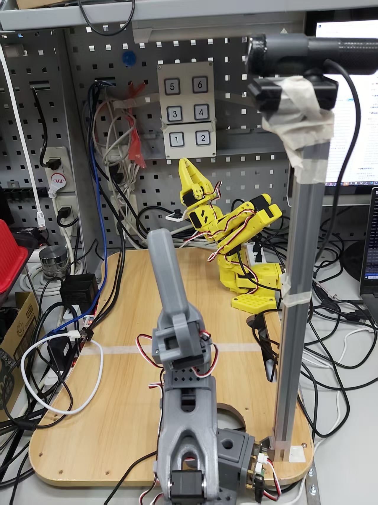
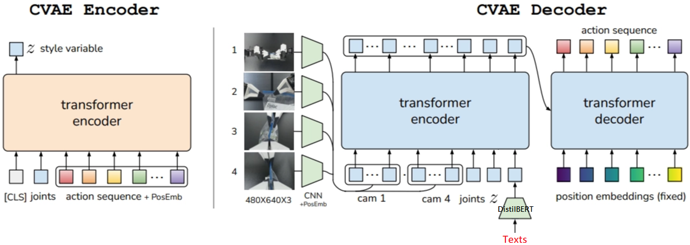

# 04 - 階段二實作：語意驅動的特定面板按壓 (6 顆按鈕)

在進入適應所有電梯面板的通用任務前，此中繼階段的目標是：**針對特定款式（6 顆按鈕，按下會亮藍光）的面板，讓模型能「聽懂指令」，由輸入的文字字串決定按哪個按鈕。**

環境樣式參考：


## 任務目標

1. **指令驅動動作**：使用者無論是藉由口頭（用語音轉文字）還是文字輸入，手臂都能根據傳入的動態字串參數決定按下對應的目標按鈕。
2. **區辨能力驗證**：確認單一系統架構能否準確解析相近按鈕影像與文字指令的對應關係，不誤觸相鄰的其它選項。
3. **特徵驗證**：觀察按下後發出的「藍光」是否能作為動作完成的視覺回饋特徵。

---

## 💡 理論探討：指令驅動按壓的三層級解決方案

為實現「由輸入字串決定發動哪個按壓行為」，在目前具身智能（Embodied AI）的發展路徑上，有三個截然不同的工程與演算法層次可以探索：

### 層次一：工程中控台路由 (Wrapper 與權重動態切換)
本質上仍是傳統的「一個按鈕，訓練一個專屬模型」。首先由外部程式（如 Python 腳本、語法解析器或輕量級 LLM Router）攔截使用者的語音或字串，解析出目標按鈕為何（例如：`target=Btn3`）後，程式再去動態讀取並載入 `btn3` 的權重（pretrained_model）來執行。
- **特性**：實作簡單直觀，但欠缺泛化性。未來若有百個按鈕，則需維護百個龐大的模型庫，且切換權重時會有將模型掛載至 VRAM 的載入延遲。

### 層次二：條件式輸入的多任務模型 (Language-Conditioned ACT)
**【⭐ 本階段 (04 筆記) 先行採用的方案】**
不再將每一顆按鈕視作獨立外掛，而是將 6 個按鈕的所有示範軌跡整合，訓練這「唯一一部」了解所有情況的 **Multi-Task ACT 模型**。
透過將代表任務的「文字指令」轉換為特徵（Language Embeddings），當作一個額外的條件 (Condition) 一併餵給類神經網路。模型在推論時會根據文字條件，自動將視覺注意力 (Attention) 對齊畫面中對應的號碼。只要傳入 `"Press button 3"` 的字串，這個單一模型就能動態產生前往按鈕 3 的動作軌跡！

### 層次三：導入視覺-語言-動作大模型 (VLA, Vision-Language-Action)
**【🚀 未來規劃：將於後續的 `05_xxx` 階段實作】**
免去手動萃取特徵與繁瑣的模型訓練設定，直接導入端到端的大型多模態基礎模型（例如 OpenVLA）。VLA 模型就像是擁有 ChatGPT 般的強大常識，不只能同時看圖與讀懂文字指令，產出的也不是文字語言，而是能直接驅動馬達的 **Action Tokens**！即使是模型以前完全沒見過的按鈕面板，單憑其強大的預訓練語言常識也有極高的機率達成 Zero-shot 的零樣本按壓。

---

## 具體實作與原始碼修改步驟 (層次二架構)

要讓原生的 ACT 模型學會「聽懂人話」，必須在 LeRobot 中進行架構級別的改裝（Language-Conditioned ACT Mod）。以下為核心的實作步驟：

### 第0步：了解 lerobot 的 ACT 實作
在動手修改架構之前，先深入理解 LeRobot 預設的原生 ACT 模型實作（原始碼與資料流），確認 Transformer Encoder/Decoder 的實際運作方式，這部分的探討與筆記對應至理論學習的 ACT 分析中，程式碼註解已加入至 [`policies/act/modeling_act.py`](../policies/act/modeling_act.py)。

### 第一步：修改 ACT 網路架構 (注入 Text Embeddings)

為保留原始實作，已將 `policies/act` 目錄複製一份為 `policies/act_lc`(Language-Conditioned ACT)。接下來的修改都將在 `act_lc` 目錄中進行。

原生 ACT 實作(位於 `lerobot/common/policies/act/modeling_act.py`) 僅接收影像與本體狀態。以下為架構改造的核心：

**📍 架構變更圖解 (ACT-LC 資料流)：**
將提取出的語意特徵注入到 Transformer Encoder 的輸入端，強制模型進行跨模態注意力計算。



具體必須做以下改造：

1. **引入文字編碼器 (Text Encoder)**：
    - 在 ACT Policy 的 `__init__` 中，載入輕量且推理快速的預訓練語言模型（採用 `distilbert-base-uncased`），並將其權重凍結 (`requires_grad=False`) 以減少機器手臂訓練初期的計算資源負擔與過度擬合問題。
2. **新增特徵對齊層 (Projection MLP)**：
    - 文字編碼器輸出的隱藏維度（DistilBERT 為 768）與 ACT 內部 Transformer 的維度（預設為 512）不同。需加入一層 Linear 進行特徵降維與映射：
    ```python
    self.text_proj = nn.Linear(config.language_dim, config.hidden_dim)
    ```
3. **改造 Transformer Encoder 流水線**：
    - 原生的 `forward()` 與 `compute_loss()` 需修改為可以接收 `batch` 中的 `language_instruction` 的批次字串，並在內部呼叫 Tokenizer 將字串轉為 `input_ids` 與 `attention_mask`。送入 Text Encoder 與 `text_proj` 後，得到 `text_tokens`（維度為 `(Batch, Seq_Len, 512)`）。
    - 接著，進入 Transformer (`self.model.encoder`) 之前，將 `text_tokens` 加入至序列中（與 `is_pad`、`z`、`proprioception`、`image_tokens` 串接），這樣 Encoder 的 Self-Attention 機制就會強制讓「語意 Token」與「影像空間 Token」產生跨模態的權重聯結。
   這樣 Encoder 的 Self-Attention 機制就會強制讓「語意 Token」與「影像空間 Token」產生跨模態的權重聯結。
4. **驗證**：
    - 在不開啟正式訓練迴圈的情況下，撰寫一小段 Python 測試腳本，初始化改版後的 ACTPolicy 並模擬輸入 batch (包含一組假影像、假 proprioception 與文字指令 ["press button 3"])。
    - 確認 forward() 能夠順利產出維度正確的 action_tokens 而不拋出維度不匹配或是 Cuda Memory 錯誤。


### 第二步：多任務資料集混合 (Multi-task Data Collection)

1. **指令標註**：
   在錄製這 6 顆按鈕時，將所有軌跡錄進 **同一個 Repo**，但透過給定特定的 `--dataset.single_task` 來給予模型訓練時的解題線索：
   ```bash
   lerobot-record ... \
     --dataset.repo_id=RonLiao/lerobot-so101-elevator-6btn-multitask \
     --dataset.single_task="press button 3" # 錄製按鈕 3 的回合
   ```

2. **修改 Dataset 解析器**：
   因為原生的 `LeRobotDataset` 預設只回傳數值型與影像特徵，為了讓改版後的 ACT-LC 模型能順利讀取到文字指令，必須撰寫一個 Wrapper 類別（實作了 `ACTLCDataset`）。
   - **實作邏輯**：在 `__getitem__` 取資料時，攔截當下回傳的字典，並拿取當前的 `task_idx = item["task_index"].item()`。接著直接從底層已載入記憶體的 `self.dataset.tasks` 映射表中（在 v3.0 架構下，數據來自 `meta/tasks.parquet`）調閱出對應的 instruction string，最後將其注入到 `item["language_instruction"]` 欄位中供 `DistilBERT` 編碼。

- **經驗：為何在多任務混合錄製時，需要給定特定的 `--dataset.single_task`？**
  - **核心考量**：正常邏輯下，錄製 Episode 前應給定一串指令（比如"press button 3"，並補入每一幀 (Frame) 的數據中。但此舉會導致同一 Episode 的每個 Frame 都存入完全重複的文字，造成嚴重的空間浪費。
  - **既有機制**：LeRobot 框架分為 Dataset/Episode/Frame 三層級。每個 Episode 附帶一個 `task_index`，並自動包含於該 Episode 下的所有 Frame 中。
  - **優化策略**：既然每個 Frame 原來就有 `task_index`，且指令字串也是以 Episode 為單位，故直接沿用此索引。訓練時透過 `act_lc_dataset.py` 將索引動態展開為“dataset.single_task"指定的對應文字指令，達成節省資料夾體積但訓練具備語意輸入的效果。
  - **參數價值**：`--dataset.single_task` 用於「為該次錄製的所有 Episode 下定義」，在 v3.0 架構下它會將此標籤自動登記於字串映射表 `meta/tasks.parquet` 中（取代了舊版存於 info.json 的作法），符合上面提到的需求。此外也能避免每個 Episode 都需手動輸入字串，支援一次錄製多個 Episode。

- **經驗：推論時若輸入略有不同的字串（如 "3" 或 "button 3"）還能運作嗎？**
  - **初期現狀**：雖然 `DistilBERT` 具備語意理解能力（換句話說，這兩個字串經過DistilBERT編碼後，會得到非常接近的向量），但 ACT 模型目前訓練時僅見過極少數的特定 Embedding。若推論時輸入未曾對齊過動作的字串，即便語意接近，仍極可能失敗。此階段建議維持與錄製時 **完全一致** 的指令。
  - **泛化解決方案（文字擾動）**：後續在訓練階段可引入「文字擾動 (Text Augmentation)」，例如將標準指令隨機更換為多樣化的說法（如 "press 3"、"go to 3" 或 "button 3"）。
  - **實施建議**：此擾動不建議在錄製時手動為 50 個 Episode 分別輸入不同字串，而應在訓練程式讀取資料時，由 DataLoader 自動進行隨機替換，迫使模型學到「語意相似」即代表「動作相同」，顯著提升系統對自然語言輸入的容錯與泛化能力。

3. **多任務錄製腳本 (Headless 全自動錄製版)**：
   為了簡化流程並確保標籤一致，使用專用的錄製腳本 `scripts/record_6btn.sh`。由於在 Docker 的 Headless 環境內無法使用鍵盤空白鍵進入下一回合，腳本中特別加入了 `--dataset.reset_time_s=5` 參數。這讓系統在錄影結束後只等待 5 秒，隨即自動進入下一段錄製，實現全程無觸碰的全自動化收集流程：
   ```bash
   # 初始化：錄製按鈕 1 的第 1 個 Episode (禁用續傳，用於徹底重建或覆蓋舊有資料集)
   bash scripts/record_6btn.sh 1 1 false

   # 錄製按鈕 1 的 剩餘49 個回合 (預設續傳模式)
   bash scripts/record_6btn.sh 1 50

   # 錄製按鈕 2 的 50 個回合 (錄制50回合，使用預設的 true 續傳模式)
   bash scripts/record_6btn.sh 2 50

   # 錄製按鈕 6 的 50 個回合 (同上)
   bash scripts/record_6btn.sh 6 50
   ```
   此腳本會自動將資料儲存至 `RonLiao/lerobot-so101-elevator-6btn-multitask`，並套用 `--dataset.single_task="press button $N"` 標籤。

4. **指令標註與數據均衡**：
   在錄製過程中，應隨時使用 `python scripts/check_dataset_balance.py` 檢查各任務進度。

5. **資料集一鍵上傳雲端**：
   由於錄製腳本為了追求效率，預設關閉了即時上傳 (`--dataset.push_to_hub=false`)。當在本地完成一段錄製（例如錄滿 50 個 Episode）後，可使用以下指令手動將所有資料打包並同步至雲端：
   ```bash
   python -c "from lerobot.datasets.lerobot_dataset import LeRobotDataset; dataset = LeRobotDataset('RonLiao/lerobot-so101-elevator-6btn-multitask'); dataset.push_to_hub()"
   ```
   > [!NOTE]
   > 這會上傳當前本地快取中該 Repo 的所有內容。上傳完成後，建議檢查 Hugging Face 頁面，確認檔案大小與 `tasks.parquet` 是否符合預期。

- **經驗：首次錄製注意事項 (404 報錯解決方案)**：
  - 若資料集尚未存在於 Hugging Face 或本地，啟動時會報 `RepositoryNotFoundError` (404)。請按照以下步驟初始化：
  - **1. 在雲端建立倉庫**：
    ```bash
    python -c "from huggingface_hub import HfApi; HfApi().create_repo(repo_id='RonLiao/ lerobot-so101-elevator-6btn-multitask', repo_type='dataset', exist_ok=True)"
    ```
  - **2. 執行首次錄製 (禁用續傳)**：
    務必在指令最後加上 `false` 以關閉 `--resume`：`bash scripts/record_6btn.sh 1 1 false`。

- **經驗：遇到錄壞欲刪除 Episode 導致資料毀損 (Metadata Corruption)**
  - **問題描述**：若因為超時多錄了空白片段，嘗試使用原生的 `lerobot-edit-dataset --operation.type=delete_episodes` 工具刪除時，可能會觸發 V2 版本底層的 Bug，導致 `info.json` 遺失，並引發連鎖反應將 Metadata 破壞，甚至報錯 `RevisionNotFoundError`。
  - **解決方式**：目前版本中，刪除特定 Episodes 具有高風險。如果不幸讓資料結構毀損，最乾淨解就是砍掉本地快取資料夾重煉 (`rm -rf ~/.cache/huggingface/lerobot/RonLiao/lerobot-so101-elevator-6btn-multitask`)。


### 第三步：啟動條件式訓練 (Language-Conditioned Training)

此時不再分開訓練 6 次。一次將混合了上述所有按鈕的巨大 Dataset 餵給改裝後的 ACT。
- **訓練哲學**：模型在預測馬達位置時，會發現同樣是「六顆按鈕的畫面」，但最佳軌跡卻有 6 種解。這會迫使 Loss 函數推動網路依賴剛加入的 `text_tokens` 作為解題的先驗條件，進而學會「看字決定按哪顆按鈕」的區辨能力。

**具體實施步驟：**
1. **資料集準備**：確保已錄製足夠的多任務 Episode (建議每顆按鈕 50+ 個)，並上傳至 Hugging Face。
2. **訓練環境配置**：啟動 Docker 容器並掛載 `ron_so101_v2` 環境。
3. **執行自定義訓練腳本 (`scripts/train_act_lc.py`)**：
   執行腳本並傳入標準的參數：
   ```bash
   python scripts/train_act_lc.py \
     --dataset.repo_id="RonLiao/lerobot-so101-elevator-6btn-multitask" \
     --policy.type="act" \
     --batch_size=16 \
     --eval_freq=10000 \
     --save_freq=10000 \
     --save_checkpoint=true \
     --policy.push_to_hub=false \
     --wandb.enable=true \
     --wandb.project="lerobot-so101-elevator-lc" \
     --output_dir="outputs/train/act_lc_btn_1_to_3" \
     --job_name="act_lc_btn_1_to_3"
   ```
4. **監控與驗證**：透過 WandB 觀察不同任務指令下，Loss 曲線是否穩定下降並收斂。

- **經驗：在不修改框架核心原始碼下注入新模型結構 (Monkey-patch 套件架構設計)**
  - **背景問題**：若要向 LeRobot 新增一種模型架構 (如 `act_lc`)，傳統做法必須將程式碼寫進 `/lerobot/src/...` 並修改框架的 Config Parser。這會導致客製化程式碼離開當前 GitHub 專案，降低可維護性並衍生版本衝突問題。
  - **另外一項誤區**：指令中的 `--policy.path` 是設計用來「讀取預訓練權重資料夾」的，不能用於載入本地的未註冊網路架構（兩者共存會拋出 `argparse.ArgumentError`）。
  - **解決方案**：採用 **動態攔截 (Monkey-patch)**。刻意撰寫了一份啟動外掛腳本 (`train_act_lc.py`)，利用 `runpy` 在同一個 Process 中呼叫 `lerobot-train`。在此之前，系統會先偷偷將記憶體中原生 LeRobot 的 `ACTPolicy` 與 `LeRobotDataset` 指標，替換 (Patch) 成自定義的 `CustomACTPolicy` 和 `ACTLCDataset`。
  - **優化優勢**：成功借用了原生 `--policy.type="act"` 的合法執行通道，但底層引擎已經實施掉包！此作法使得所有客製化語意模型邏輯、數據處理層都能「100% 留在當前的獨立專案」內。
  - **新增特點：結合 `TeeLogger` 進行日誌雙軌儲存**：包裝腳本也藉機攔截了 `sys.stdout` 與 `sys.stderr`，在啟動訓練時能在 `record/` 資料夾自動生成日誌，等同於 bash 的 `tee -a`，方便無縫保存數據供後續覆盤驗證。

- **經驗：首度條件式訓練 (按鈕 1-3) 成果分析**：
   - **訓練日誌 (GitHub)**：[act_lc_train_20260422_195628.log](../record/act_lc_train_20260422_195628.log)

   這是首度成功跑完 100,000 steps、帶有文字指令條件 (Language-Conditioned) 的多任務模型訓練。從記錄中解析出以下關鍵指標與計步參數的涵義：

  1. **訓練效能與時長**：
     - **硬體**：NVIDIA GeForce GTX 1080 Ti (11GB VRAM)。
     - **總耗時**：約 **8 小時 40 分鐘** (自 19:56 啟動至隔日 04:39 結束)。
     - **更新速率 (updt_s)**：單次 GPU 計算耗時穩定維持在 **0.29 秒**。
     - **資料載入延遲 (data_s)**：平均僅 **0.019 秒**。
     - **分析**：這代表硬體 CPU/SSD 效能充足且多線程設定得宜 (`num_workers=4`)，完全沒有因為載入大量的多任務影像而產生 I/O 瓶頸。儘管加入了 Language Embedding 加工作業，計算效率依然維持絕佳表現。

  2. **Loss 與收斂趨勢**：
     - **誤差下降**：Loss 從初始的 **6.078** (step 200) 平穩下降至結尾的 **0.034** (step 100K)。
     - **梯度穩定度 (grdn)**：從起初的 **113** 完美降落至最後約 **2.0** 的平緩谷底。
     - **分析**：全程完全無任何反彈、震盪或梯度爆炸 (Exploding Gradients)。因為 ACT 只要降至 0.1 以下就代表學習極佳，此異常精準的誤差值證實了模型不只死背熟了這 3 顆按鈕的位置，更「成功抓到了使用文字指令做為預測條件的區分規律」。

  3. **重要計步器參數解讀 (`ep` 與 `epch`)**：
     - **`step` (步數)**：執行優化器更新（Forward + Backpropagation）的次數，本次設定為上限的 100K 萬步。
     - **`ep` (Episodes)**：訓練過程中所抽樣處理了總計多少回合 (Episode)。這有助於確認 DataLoader 在處理混合式多任務時，是否有順暢地載入並堆疊資料。
     - **`epch` (Epochs)**：代表模型「完整看完 150 筆 Episodes」的週期總數。在 10 萬步結束時值約為 **44.28**，代表在這 8 多小時的訓練期間，模型反覆研讀了這批錄製資料整整 44 遍。

- **經驗：自訂網路架構的訓練權重手動上傳 (Push Custom Model to Hugging Face)**：
  由於訓練指令中加上了 `--policy.push_to_hub=false`，權重目前只保留在本地伺服器。若後續想手動備份到雲端，由於模型已加上 Language Embedding，**重新建立一個帶有後綴（如 `-lc`）的新 Repository**，避免覆蓋掉第一階段的純視覺舊模型。操作上沿用之前舊模型上傳的方式，進入 LeRobot scripts 目錄執行：

  ```bash
  # 使用最穩定的 Python API 方式上傳 (程式會自動建立 Repo 並上傳)
  python -c "from huggingface_hub import HfApi; api = HfApi(); repo_id = 'RonLiao/so101-elevator-act-lc-btn-1-to-3'; api.create_repo(repo_id=repo_id, repo_type='model', exist_ok=True); api.upload_folder(folder_path='outputs/train/act_lc_btn_1_to_3/checkpoints/last/pretrained_model', repo_id=repo_id, repo_type='model')"
  ```

  > [!TIP]
  > 這邊特別指定只上傳 `checkpoints/last/pretrained_model` 子資料夾。因為它裡頭包含了乾淨的模型權重 (`model.safetensors`) 與結構設定檔 (`config.json`)，是推論時真正需要的東西。這麼做可以避免把訓練過程產生的龐大 Optimizer 暫存狀態一併上傳，省下巨量的雲端儲存空間。

### 第四步：客製化推論腳本 (Inference Router)
 
由於原廠的錄製與評價工具（如 `lerobot-record`）無法動態接收外部字串作為模型輸入，因此自行實作了 `scripts/inference_language_act.py` 作為推論中控台：
 
 1. **模型載入與初始化**：
    - 直接引用自定義的 `from policies.act_lc.modeling_act import ACTPolicy`。
    - 透過 `from_pretrained("RonLiao/so101-elevator-act-lc-btn-1-to-3")` 自動從 Hugging Face 雲端（或本地快取）拉取權重與 config。
 2. **互動式指令迴圈 (Interactive CLI)**：
    - 啟動後進入 `While True` 模式，程式會暫停並等待使用者輸入指令（例：`press button 3`）。
    - 支援 `--dummy` 模式，在不連接實體手臂的情況下也能驗證語言特徵是否順利注入 Policy。
 3. **多步執行子迴圈 (Action Execution Loop)**：
    - 當接收到指令後，系統會自動開啟一個為期 200 步（可透過 `--num_steps` 調整）的子迴圈。
    - 在每一小步 (Step) 中，即時抓取影像與關節狀態，並將使用者輸入的指令附加在 `observation["language_instruction"]` 欄位中，讓 DistilBERT 產出條件向量。
 4. **硬體下發與對齊**：
    - 使用 `make_robot()` 建構連線，獲取預測動作後透過 `robot.send_action()` 送往馬達執行。

**驗證指令與結果：**
```bash
# 執行離線虛擬測試
python scripts/inference_language_act.py --dummy

# 執行驗證輸出
# 🎯 鎖定特徵注入條件: [ press button 3 ] - 開始執行任務...
#   ↳ [Step 0] 位移量: 0.000000
#   ↳ [Step 50] 位移量: 0.055191
#   ⏱️ 單次決策總耗時: 0.230 秒
# ✅ 任務執行完畢，回到待命狀態。
```

- **經驗：引入「自動靜止停止機制」優化任務銜接速率**：
  - **核心問題**：ACT 模型本身沒有「終止標籤」，導致傳統做法必須跑滿固定的步數（如 200 步）才能停下來。若模型在第 100 步就已經按完按鈕並縮回，剩下的 100 步就會變成無謂的等待。
  - **解決方案**：在推論迴圈中加入 **「位移量監控 (Stationary Detection)」**。
    - 運算邏輯：計算當前指令 $a_t$ 與前一步指令 $a_{t-1}$ 的歐幾里德距離。
    - 判定準則：當位移量連續 15 步（可透過 `--stop_patience` 調整）低於閾值 `0.001` 時，判定模型已進入「收斂靜止狀態」。
  - **實際效益**：手臂完成按壓任務並回到初始位置後，系統會立即自動跳出迴圈並顯示「任務完成」，無需手動干預或盲目等待，大幅提升了連續多任務（如：按完 3 樓再按 5 樓）的測試效率。

- **經驗：推論失敗與異常行為**

在實機部署初期，發生了推論成功啟動但手臂完全無法定位按鈕的問題。

**故障現象：**
手臂雖然接收到指令並開始動作，但動作路徑完全偏離目標，出現甩動或在空中亂舞的現象。典型的失敗錄像如下：


**問題排查與潛在解決方案：**
為了找出行為異常的原因，目前正針對以下幾點進行逐一排查：

1.  **色域標準一致性 (BGR vs RGB)**：
    *   **可能原因**：OpenCV 預設讀取影像為 BGR，但多數神經網路（包含 LeRobot 錄製格式）預期為 RGB。色域顛倒會導致特徵提取完全錯誤。
    *   **排查狀態**：待驗證。已在腳本中準備通道翻轉邏輯。
2.  **指令字串精確度**：
    *   **可能原因**：模型對文字非常敏感，非訓練集的指令（如多一個空格）可能導致特徵偏移。
    *   **排查狀態**：待驗證。已修正提示訊息確保輸入格式一致。
3.  **校正數據一致性**：
    *   **可能原因**：若推論時與錄製時用的馬達校正檔不同，座標系會整體偏移。
    *   **排查狀態**：已排除。透過固定 `robot_id` 確保套用正確校正。
4.  **模型狀態 (Train/Eval Mode)**：
    *   **可能原因**：若 BN 層未固定在 Eval 模式，推論結果會劇烈晃動。
    *   **排查狀態**：已排除。已確認 `policy.eval()` 被調用。
